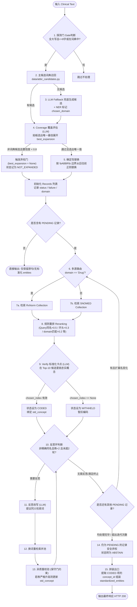

# Medical NLP 临床文本标准化平台：整体脉络与数据流分析 (V11/L3 交付版)

> **文档定位**：面向 RAG/Agent 工程实践的架构梳理与核心链路解析。读完应能在白板上完整复现整条控制流，讲清每个设计决策的 Why、Trade-off 以及数据在各模块前后的形态变化。
> 
> **一句话定位**：将“临床缩写扩写 + 多源术语标准化”解构为「候选召回 → 确定性替换 → 单映射状态机（RAG检索 → 判忠实弃权 → 有界自纠自检）」的、可量化评估的 Agentic RAG 后端系统。

---

## 1. 30秒电梯陈述与核心设计哲学

当用户向 API 发送包含临床缩写（如 `"CP"`, `"ASA"`, `"SOB"`）的文本时，系统遵循**确定性优先**和**局部失败隔离**的原则，在保证极高运行效率的同时杜绝大模型的语义幻觉：

*   **确定性有限扩写**：摒弃大模型整句重写（避免丢失否定词或产生幻觉），通过“探测门（Gate）限制候选召回范围”并在“Coverage 阶段拍板唯一展开”，最后实施**确定性 Token 边界正则替换**。
*   **单映射状态机与失败隔离**：将工作单位降级至“单个缩写映射对（Mapping）”。每个映射独立运行其生命周期状态机，一个映射的匹配/校验失败只隔离重试其自身，不影响其他已被锁定的正确映射。
*   **标准化卡点（Verify）而非冗余扩写校验**：Verify 不再重复校验扩写（那是 Coverage 的工作，同源 LLM 循环论证无收益），而是专注于判别 SNOMED/RxNorm 检索结果的忠实度，找不到符合的便诚实地**弃码（Withheld）**。
*   **多源 Agentic RAG 与确定性路由**：按医学命名实体（NER）的 Domain 将缩写扩写词分流。疾病走 **SNOMED** 临床概念库，药品走 **RxNorm** 成分库。大幅扩展了词表覆盖面，实测使成分药标准化从 0/5 弃码提升至 5/5 正确匹配。
*   **有界自纠改写环**：当校验出的概念并非精确同名时，触发 LLM 提议同义检索词，拉回新候选并入池进行二次校验，以“秩严格变高”和“最多迭代 2 轮”作为终止门槛，保证收敛。

---

## 2. 核心技术栈架构

| 维度 | 所选技术与组件 | 核心设计考虑 / 关键细节 |
| :--- | :--- | :--- |
| **Web 框架** | FastAPI / Uvicorn | 主接口 `/expand/simple` 采用**懒加载（Lazy Loading）**，在首个请求到达时才加载重型 NLP 模型（NER, BGE-M3）并建立 Milvus 连接，避免空置占用。 |
| **大模型层** | DeepSeek Chat (工厂化配置，支持切换 Qwen) | `temperature=0`。使用 LLM 工厂类实现配置与逻辑解耦，通过 Prompt 约束和 Schema 校验兜底。 |
| **向量库与多库检索** | Milvus (`concepts_only_name` / `rxnorm_concepts`) | 针对 OHDSI Athena 全量临床 SNOMED（34.5万概念）与 RxNorm（15.7万成分药）建立双 Collection 分区，以 Cosine 距离做多源向量匹配。 |
| **语义向量模型** | HuggingFace `BAAI/bge-m3` | 本地 Cuda/CPU 自适应推理，进行 Query 级的实时向量化（Embedding）。 |
| **实体抽取 (NER)** | `Clinical-AI-Apollo/Medical-NER` | 离线运行的轻量级 Transformer 模型，提供独立于 DeepSeek 的“跨模型第二意见”。**仅用于在 Fallback 时识别词语 domain，不做候选过滤**。 |
| **LangGraph 编排** | LangGraph 流程图（不进生产热路径） | 定位为**可视化壳与 Parity（一致性）回归测试工具**。主接口依然走轻量级的 Python 状态机以规避框架带来的开销与不确定性。 |
| **评估与诊断** | 74 例 Master Benchmark + 19 例 Concept Benchmark | 引入明大 35 万病历提取的 CASI 真实数据进行多义词消歧测试，使用 **SNOMED concept_id + 接受集**判等，提供错误分析自检机制。 |

---

## 3. L3 多源业务处理流水线 (控制流)

系统的完整流程图如下。整个控制流以映射（Mapping）为处理颗粒度，显式包含了多源路由与反思自纠环：



---

## 4. 统一 Record 状态机与生命周期

在 V11 版中，为了解决召回与重试状态割裂的问题，系统引入了**单一 record 走到底**的数据模型。每个缩写在生命周期中被规范为以下五种状态：

```
                    ┌─── [Coverage 置信度不足] ───> NOT_EXPANDED (安全不扩写，记录 failure)
                    │
输入缩写 ──> 召回 ──┼─── [选出最佳展开] ───> PENDING (待处理)
                                               │
                                               ├─> [向量检索 + 规则重排]
                                               │
                                               ├─> [Verify 判定概念忠实] ─> CODED (锁定给码，导出)
                                               │
                                               ├─> [Verify 判定无忠实概念] ─> WITHHELD (保留扩写但无码，导出)
                                               │
                                               └─> [重试用尽 / 换池候选用光] ─> ABSTAIN (安全弃扩，回退原文)
```

### 状态属性定义与 Failure 结构
每一条 Record 在代码里都是一个 `dict`，其生命周期字段的变化如下：
*   **`NOT_EXPANDED`**：
    *   *触发条件*：Fallback 生成的候选覆盖评估不自信（`confidence < 0.8`）。
    *   *属性变化*：`expansion = None`, `status = "NOT_EXPANDED"`。
    *   *Failure 挂载*：`{"type": "ABBR_NOT_EXPANDED", "stage": "coverage", "reason": "...", "evidence": {...}}`。
*   **`PENDING`**：
    *   *触发条件*：Coverage 成功选定唯一 `best_expansion`，等待进入检索和校验。
    *   *属性变化*：`expansion = best_expansion`, `status = "PENDING"`。
*   **`CODED`**：
    *   *触发条件*：检索出的 Top-10 概念中有被 Verify 判定为 `standardization_faithful` 的项，或者通过反思自纠救回。
    *   *属性变化*：`std_concept = chosen_concept`, `status = "CODED"`。
*   **`WITHHELD`**：
    *   *触发条件*：Verify 确认扩写是对的，但全量库里捞出来的 10 个概念都不忠实（如 `CP` 扩写为 `chest pain`，但 SNOMED 里只有 `Chest pain rating` 等量表概念，缺乏 `Chest pain` 纯母概念）。
    *   *属性变化*：`std_concept = None`, `status = "WITHHELD"`。
    *   *Failure 挂载*：`{"type": "CODE_WITHHELD", "stage": "standardization", "reason": "...", "evidence": {"retrieved_top": [...]}}`。
*   **`ABSTAIN`**：
    *   *触发条件*：在重试循环结束时，仍有映射由于冲突等原因处于 `PENDING` 状态。
    *   *属性变化*：`expansion = None`, `status = "ABSTAIN"`。

---

## 5. 数据状态演变实例分析

以输入文本 `"The patient denies CP and took ASA."` 为具体场景，跟踪记录状态在各个处理节点的演变过程：

### 5.1 初始解析与探测
经过 `_should_consider_abbreviation`，`CP`（在词典中）与 `ASA`（全大写 <= 8字）均通过探测门。
*   `CP` 直接通过 `ABBRCandidateRetriever` 召回词典候选。
*   `ASA` 词典中未命中，进入 `ABBRCandidateFallbackRetriever`（LLM 结合上下文生成候选词列表，NER 模型检测其候选并打上 `domain=Drug` 标记）。

### 5.2 覆盖度判定与 Record 生成
通过 `ABBRCandidateCoverageEvaluator` 分别决定：
*   `CP` -> 最佳展开 `"chest pain"`, 属于 `Condition` 领域。
*   `ASA` -> 最佳展开 `"aspirin"`, 属于 `Drug` 领域。

此时生成的内部 Records 初始化为：
```json
[
  {
    "abbreviation": "CP",
    "source": "primary",
    "expansion": "chest pain",
    "domain": "Condition",
    "std_cache": null,
    "std_concept": null,
    "status": "PENDING",
    "failure": null
  },
  {
    "abbreviation": "ASA",
    "source": "fallback",
    "expansion": "aspirin",
    "domain": "Drug",
    "std_cache": null,
    "std_concept": null,
    "status": "PENDING",
    "failure": null
  }
]
```

### 5.3 确定性替换与拼装
利用 `_build_expanded_text_deterministic` 得到过渡期扩写文本（利用正则边界安全防误伤，且保留了 `denies` 否定语义）：
```text
"The patient denies chest pain and took aspirin."
```

### 5.4 多源路由与 RAG 检索
主循环首轮：
1.  **处理 CP**：`domain == "Condition"` 路由至 **SNOMED**（Milvus Collection: `concepts_only_name`）。
    *   向量匹配 + 规则重排（精确同名 +0.5），过滤出 Top-10 写入 `std_cache`。
2.  **处理 ASA**：`domain == "Drug"` 路由至 **RxNorm**（Milvus Collection: `rxnorm_concepts`）。
    *   向量匹配 + 规则重排，过滤出 Top-10 写入 `std_cache`。

### 5.5 标准化卡点与判定 (Verify)
`ABBVerifier.verify_mappings` 介入，同时验证两项（将全部 10 个候选输入给 LLM 裁判）：
*   **CP 的评判结果**：在 SNOMED 缓存中，精确概念 `"Chest pain"` (Concept ID: `29857009`) 位于 index 0，语义忠实。
    *   *动作*：`std_concept = std_cache[0]`, `status = "CODED"`。
*   **ASA 的评判结果**：在 RxNorm 缓存中，精确概念 `"aspirin"` (Concept ID: `1191`) 位于 index 0，语义忠实。
    *   *动作*：`std_concept = std_cache[0]`, `status = "CODED"`。

> [!TIP]
> 如果 ASA 路由到 SNOMED 库，检索结果只能拉回 `"Aspirin allergy"` 或 `"Aspirin poisoning"`。Verify 发现这与扩写 `"aspirin"` 相比多了特化修饰，语义不忠实，会返回 `chosen_index=None`。ASA 的状态将被设为 `WITHHELD`（即弃码不给错码）。

### 5.6 拼装出口 (API Response)
主循环判定已无 `PENDING` 记录，直接退出重试。过滤并提取 `LOCKED`（即 `CODED` + `WITHHELD`）的记录，拼装最终 API 响应：
```json
{
  "success": true,
  "expanded_text": "The patient denies chest pain and took aspirin.",
  "mappings": [
    {"abbreviation": "CP", "expansion": "chest pain", "label": null, "source": "primary"},
    {"abbreviation": "ASA", "expansion": "aspirin", "label": null, "source": "fallback"}
  ],
  "standardized_entities": [
    {
      "abbreviation": "CP",
      "expansion": "chest pain",
      "concept_id": "29857009",
      "concept_name": "Chest pain",
      "concept_code": "418307001",
      "domain_id": "Condition",
      "score": 0.942
    },
    {
      "abbreviation": "ASA",
      "expansion": "aspirin",
      "concept_id": "1191",
      "concept_name": "aspirin",
      "concept_code": "aspirin_rxnorm_cui",
      "domain_id": "Drug",
      "score": 1.0
    }
  ]
}
```

---

## 6. 从 V9 到 V11/L3 的架构演进史

整个平台的成型经历了一次深刻的“减负与重构”过程。下表整理了核心演进细节：

| 维度 | V9 初始架构 | V11/L3 当前架构 | 重构背后的工程决策与 Why |
| :--- | :--- | :--- | :--- |
| **扩写控制** | 依赖 LLM 自由重写/造句生成整句。 | **Coverage 拍板唯一展开 + 确定性 Token 替换**。 | **彻底消除丢否定/幻觉的问题**。LLM 生成很难保证“否定词保持”，而正则边界替换物理上杜绝了对上下文语义的修改。 |
| **工作颗粒度**| 整句拼装。 | **单个映射状态机，失败隔离**。 | **防级联失败**。当句子里有多个缩写时，V9 整句反思会牵连正确的词一起被重写；V11 分割后，正确的词直接冻结（CODED），只重试或弃权出错的词。 |
| **Verify 职责**| 复查整句扩写是否符合原意（橡皮图章）。 | **标准化卡点（Verify Mappings）**。 | **消除冗余与自证**。打点统计发现老 Verify 的拒绝率为 0/0/0。因为扩写已被同源 Coverage 拍板，Verify 属于循环自证。挪到判定 SNOMED 忠实度上后，Verify 开始发挥实质把关作用。 |
| **自纠反思环**| 依靠 LLM 对整句进行重写重试（已删）。 | **有界同义词改写重检索环（Stage-6d）**。 | **真带回新证据**。Verify 得到非同名概念时，让 LLM 提议同义检索词，去 Milvus 重新拉回一套完全不同的候选再判定，以“秩严格变高”做保守约束，迭代最多 2 轮。 |
| **知识源覆盖**| 单 Collection（SNOMED 5000 稀疏子集）。| **多Collection（全量 SNOMED + RxNorm 药品库）**。| **解决实体荒与跨领域错配**。解决原库缺失“高血压/冠心病”母概念的问题，同时通过 domain 自动路由，避免了成分药在 SNOMED 库中大量因候选漂移而被迫弃码的尴尬。 |
| **LangGraph** | 控制流直接写在 LangGraph 中，导致调试沉重。 | **LangGraph 作为可视化与 Parity 校验层**。 | **框架要挣到钱才进热路径**。在没有断点续跑、人工介入（Human-in-the-loop）的简单短链中，框架带来的是不透明的开销。因此将其剥离出热路径。 |

---

## 7. 错误分析系统 (Error Triage) 架构

在开发后期，项目引入了离线“错误分析与自检系统”，以抗误用和诊断驱动的形式推进质量闭环：

```
                    [ 运行时 known-unknowns ]
                  ( 没扩/弃码/弃权/coverage 失败 )
                                │
                                ├─> [ 统一写入 error_collector (unresolved_cases.jsonl) ]
                                │
                  [ 评测 unknown-unknowns ]
                  ( GOLD_MISMATCH: 自信地答错 )
                                │
                                ▼
                       [ 确定性 Expected 打标 ] 
                      ( 读时筛, 过滤 expected=True )
                                │
                                ▼
                       [ Error Triage 三段式 ]
               ┌──────────────────────────────────────┐
               │  1. LLM 提假设: 判断成因并输出 claim  │
               │  2. 数据自检: 查 Milvus/词典打脸假设  │
               │  3. LLM 写摘要: 整合通过自检的有效结论 │
               └──────────────────────────────────────┘
                                │
                                ▼
               [ 自动输出中英文执行摘要 (三栏三色报告) ]
```

### 核心自检与抗误用原则
1.  **不在写入端丢数据**：错误日志全量收集，过滤完全是读取时的动态决策（`--all` 参数可逆还原），防止误判导致真 bug 被吞。
2.  **确定性打标**：是否符合 Gold 标签由代码规则硬核计算，绝对不交给 LLM 模糊判定。
3.  **LLM 提、数据裁、LLM 写**：把 LLM 仅限制在“构思假设（Triage）”和“写人话（Summary）”两个阶段。对于假设的真实性（如“库里是否真的缺失该概念”），由自检代码去 Milvus 查实，一旦被打脸直接标红警示且不产草稿。这有效防范了 LLM 产生“幻觉套幻觉”的噪声报告。
