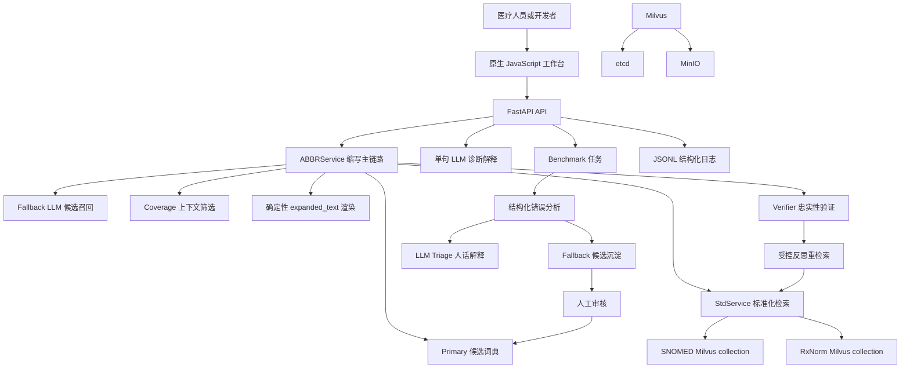

# Medical NLP V11 系统架构设计

## 1. 文档目的

本文从系统架构角度说明 Medical NLP V11 的模块边界、数据流、运行方式和设计取舍，供 GitHub 阅读、项目维护和面试讲解使用。

当前系统的事实边界以生产代码为准：项目主链路聚焦医学缩写扩写与标准化，不宣称已经实现覆盖整句所有医学实体的通用 NER 标准化系统。

---

## 2. 系统定位

V11 是一个面向临床文本的医学缩写标准化工作台：

```text
临床文本
    -> 识别目标缩写
    -> primary / fallback 候选召回
    -> coverage 上下文筛选
    -> 确定性扩写
    -> SNOMED / RxNorm 概念检索
    -> verifier 忠实性判断
    -> 受控反思重检索
    -> 结构化结果与可解释状态
```

典型输入：

```text
The patient has SOB and CP.
```

典型业务结果：

```text
SOB -> shortness of breath -> Dyspnea
CP  -> chest pain          -> Chest pain
```

其中：

- `expansion` 是缩写的完整扩写；
- `standard concept` 是向标准医学术语库绑定后的概念；
- `concept_id/code` 是标准概念的标识；
- 失败时系统优先保守返回，不强行绑定错误概念。

---

## 3. 总体架构



系统可以分为五个层次：

| 层次 | 主要职责 | 代表位置 |
| --- | --- | --- |
| 前端交互层 | 输入文本、展示结果、运行 Benchmark、人工审核 | `frontend/` |
| API 编排层 | 请求校验、路由、任务管理、响应转换 | `backend/api/` |
| 领域服务层 | 缩写扩写、coverage、标准化、验证和反思 | `backend/services/` |
| 评估运营层 | Benchmark、错误分析、候选沉淀 | `backend/evaluation/` |
| 基础设施层 | LLM、Embedding、Milvus、日志、追踪和 Docker | `backend/utils/`、`backend/tools/`、根目录 Docker 文件 |

---

## 4. 后端模块边界

### 4.1 API 层

位置：

```text
backend/api/main.py
backend/api/schemas.py
```

API 层负责：

- 接收 HTTP 请求；
- 校验输入格式；
- 调用业务服务；
- 管理 Benchmark 后台任务；
- 读取评估产物；
- 返回前端需要的结构化 JSON；
- 建立 request_id、job_id 和 frontend_request_id 关联。

API 层不负责实现医学判定规则。医学处理逻辑由 `ABBRService`、`StdService` 和相关服务完成。

主要路由：

```text
POST /expand/simple
POST /analysis/diagnose

GET  /benchmark/summary
GET  /benchmark/results
POST /benchmark/cases/jobs
GET  /benchmark/cases/jobs/{job_id}

GET  /error-analysis/report
GET  /error-analysis/triage
GET  /candidate-promotions
POST /candidate-promotions/apply
POST /candidate-promotions/apply-single
```

### 4.2 ABBRService 主链路

位置：

```text
backend/services/abbr_service.py
```

入口：

```python
ABBRService.expand_verify_with_retry(text, max_retries=2)
```

它负责把多个步骤组织成一次缩写标准化请求，但每个步骤仍由独立服务完成：

```text
目标缩写识别
    -> 候选召回
    -> coverage
    -> record 状态推进
    -> 确定性文本替换
    -> 标准化候选检索
    -> verifier 选择或拒绝
    -> reflection 受控重检索
    -> final_result
```

### 4.3 Record 状态模型

一句话是一个 case，句子中的每个目标缩写是一个 record。

典型状态：

```text
PENDING       已有扩写，等待标准化
CODED         扩写可信，且已绑定标准概念
WITHHELD      扩写可信，但没有忠实标准概念，安全拒绝编码
NOT_EXPANDED  没有得到可用扩写
ABSTAIN       当前流程保守放弃
```

record 是业务诊断的最小单位，case 是统计和产品展示单位：

```text
一个 case 可以包含多个 record。
只要一个目标 record 没有完成，整个 case 就可能失败。
```

### 4.4 三层成功语义

返回结果拆成三层：

```text
expansion_success
    所有目标缩写是否都有 expansion。

standardization_success
    所有目标缩写是否都进入 CODED。

success
    当前缩写主链路是否完成最终业务条件。
```

`success_breakdown` 继续提供数量拆解：

```text
target_count
expanded_count
coded_count
withheld_count
not_expanded_count
abstain_count
pending_count
```

这样可以区分：

```text
没有候选扩写
    -> expansion_success = false

扩写成功但标准概念不忠实
    -> expansion_success = true
    -> standardization_success = false
    -> status = WITHHELD

扩写和标准化都完成
    -> expansion_success = true
    -> standardization_success = true
    -> success = true
```

---

## 5. 候选召回与 Coverage

### 5.1 Primary 候选词典

位置：

```text
backend/data/abbr_candidates.py
```

Primary 是确定性本地候选来源。同一个缩写可以保留多个扩写：

```python
"PA": [
    {"expansion": "physician assistant", "domain": "Occupation"},
    {"expansion": "posteroanterior", "domain": "Observation"},
]
```

Primary 提供候选，不直接跳过上下文判断。候选最终仍需经过 coverage。

### 5.2 Fallback LLM 候选

位置：

```text
backend/services/abbr_candidate_fallback_retriever.py
```

Fallback 只负责在 primary 不足时补充候选，并记录：

- fallback 是否调用；
- 返回了多少候选；
- fallback reason；
- 错误类型和原始证据；
- 候选是否被 coverage 接受。

Fallback 不直接改写整句，也不直接写入 primary，更不直接决定标准概念。

### 5.3 Coverage

位置：

```text
backend/services/abbr_candidate_coverage_evaluator.py
```

Coverage 解决的是“这个扩写在当前上下文中是否合理”，而不是“这个词是否存在于医学库”。

典型失败会区分：

```text
NO_CANDIDATES
CANDIDATES_REJECTED_BY_COVERAGE
AMBIGUOUS_LOW_CONTEXT
FALLBACK_ERROR
```

这些信息会进入 record 或错误分析证据，帮助区分“没有答案”和“有答案但不敢选”。

---

## 6. 确定性文本替换

扩写文本不是 LLM 重新生成的整句，而是根据原始文本和 record 状态进行确定性渲染：

```text
原始 text 是事实源。
records 是状态源。
expanded_text 是渲染结果。
```

替换遵守 token 边界：

```text
CP 可以替换。
CP 不会误替换 CPR。
```

每一轮都从原始文本重新生成 `expanded_text`，避免 retry 或 reflection 在上一轮结果上继续替换造成状态残留。

---

## 7. 多源标准化架构

### 7.1 两个独立 collection

当前不是一个 Milvus collection 加两个字段，而是两个独立集合：

```text
SNOMED CT -> concepts_only_name
RxNorm    -> rxnorm_concepts
```

相关代码：

```text
backend/services/std_service.py
backend/services/medical_retriever.py
backend/tools/milvus/rebuild_milvus.py
backend/tools/milvus/rebuild_rxnorm_milvus.py
```

### 7.2 Source 与 domain

```text
source
    决定使用哪个标准化知识源或 collection。

domain
    表示候选的医学领域，并辅助路由、检索 boost 和结果解释。
```

当前主要路由规则：

```text
domain == Drug -> RxNorm
其它领域       -> SNOMED CT
```

### 7.3 检索、验证与反思

向量 Top-k 只是候选召回，不等于医学语义正确。

```text
扩写词
    -> Embedding
    -> Milvus Top-k
    -> verifier 判断候选是否忠实
    -> CODED 或 WITHHELD
```

如果候选质量不足，reflection 可以提出新的检索词并重新检索，但只在质量严格提升时采纳，避免反思过程漂移。

---

## 8. 前端架构

前端是 FastAPI 托管的原生 HTML/CSS/JavaScript 工作台，没有 React/Vue 构建链。

位置：

```text
frontend/
├─ app.js
├─ router.js
├─ styles.css
├─ api/client.js
├─ state/store.js
├─ pages/
├─ components/
└─ utils/frontend_logger.js
```

职责分层：

```text
app.js
    应用装配入口。

router.js
    页面路由。

state/store.js
    前端单一状态源。

api/client.js
    请求、响应、request_id 和错误处理。

pages/
    页面级动作和渲染。

components/
    shell、弹窗、进度、图表和 triage 卡片。
```

页面：

```text
Analyze
    单句缩写扩写、标准化和诊断。

Benchmark Overview
    上传 cases、运行任务、查看统计。

Error Analysis
    查看失败交集和 LLM 人话解释。

Fallback Promotions
    审核并写入 fallback 成功候选。
```

Benchmark 轮询只更新 Overview 的局部进度，避免全局重绘 Analyze 页面，从而避免 primary 弹窗被反复重建。

---

## 9. 评估与持续改进闭环

Benchmark 不是生产主链路，而是评估和回归工具：

```text
cases
    -> run_benchmark.py
    -> benchmark_results.json
    -> error_analysis_report.py
    -> error_analysis_report.json
    -> error_triage.py
    -> error_triage_report.md
    -> collect_fallback_candidate_promotions.py
    -> fallback_candidate_promotions.json
    -> 人工确认
    -> apply_fallback_candidate_promotions.py
    -> abbr_candidates.py
```

统计单位：

```text
Benchmark accuracy 以 case 为单位。
mapping_states 和 failure_type 以 record 为主要解释单位。
```

一个 case 可以同时包含：

```text
benchmark_mismatch
expansion_blocked
standardization_failure
```

这样可以保留错误交集，避免将扩写错误和标准化错误重复计数成互不相关的失败。

Fallback 候选只有在满足以下条件时才进入推荐：

```text
case.correct == true
source == fallback
status == CODED
chosen_concept 存在
```

最终仍需人工确认，系统不会自动把 LLM 产物直接写入 primary。

---

## 10. 可观测性与追踪

日志实现：

```text
backend/utils/structured_logger.py
backend/utils/trace_context.py
```

日志文件：

```text
backend/logs/app.jsonl
backend/logs/dependency.jsonl
backend/logs/pipeline.jsonl
backend/logs/benchmark.jsonl
backend/logs/audit.jsonl
backend/logs/frontend.jsonl
```

追踪字段：

```text
frontend_request_id
request_id
backend_request_id
job_id
case_id
```

record 和 log 的区别：

```text
record：这个缩写最终是什么状态。
log：这次请求何时进入哪个阶段、哪个依赖耗时或失败。
```

默认日志尽量不写入完整临床文本，而记录长度和 hash；短文本预览由配置控制。

---

## 11. Docker 部署架构

```text
api
├─ FastAPI
├─ frontend
└─ backend services

milvus
├─ etcd
└─ minio
```

Compose 服务：

```text
api
milvus
etcd
minio
```

API 容器内通过：

```text
MILVUS_URI=http://milvus:19530
```

访问 Milvus；本机运行时通常使用：

```text
MILVUS_URI=http://127.0.0.1:19530
```

主要持久化内容：

- API 日志；
- evaluation runtime/archive；
- backend data；
- Hugging Face 模型缓存；
- Milvus、etcd、MinIO Docker volumes。

---

## 12. LangGraph 的架构位置

`backend/graph/` 中的 LangGraph 代码用于：

- 流程实验；
- 生产流程可视化；
- 状态节点和反思路径验证；
- 生成 Mermaid 流程图。

它不是当前 FastAPI 的生产主入口。

这样设计是有意的：当前生产链路已经由 `ABBRService` 稳定承载，如果为了“Agent”概念强行替换入口，会增加状态迁移、调试和回归风险。更准确的项目定位是：

```text
Medical NLP intelligent pipeline
+ RAG retrieval
+ LLM verification workflow
+ bounded reflection
```

而不是把项目包装成已经具备自主规划能力的 Agent 系统。

---

## 13. 关键设计取舍

### 13.1 为什么不让 LLM 直接改写整句

直接让 LLM 生成最终句子会带来：

- 未授权文本变化；
- 否定关系丢失；
- 重复扩写；
- 缩写边界错误；
- 结果难以复现。

因此 V11 让 LLM 负责候选和判断，最终文本由确定性替换生成。

### 13.2 为什么保留 WITHHELD

向量检索总能返回相似词，但相似词不一定表达同一个医学实体。`WITHHELD` 允许系统保留可信扩写，同时拒绝不忠实的标准编码，属于安全失败而不是静默误标。

### 13.3 为什么 fallback 不直接写入 primary

fallback 可能产生上下文错误或过度扩写。必须经过：

```text
fallback 候选
    -> coverage
    -> 标准化
    -> verifier
    -> benchmark/人工审核
    -> primary
```

这使词典沉淀成为可审计的闭环。

---

## 14. 当前边界与后续方向

当前边界：

1. 主链路处理医学缩写，不等同于完整医学实体标准化。
2. 标准化效果依赖 Milvus collection、Embedding 模型和数据覆盖率。
3. fallback、verifier 和 triage 依赖可用的 LLM API。
4. Benchmark accuracy 是 case 级指标，不等于所有 record 的成功率。
5. 当前 LangGraph 不是生产主入口。
6. SNOMED、RxNorm、模型和向量数据需要单独处理许可证与分发问题。

合理的后续方向：

```text
1. 增加性能指标：平均耗时、P50/P95、LLM/Milvus 分阶段耗时。
2. 补充 Benchmark 数据来源与标注说明。
3. 增加 /full-standardize，独立支持完整医学实体 NER。
4. 增加更大规模、版本化的医学评估集。
5. 将 primary 候选管理迁移到受控数据存储或管理界面。
```

---

