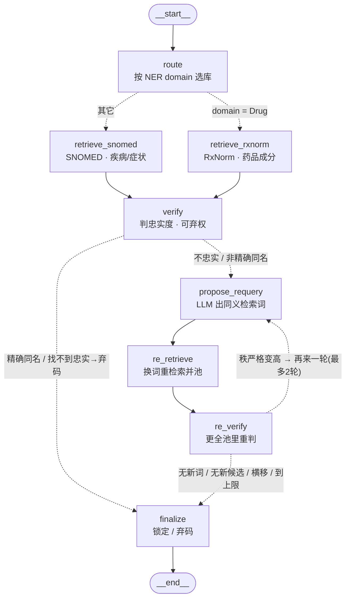

# L3 多源 Agentic RAG · 面试讲稿

> 定位:临床文本标准化后端——把病历缩写(CP、ASA)扩成全称,再映射到标准医学编码。
> L3 这块做的是**多源 agentic 检索**:加第二个知识源 RxNorm,按 NER domain 路由,
> 配 verify 判忠实+弃权 和 一个有界自纠环。
> 全程口径:**确定性优先,agency 只加在挣得到钱的地方;每步 benchmark 卡关、讲清诚实边界。**

---

## 1. 两分钟口述稿(背这段)

我做的是一个临床文本标准化后端:把病历里的缩写(像 CP、ASA)扩成全称,再映射到标准医学编码。L3 这部分做的是**多源 agentic 检索**。

最初只有一个 SNOMED 库,所有词都查它。但 SNOMED 擅长疾病、对药品很弱——库里 aspirin 只有"中毒 / 过敏 / 含某成分的制品",没有干净的成分概念。所以我加了第二个库 **RxNorm**(专门的药品库),并按 **NER 给的 domain 路由**:疾病走 SNOMED、药品走 RxNorm。

我用 **A/B 量化**了它:同一批成分级药名,只用 SNOMED 时 verify **全部弃码**——注意候选其实检索到了(相似度 0.7~0.8),但都不忠实,弃权门正确拒绝把 aspirin 标成"aspirin 中毒";路由到 RxNorm 后 **5/5 全部命中**正确成分编码。所以这个收益是**真覆盖**——补了对的知识源,不是放松了"一直正确"的判定护栏。诚实的边界:我只证明了**成分级纯药名**;复方、商品名、剂型、疾病不在这个结论里。

整条链路里**真正自主的**是两块:**verify** 会给检索结果判忠实度、找不到就**弃权**(宁可不给码也不给错码);以及一个**有界自纠环**——选到不够规范的概念时,让模型改写检索词、重检索、重判,**秩变高才继续、最多两轮、保证终止**。我还做了 **ablation**,诚实说:第二轮在我现有数据上没带来额外收益,所以我把它留作安全余量,而不是吹它。

有两处我**有意没做**:路由我用**确定性的 NER 标签**、没用 LLM——两个库时路由就是个"是不是药"的二分类,NER 又快又免费又可靠,上 LLM 只是加延迟和幻觉;等源多到四五个、路由变成真难题,我才会上模型路由。同理我没让模型去"选动作",因为 action 空间小、固定恢复策略就够;**agency 是有成本的,只该加在决策真难的地方**。

最后,**LangGraph 我没放进生产热路径**:生产是条轻量确定性状态机,LangGraph 只用来把这套控制流画成可读状态图、并用 **parity 测试**保证"图版与生产版行为一致"。我能说清它在这个规模带不来新能力,所以框架待在可视化层——**框架要挣到钱才进热路径**。

---

## 2. 当前 LangGraph 流程图(单个缩写的标准化之旅)

- **蓝色岔路 = L3 路由**(确定性,按 domain 选库)。
- **紫色环 = 有界自纠环**(改写→重检索→重判,秩升才折回,最多 2 轮)。
- 外层"一句话里多个缩写"由编排逐个跑这张图、失败隔离。

---

## 3. 真做的(及为什么)

- **多源路由(RxNorm + SNOMED,按 NER domain)** —— 一个库样样都行不存在;SNOMED 强在疾病、RxNorm 强在成分级药品。实测把药品标准化从 **0/5 → 5/5**。
- **verify = 判忠实 + 弃权** —— coverage 之后唯一的新数据是检索结果,所以 verify 唯一不冗余的位置是"判标准化质量";找不到忠实概念就弃码,**宁可不给码也不给错码**。这是项目真正的 agentic 内核。
- **有界自纠改写环** —— 选到不够规范的概念时,模型改写检索词带回新证据重判;**秩门 + 最多 2 轮 + 多重早停**保证终止、不漂移。带新证据、非同源复判。
- **分层评测 + 诚实量化** —— 主 benchmark 判扩写(0.9595)、concept benchmark 判标准化(PASS 19/19、canonical 17/19);A/B 量化多源、ablation 量化自纠环。

## 4. 有意不做的(及为什么)—— 这是最能体现工程判断的部分

- **没用 LLM 做路由** —— 两个库时路由只是"是不是药"的二分类,NER 标签又快、又免费、又可靠;LLM 做同一个二分类只是加延迟、成本、幻觉。**等源多到三四个、路由成为真决策时才升级。** 而且真要上,也只让模型在"已有的几个源"里**选**(分类),绝不让它自由生成一个我还要去对应、可能对不上的 domain ——**约束动作空间到合法选项**。
- **没让模型"选动作"(reroute / broaden 等)** —— action 空间小,固定恢复策略("弃码→换源→放宽→真弃")就能覆盖且可预测;让模型当调度器只是把确定性换成"慢、可能错、难调"的不确定性。**agency 有成本,只加在决策真难处。**
- **把自纠环留在 max_iter=2 而非吹成多轮** —— ablation 显示第二轮在现有数据上零额外收益;诚实保留为安全余量,不假装它救了很多 case。
- **LangGraph 不进生产热路径** —— 见下。

> 统一口径:**能确定性算的就别问 LLM;框架/agency 要挣到钱才上。** 知道一个技术"什么时候该上、什么时候是表演",比到处套 agentic 更专业。

## 5. LangGraph 在生产里到底带来了什么?(必被问 · 诚实回答)

诚实说:**它没进我的生产热路径,这是个有意的选择。** 生产是一条轻量确定性状态机(`expand_verify_with_retry`)。我用 LangGraph 做两件事:

1. **把已有的 agentic 控制流画成标准、可读的状态图**(沟通 / 维护价值);
2. **parity 测试** —— 同样输入,LangGraph 版和生产版输出逐字段一致,作为"框架版没改变行为"的回归保证。

我没把它放进热路径,因为我**能说清它在这个规模带不来新能力**:框架真正值钱的东西——断点续跑(checkpoint)、中间状态流式、human-in-the-loop 中断、节点级重试、动态扇出(Send)——我这条短链路都用不上。**所以框架待在可视化层。** 这不是"我没用明白框架",而是"我评估过、有意识地把它的职责限定在可视化和回归测试"——**框架要挣到钱才进热路径。**

> 反例自证:V9 曾把逻辑塞进 LangGraph 工作流,后来证明是死重量被整目录删掉;这次我反过来,先把逻辑做成普通函数 + benchmark 测通,框架只做它真正擅长的事(画图、标准语义)。

## 6. 预判追问 & 应答

- **"0/5→5/5 是不是放松了判定才好看?"** —— 不是。SNOMED 那 5 个是 verify **主动弃码**的(候选相似度 0.7~0.8 都检索到了、但不忠实),护栏一直在工作;换 RxNorm 才有正确成分概念可锁。增益是真覆盖,不是松护栏。
- **"你的自纠环实测救了几个 case?"** —— 诚实:现有数据上第二轮零额外收益(ablation 证实),它在一轮内收敛。我保留它作为保证终止的安全结构,并据实报告 ROI,而不是造题证明它有用。
- **"这算 agentic RAG 吗?"** —— 部分算,我不硬吹。真正自主的是 verify 的判忠实+弃权;路由是确定性的(我辩护过为什么);自纠环是带新证据的迭代。我更愿意精确描述每块的自主程度,而不是给整个系统贴标签。
- **"benchmark 会不会过拟合 / 太小?"** —— 主 74 例含 CASI 真实数据、concept 19 例;我清楚它偏小,所以判净收益看"具体哪例翻了 + 每类",不被单例噪声带偏;LLM temp=0 仍有 ±1~2 例噪声地板。
- **"规范化还有什么缺口?"** —— 有:CAD 库里无精确节点只能给忠实父概念、high blood pressure 拿到偏字面的 Increased blood pressure 而非 Hypertensive disorder。我把这些标成 PASS-非-canonical,作为改写/库覆盖的改进余量,而不是藏起来。

---

**一句话收尾**:这套 L3 的价值不在"我堆了多少 agentic 组件",而在"我把多源做出真覆盖、把每个判定放对位置、并诚实划清哪里该上模型、哪里是表演"。
