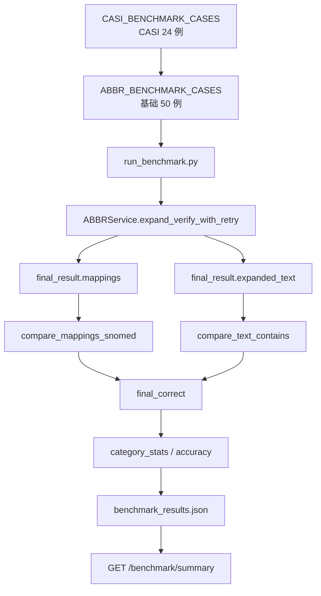

# Benchmark 评估系统 —— run_benchmark.py · V11

> 文件:`backend/evaluation/run_benchmark.py`、`backend/evaluation/run_benchmark_parallel.py`、`backend/evaluation/abbr_benchmark_cases.py`、`backend/evaluation/abbr_benchmark_cases_casi.py`、`backend/evaluation/concept_match.py`
> 衔接:第 16 篇讲的是 FastAPI 如何对外提供服务。本篇讲离线评估系统:它怎么拿同一条主链路做考试、怎么判对错、怎么把结果写成 `benchmark_results.json`,最后再由 `/benchmark/summary` 读取。
> **V11 必看定位**:Benchmark 不是线上接口,而是离线质量闸门。当前主结果是 74 例,71 对,accuracy = 0.9594594594594594。主要失败集中在 `low_context_abbreviation`,也就是上下文太弱时仍过度扩写。

## 核心速记

> 1. **主评估入口**:`python backend/evaluation/run_benchmark.py`,内部创建 `ABBRService()`,逐条调用 `expand_verify_with_retry(text, max_retries=2)`。
> 2. **测试集来源**:`ABBR_BENCHMARK_CASES` 原始 50 例 + `CASI_BENCHMARK_CASES` 24 例,合计 74 例。
> 3. **判分口径**:缩写集合必须完全一致;扩写允许字符串相等或 SNOMED concept_id 等价;再叠加 `expected_text_contains` 检查否定语义保留。
> 4. **输出文件**:`backend/evaluation/benchmark_results.json`,里面有 `total / correct / accuracy / category_stats / results`。
> 次要(trivia):`run_benchmark_parallel.py` 评分逻辑和串行版一致,只是用线程池并发跑 case;每个线程各自懒加载一份 `ABBRService`,速度更快但更吃内存。

## 这一段在解决什么

大白话:**系统改完以后,怎么知道是不是变好了?**

这个项目不是只靠手工试一句:

```text
The patient denies SOB.
```

而是把一批有标准答案的临床缩写句子放在 `evaluation/` 里,每次跑:

```powershell
python backend/evaluation/run_benchmark.py
```

然后系统逐条执行真实主链路:

```text
benchmark case
  ↓
ABBRService.expand_verify_with_retry()
  ↓
得到 predicted_mappings + final_expanded_text
  ↓
compare_mappings_snomed + compare_text_contains
  ↓
统计 accuracy/category_stats
  ↓
写 benchmark_results.json
```

所以 benchmark 的意义是:**它不模拟主链路,而是直接调用主链路。**这让它适合作为改代码后的回归测试。

## 核心1 · Case 从哪里来

主 case 文件:

```python
from evaluation.abbr_benchmark_cases import ABBR_BENCHMARK_CASES
```

`abbr_benchmark_cases.py` 前面定义基础 case,末尾追加 CASI case:

```python
from evaluation.abbr_benchmark_cases_casi import CASI_BENCHMARK_CASES
ABBR_BENCHMARK_CASES = ABBR_BENCHMARK_CASES + CASI_BENCHMARK_CASES
```

当前 `benchmark_results.json` 里显示总数:

```json
{
  "total": 74,
  "correct": 71,
  "accuracy": 0.9594594594594594
}
```

类别分布:

| category | total | correct | 这类在测什么 |
|---|---:|---:|---|
| `single_meaning` | 10 | 10 | 单义缩写,如 SOB/HTN/DM |
| `ambiguous` | 10 | 10 | 词典内多义缩写消歧 |
| `multi_abbreviation` | 10 | 10 | 一句话里多个缩写 |
| `coverage_failed` | 5 | 5 | 应该弃权或不扩写的情况 |
| `low_context_abbreviation` | 5 | 2 | 上下文不足时是否能保守 |
| `negation_preservation` | 10 | 10 | 扩写后不能丢否定语义 |
| `casi_ambiguous` | 18 | 18 | CASI 真实缩写义项的 fallback 消歧 |
| `fallback_should_expand` | 6 | 6 | 词典外但应该扩写的缩写 |

这里很关键:V11 不只是 50 条自造样例,还补了 24 条 CASI-grounded case。`abbr_benchmark_cases_casi.py` 里说明这些 case 基于 CASI 临床缩写义项,用于压测真实世界高歧义缩写和 fallback 路径。

## 核心2 · run_benchmark 的执行顺序

`run_benchmark.py` 的主函数:

```python
def run_benchmark():
    service = ABBRService()
    total = len(ABBR_BENCHMARK_CASES)
    correct = 0
    category_stats = {}
    results = []

    for case in ABBR_BENCHMARK_CASES:
        ...
```

它一开始就创建 `ABBRService()`。这意味着跑 benchmark 时会加载主服务需要的资源:

```text
ABBRService
  ├─ primary/fallback candidate retriever
  ├─ coverage evaluator
  ├─ verifier
  ├─ NER/embedding/Milvus 检索组件
  └─ LLM 客户端
```

每个 case 最多外层重试 3 次:

```python
for _try in range(3):
    try:
        result = service.expand_verify_with_retry(
            text=case["text"],
            max_retries=2
        )
        break
    except Exception as e:
        ...
```

这里有两层“重试”不要混淆:

| 层级 | 在哪里 | 作用 |
|---|---|---|
| 内部 `max_retries=2` | `expand_verify_with_retry` | 主状态机内部反思/换候选重试 |
| 外层 `_try in range(3)` | `run_benchmark.py` | 某条 case 因网络/API 临时异常失败时再跑一次 |

如果 3 次都异常,这个 case 会被记录成:

```python
result = {"final_result": {}, "success": False, "error": str(e)}
```

也就是说 benchmark 不会因为单条异常直接中断整轮,而是把异常变成失败样本进入报告。

## 核心3 · 它从主链路结果里拿什么

主链路返回的 `result` 很大,benchmark 只取几项:

```python
final_result = result.get("final_result", {})
predicted_mappings = final_result.get("mappings", [])
final_expanded_text = final_result.get("expanded_text", "")
```

对应含义:

| 字段 | 来源 | 用途 |
|---|---|---|
| `final_result.mappings` | 主状态机最终成功扩写出的 mapping | 和 gold `expected_mappings` 对比 |
| `final_result.expanded_text` | 确定性替换后的最终文本 | 检查否定语义或指定片段是否保留 |
| `final_result.mapping_states` | 每个缩写状态记录 | 收集 unresolved/错误日志用 |

注意:benchmark 的主 accuracy 评的是“缩写扩写是否对”,不是“最终 SNOMED 标准概念选得是否最好”。V11 虽然在判等时用 SNOMED concept_id 放宽同义写法,但它没有把每个 mapping 的 `chosen_concept` 当成主得分对象。标准化层另有 concept benchmark 和诊断脚本,不能把这两个口径混在一起。

## 核心4 · 判对错:compare_mappings_snomed

`run_benchmark.py` 里真正使用的是:

```python
from evaluation.concept_match import compare_mappings_snomed
```

不是老的 `compare_mappings`。

老函数还在文件里:

```python
def compare_mappings(expected_mappings, predicted_mappings):
    ...
    return expected_set == predicted_set
```

但当前主流程判分调用:

```python
is_correct = compare_mappings_snomed(
    service,
    case["expected_mappings"],
    predicted_mappings
)
```

`compare_mappings_snomed` 的规则:

```text
1. 预测出的缩写集合必须和 gold 缩写集合完全一致
   - 多扩一个:错
   - 少扩一个:错
   - 该弃权没弃:错
   - 该扩写却弃权:错

2. 每个缩写的 expansion 要和 gold 等价
   - 字符串归一化后相等:对
   - 或两者检索到同一个 SNOMED concept_id:对
   - gold 里有 accept 接受集时,命中任意一个可接受写法即可
```

为什么这样设计?

旧的纯字符串判等太硬。例如:

```text
primary care provider
primary care physician
```

在临床语义上可能足够接近,但字符串不相等。V11 既然已经有 SNOMED 检索层,就可以用“是否落到同一概念”来补充判等。

但它也没有放得太松。缩写集合仍然完全一致,这是为了继续抓住这些错误:

```text
系统多扩了 ABC/QRS 这类低上下文缩写
系统漏扩了应该扩的缩写
系统把应弃权的 fallback 强行扩写
```

## 核心5 · 否定语义检查:expected_text_contains

只看 mapping 有时候不够。例如:

```text
The patient denies SOB.
```

如果系统把 SOB 扩成 shortness of breath,但最终句子变成:

```text
The patient has shortness of breath.
```

mapping 可能对,语义却错了,因为否定丢了。

所以 `run_benchmark.py` 还有:

```python
text_check = compare_text_contains(
    final_text=final_expanded_text,
    expected_text_contains=case.get("expected_text_contains")
)
final_correct = is_correct and text_check["correct"]
```

如果 case 配了 `expected_text_contains`,最终文本必须包含指定片段。没有配置时:

```python
{
  "checked": False,
  "correct": True
}
```

也就是默认不额外检查文本片段。

这个机制主要服务 `negation_preservation` 类,用来防止系统“扩写对了,但把原句语气改坏了”。

## 核心6 · 结果怎么统计

每个 case 跑完后会生成一条 result:

```python
results.append({
    "id": case["id"],
    "category": case["category"],
    "text": case["text"],
    "success": result.get("success"),
    "expected_mappings": case["expected_mappings"],
    "predicted_mappings": predicted_mappings,
    "final_expanded_text": final_expanded_text,
    "mapping_correct": is_correct,
    "text_check": text_check,
    "correct": final_correct
})
```

汇总层:

```python
accuracy = correct / total if total > 0 else 0
```

并按 category 累计:

```python
category_stats[category]["total"] += 1
if final_correct:
    category_stats[category]["correct"] += 1
```

最后写入:

```python
output_path = BACKEND_DIR / "evaluation" / "benchmark_results.json"
```

JSON 结构:

```json
{
  "total": 74,
  "correct": 71,
  "accuracy": 0.9594594594594594,
  "category_stats": {
    "single_meaning": {"total": 10, "correct": 10}
  },
  "results": [
    {
      "id": "single_001",
      "category": "single_meaning",
      "text": "...",
      "success": true,
      "expected_mappings": [],
      "predicted_mappings": [],
      "final_expanded_text": "...",
      "mapping_correct": true,
      "text_check": {},
      "correct": true
    }
  ]
}
```

第 16 篇提到的 API:

```http
GET /benchmark/summary
```

不会重新跑 benchmark,只是读取这个 JSON 的摘要字段。

## 当前结果怎么读

当前结果:

```text
Total Cases: 74
Correct: 71
Accuracy: 0.9594594594594594
```

失败 3 条:

| id | category | 问题 |
|---|---|---|
| `coverage_003` | `low_context_abbreviation` | gold 只期望扩 SOB,系统额外把 ABC 扩成 `Airway, Breathing, Circulation` |
| `coverage_005` | `low_context_abbreviation` | gold 期望不扩,系统把 LMN 扩成 `lower motor neuron` |
| `coverage_006` | `low_context_abbreviation` | gold 只期望扩 DM,系统额外把 QRS 扩成 `QRS complex` |

这说明当前系统的大头能力已经稳定:

```text
单义缩写:10/10
多义缩写:10/10
多缩写:10/10
否定保留:10/10
CASI fallback:24/24
```

但仍有一个诚实边界:

```text
低上下文缩写容易过度扩写
```

也就是“候选存在”不等于“当前语境应该扩写”。这个问题和第 11 篇 coverage gate、第 14 篇状态机、第 18 篇错误分析会连起来看。

## 核心7 · 错误日志采集

`run_benchmark.py` 开头有:

```python
os.environ["ERROR_LOG_RUNTIME"] = "0"
```

含义:关闭普通 runtime 自动日志,避免跑 benchmark 时把所有运行时未解析项都当线上错误流量污染。

但 benchmark 自己仍会显式收集两类信息:

```python
collect_unresolved(
    text=case["text"],
    records=final_result.get("mapping_states", []),
    source="benchmark:main",
    gold_abbrs=gold_abbrs,
)
```

以及失败时:

```python
collect_gold_mismatch(
    text=case["text"],
    stage="expansion",
    source="benchmark:main",
    expected=case["expected_mappings"],
    predicted=predicted_mappings,
)
```

这让 benchmark 不只是给一个 accuracy,还能把“系统不知道自己错了”的 gold mismatch 写入错误资产,后续给 `analyze_errors.py` / `error_triage.py` 继续归因。

## 并行版 run_benchmark_parallel.py

并行版文件开头写得很明确:

```text
和 run_benchmark.py 的评分/报告逻辑完全一致,只把执行方式从串行改成并行。
```

核心配置:

```python
MAX_WORKERS = int(os.getenv("BENCH_WORKERS", "2"))
```

每个线程一份 service:

```python
_tls = threading.local()

def get_service():
    svc = getattr(_tls, "svc", None)
    if svc is None:
        svc = ABBRService()
        _tls.svc = svc
    return svc
```

为什么不能所有线程共用一个 `ABBRService`?

因为内部有 HuggingFace pipeline、embedding 模型、Milvus client、LLM 调用,这些组件不保证多线程共享安全。并行版用 thread-local service 换稳定性。

代价也很直接:

```text
worker 越多
  ↓
每个线程各加载一份模型/连接
  ↓
内存压力越大,LLM API 也更容易限流
```

所以并行版适合快速回归,但如果机器内存紧张或结果抖动,应该先跑串行版。

## 和线上 API 的关系

这一篇和第 16 篇是这样的关系:

```text
离线:
python backend/evaluation/run_benchmark.py
  ↓
写 backend/evaluation/benchmark_results.json

线上/前端摘要:
GET /benchmark/summary
  ↓
读取 benchmark_results.json
  ↓
返回 total/correct/accuracy/category_stats
```

所以:

```text
POST /expand/simple     = 真实处理用户文本
GET /benchmark/summary = 展示最近一次离线 benchmark 的摘要
run_benchmark.py       = 真正执行离线评估
```

不要误以为访问 `/benchmark/summary` 会重新跑 74 个 case。它只是读文件。

## 数据流总图



## 面试怎么讲

可以这样说:

> 我没有只靠 demo 样例判断效果,而是建了离线 benchmark。它直接调用生产同一条 `expand_verify_with_retry` 主链路,用 74 条 case 覆盖单义缩写、多义消歧、多缩写、低上下文、否定保留,以及 CASI-grounded 的真实缩写义项。评分时缩写集合必须完全一致,扩写允许字符串一致或落到同一个 SNOMED concept,避免因为同义表达差异误判。当前主 benchmark 是 71/74,失败主要集中在 low-context over-expansion,这也是后续错误分析和保守弃权策略要继续优化的点。

如果面试官追问“这个 accuracy 能不能代表标准化质量”,要诚实补一句:

> 主 benchmark 主要评扩写层,不是完整评价 SNOMED 标准化层。V11 虽然用 SNOMED concept_id 辅助判等,但最终概念选择质量还要靠 concept benchmark、诊断脚本和人工抽查。

## 常见误解

| 误解 | 正确理解 |
|---|---|
| `/benchmark/summary` 会重新跑评估 | 不会,它只读 `benchmark_results.json` |
| accuracy 0.9595 说明所有层都 95.95% | 不对,它主要代表扩写 benchmark 表现 |
| 判分就是字符串完全相等 | 当前主流程用 `compare_mappings_snomed`,支持 accept 集和 concept_id 等价 |
| 并行版更“准” | 不更准,只是更快;评分口径应与串行版一致 |
| 74 例足够代表真实医疗场景 | 不足够,它是回归闸门和阶段性尺子,不是临床级泛化证明 |

## 一句话总结

`run_benchmark.py` 是 V11 的离线考试系统:用 74 条 case 直接跑真实主链路,通过“缩写集合严判 + 扩写语义等价 + 否定文本检查”计算 accuracy,把结果写入 `benchmark_results.json`;当前强项是常规扩写和 CASI fallback 消歧,主要短板是低上下文场景下仍可能过度扩写。
