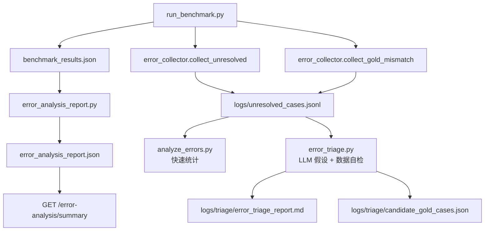

# Error Analysis 错误原因分析系统 —— evaluation/error_analysis_report.py · V11

> 文件:`backend/evaluation/error_analysis_report.py`、`backend/evaluation/error_analysis_report.json`、`backend/services/error_collector.py`、`backend/evaluation/analyze_errors.py`、`backend/evaluation/error_triage.py`
> 衔接:第 17 篇讲 benchmark 如何把 74 例跑出 `benchmark_results.json`。本篇继续往下看:系统怎么把“哪些 case 错了”整理成“为什么错、错在哪一类、下一步该看哪里”。
> **V11 必看定位**:这里有两条线。第一条是稳定的结构化报告:`error_analysis_report.py` 读取 `benchmark_results.json`,输出 `error_analysis_report.json`。第二条是更实验性的错误资产线:`error_collector.py` 把运行时/benchmark 的异常记录进 JSONL,再由 `analyze_errors.py` 和 `error_triage.py` 做聚合与 LLM 辅助归因。

## 核心速记

> 1. **结构化报告入口**:`python backend/evaluation/error_analysis_report.py`,读取 `benchmark_results.json`,筛出 `correct=false` 的失败 case。
> 2. **自动分类**:`classify_error_type()` 产出简短 error_type;`classify_taxonomy()` 产出更可读的 major/sub type。
> 3. **当前结论**:当前 74 例 benchmark 失败 3 例,全是 `low_context_over_expansion`,taxonomy 全是 `Over Expansion / Extra Abbreviation Expansion`。
> 4. **API 只读摘要**:`GET /error-analysis/summary` 读取 `error_analysis_report.json`,不会重新跑错误分析。
> 次要(trivia):`error_triage.py` 会让 LLM 先提根因假设,再用 Milvus/词典做数据自检,最后再让 LLM 写中文摘要;它是离线诊断工具,不自动改代码或 gold。

## 这一段在解决什么

Benchmark 给你的第一层答案是:

```text
74 条里对了 71 条,错了 3 条。
```

但工程上真正需要的是第二层答案:

```text
错的是漏扩?
错的是多扩?
错的是选错候选?
错的是扩写后语义变了?
错的是标准化时没有给码?
```

`error_analysis_report.py` 做的事情就是把第 17 篇的结果文件继续加工:

```text
benchmark_results.json
  ↓
筛 correct=false 的 failed cases
  ↓
classify_error_type
  ↓
classify_taxonomy
  ↓
error_analysis_report.json
  ↓
GET /error-analysis/summary 只读展示
```

所以它不是重新跑模型,也不是重新调用 Milvus/LLM。它只是读已经生成的 benchmark 结果,做规则归因和汇总。

## 核心1 · 输入文件:benchmark_results.json

入口文件固定:

```python
CURRENT_DIR = Path(__file__).resolve().parent
RESULT_PATH = CURRENT_DIR / "benchmark_results.json"
OUTPUT_PATH = CURRENT_DIR / "error_analysis_report.json"
```

主函数第一步:

```python
with open(RESULT_PATH, "r", encoding="utf-8") as f:
    benchmark_data = json.load(f)
```

然后筛失败:

```python
failed_cases = [
    result for result in benchmark_data["results"]
    if not result["correct"]
]
```

这意味着错误分析完全依赖第 17 篇生成的 `benchmark_results.json`。如果 benchmark 没重跑,错误分析看到的也是上一次 benchmark 的旧结果。

## 核心2 · error_type:先给一个短标签

`classify_error_type(result)` 是第一层粗分类。

代码逻辑:

```python
category = result.get("category")

if category == "low_context_abbreviation":
    return "low_context_over_expansion"
```

只要 benchmark category 是 `low_context_abbreviation`,就直接归到:

```text
low_context_over_expansion
```

后面才是通用判断:

```python
expected = result.get("expected_mappings", [])
predicted = result.get("predicted_mappings", [])

if expected and predicted:
    return "wrong_expansion"

if expected and not predicted:
    return "missing_expansion"

if not expected and predicted:
    return "over_expansion"

return "unknown_error"
```

这层标签适合做数量统计:

```json
"error_type_summary": {
  "low_context_over_expansion": 3
}
```

但它比较粗,不能告诉你具体“多扩了哪个缩写”。所以还有 taxonomy。

## 核心3 · taxonomy:给人看的错误分类

`classify_taxonomy(result)` 会把 expected/predicted mapping 归一化成集合:

```python
expected_set = normalize_mapping_set(expected_mappings)
predicted_set = normalize_mapping_set(predicted_mappings)

expected_abbrs = {abbr for abbr, _ in expected_set}
predicted_abbrs = {abbr for abbr, _ in predicted_set}

extra_abbrs = predicted_abbrs - expected_abbrs
missing_abbrs = expected_abbrs - predicted_abbrs
```

它最先看“是不是多扩了缩写”:

```python
if extra_abbrs:
    return {
        "major_type": "Over Expansion",
        "sub_type": "Extra Abbreviation Expansion",
        "reason": "...",
        "extra_abbreviations": sorted(list(extra_abbrs)),
        "missing_abbreviations": []
    }
```

再看“是不是漏扩”:

```python
if missing_abbrs:
    return {
        "major_type": "Under Expansion",
        "sub_type": "Missing Abbreviation Expansion",
        ...
    }
```

再看“缩写集合一样,但 expansion 不一样”:

```python
if expected_abbrs == predicted_abbrs and expected_set != predicted_set:
    return {
        "major_type": "Wrong Disambiguation",
        "sub_type": "Wrong Expansion Selection",
        ...
    }
```

最后看“mapping 对了但文本语义检查没过”:

```python
if text_check.get("checked") and not text_check.get("correct"):
    return {
        "major_type": "Semantic Preservation Failure",
        "sub_type": "Expanded Text Meaning Changed",
        ...
    }
```

这套 taxonomy 的作用是把 benchmark 失败翻译成工程语言:

| major_type | sub_type | 大白话 |
|---|---|---|
| `Over Expansion` | `Extra Abbreviation Expansion` | 系统多扩了 gold 没要求扩的缩写 |
| `Under Expansion` | `Missing Abbreviation Expansion` | 系统漏掉了应该扩写的缩写 |
| `Wrong Disambiguation` | `Wrong Expansion Selection` | 找到了缩写,但选错 expansion |
| `Semantic Preservation Failure` | `Expanded Text Meaning Changed` | expansion 对,但最终句义变了 |
| `Unknown` | `Needs Manual Review` | 当前规则不能自动判断 |

## 当前报告结果

当前 `error_analysis_report.json` 的摘要:

```json
{
  "benchmark_summary": {
    "total_cases": 74,
    "correct": 71,
    "accuracy": 0.9594594594594594
  },
  "failed_summary": {
    "failed_count": 3,
    "error_type_summary": {
      "low_context_over_expansion": 3
    },
    "taxonomy_summary": {
      "Over Expansion": {
        "Extra Abbreviation Expansion": 3
      }
    }
  }
}
```

三条失败明细:

| id | gold 期望 | 系统预测 | taxonomy |
|---|---|---|---|
| `coverage_003` | 只扩 `SOB` | 额外扩了 `ABC` | `Over Expansion / Extra Abbreviation Expansion` |
| `coverage_005` | 不扩任何缩写 | 扩了 `LMN` | `Over Expansion / Extra Abbreviation Expansion` |
| `coverage_006` | 只扩 `DM` | 额外扩了 `QRS` | `Over Expansion / Extra Abbreviation Expansion` |

所以当前 V11 的错误画像很集中:

```text
不是漏扩
不是否定语义丢失
不是常规多义消歧失败
而是低上下文时仍然过度扩写
```

这和第 11 篇 coverage gate、第 14 篇 mapping 粒度状态机能接起来看:系统已经能扩很多该扩的词,但在“上下文支持不足时保守弃权”这件事上仍有继续优化空间。

## 核心4 · 输出文件:error_analysis_report.json

最终写出的 report 结构:

```python
report = {
    "benchmark_summary": {
        "total_cases": benchmark_data["total"],
        "correct": benchmark_data["correct"],
        "accuracy": benchmark_data["accuracy"],
        "category_stats": benchmark_data["category_stats"]
    },
    "failed_summary": {
        "failed_count": len(failed_cases),
        "error_type_summary": error_type_summary,
        "taxonomy_summary": taxonomy_summary
    },
    "failed_cases": failed_case_details
}
```

每条 failed case 会保留:

```python
{
    "id": result["id"],
    "category": result["category"],
    "text": result["text"],
    "expected_mappings": result["expected_mappings"],
    "predicted_mappings": result["predicted_mappings"],
    "final_expanded_text": result["final_expanded_text"],
    "system_success": result["success"],
    "mapping_correct": result["mapping_correct"],
    "text_check": result["text_check"],
    "error_type": error_type,
    "taxonomy": taxonomy
}
```

这使它比 benchmark summary 更适合排查:

```text
benchmark_results.json       = 全部 74 条逐例成绩单
error_analysis_report.json   = 只聚焦失败样本 + 自动归因
```

## 核心5 · API 怎么读取错误分析

第 16 篇提到的接口:

```http
GET /error-analysis/summary
```

在 `api/main.py` 里只是读:

```python
error_path = BACKEND_DIR / "evaluation" / "error_analysis_report.json"
```

然后返回:

```python
{
    "benchmark_summary": data.get("benchmark_summary", {}),
    "failed_summary": data.get("failed_summary", {}),
    "failed_cases": data.get("failed_cases", [])
}
```

所以关系是:

```text
python backend/evaluation/error_analysis_report.py
  ↓
生成 error_analysis_report.json
  ↓
GET /error-analysis/summary
  ↓
读取并展示这个 JSON
```

接口不会自动重跑 benchmark,也不会自动重跑错误分析。

## 第二条线:error_collector.py

除了结构化报告,V11 还有一个更“长期资产化”的错误收集器:

```text
backend/services/error_collector.py
```

默认日志位置:

```python
DEFAULT_LOG = Path(__file__).resolve().parents[1] / "logs" / "unresolved_cases.jsonl"
```

它有两个主要入口:

```python
collect_unresolved(...)
collect_gold_mismatch(...)
```

### collect_unresolved

用于收集主状态机里每个 mapping 的 failure:

```python
for r in records or []:
    f = r.get("failure")
    if not f:
        continue
    rows.append({
        "ts": _now(),
        "text": text,
        "source": source,
        "failure_type": f.get("type"),
        "stage": f.get("stage"),
        "abbreviation": r.get("abbreviation"),
        "expansion": r.get("expansion"),
        "reason": f.get("reason"),
        "evidence": f.get("evidence"),
        "expected": _expected_for(...)
    })
```

它记录的是“系统自己知道哪里没做成”的 known-unknown,例如:

```text
ABBR_NOT_EXPANDED
COVERAGE_FAILED
CODE_WITHHELD
```

`expected` 字段用于区分:

| expected | 含义 |
|---|---|
| `true` | gold 也认为这里不该扩/不该给,这是预期内 |
| `false` | gold 认为系统错了 |
| `null` | 没有 gold 或无法判断,需要后续分析 |

### collect_gold_mismatch

用于收集 benchmark 失败时的 unknown-unknown:

```python
collect_gold_mismatch(
    text=case["text"],
    stage="expansion",
    source="benchmark:main",
    expected=case["expected_mappings"],
    predicted=predicted_mappings,
)
```

它记录的是:

```text
系统可能以为自己成功了,但和 gold 不一致
```

写入行里:

```json
{
  "failure_type": "GOLD_MISMATCH",
  "stage": "expansion",
  "reason": "predicted != gold",
  "evidence": {
    "expected": [],
    "predicted": []
  },
  "expected": false
}
```

这条线的价值是把一次 benchmark 的失败沉淀成可持续分析的日志,而不是只看控制台输出。

## analyze_errors.py:快速统计 JSONL

`analyze_errors.py` 是轻量统计脚本:

```powershell
python backend/evaluation/analyze_errors.py
```

它读取:

```python
LOG = backend/logs/unresolved_cases.jsonl
```

默认会隐藏 `expected is True` 的记录:

```python
expected_ok = [r for r in raw if r.get("expected") is True]
recs = raw if show_all else [r for r in raw if r.get("expected") is not True]
```

也就是说它默认只看“不是预期内正确弃权”的信号。如果想看全量:

```powershell
python backend/evaluation/analyze_errors.py --all
```

它输出几类分布:

```text
By failure_type
Top abbreviations
Top withheld expansions
By source
By stage
One sample per failure_type
```

这适合快速回答:

```text
最近最多的是 coverage 失败,还是标准化弃码?
集中在哪些 abbreviation?
来自 runtime,还是 benchmark?
```

## error_triage.py:LLM 辅助归因,但带数据自检

`error_triage.py` 是更复杂的离线诊断工具。文件顶部说明它的流程:

```text
LLM 提假设 → 数据自检 → LLM 据自检写执行摘要
```

它读取同一个 JSONL:

```python
LOG = BACKEND_DIR / "logs" / "unresolved_cases.jsonl"
```

输出:

```python
REPORT = OUT_DIR / "error_triage_report.md"
CANDIDATE_GOLD = OUT_DIR / "candidate_gold_cases.json"
```

它会按:

```python
(failure_type, stage)
```

聚类,例如:

```text
CODE_WITHHELD / standardization
GOLD_MISMATCH / expansion
```

然后让 LLM 对每簇提出 1-3 个根因假设,并标注可能的修改杠杆:

```python
LEVERS = "dictionary | lib_coverage | retrieval | verify_rubric | gold_labeling | other"
```

关键点是它不是“让 LLM 说了算”。LLM 提出的 `checkable_claims` 会被真实数据自检:

```python
verify_claim(retriever, claim)
```

可检查两类:

| claim kind | 怎么检查 |
|---|---|
| `lib_concept` | 用 `MedicalRetriever` 查 Milvus 概念库 |
| `dict_abbr` | 查 `ABBR_CANDIDATES` 缩写词典 |

如果 LLM 说“库里没有 X”,但 Milvus 查到高分结果,报告会把这个假设标成:

```text
数据矛盾
```

并抑制相应候选 gold 草稿:

```python
elif drafts and contradicted:
    detail_lines.append("- 候选 gold 用例草稿:已抑制(假设被数据打脸)")
```

这个设计很重要:LLM 只做“提假设”和“写摘要”,真伪尽量交给可检查的数据。

## 当前 triage 报告怎么看

当前 `backend/logs/triage/error_triage_report.md` 显示:

```text
全量 22 条
隐藏 11 条预期内记录
分析 11 条、2 个簇
```

两个簇:

```text
CODE_WITHHELD / standardization
GOLD_MISMATCH / expansion
```

它给出的一个可跟进方向是:

```text
检索/排序可能把“更精确的标准概念”排在了修饰性概念后面,
例如 heart rate 返回 Heart rate response。
```

同时它也排除了一类假信号:

```text
“库里完全没有对应概念”这个说法不总成立,
因为部分 expansion 在库里能查到高分近似概念。
```

这和主报告不冲突:

```text
error_analysis_report.json 说:当前 benchmark 失败主要是扩写层多扩
error_triage_report.md 说:错误日志里还有标准化弃码/检索排序相关线索
```

前者是 benchmark 失败报告,后者是更宽的错误资产诊断。

## 两套错误分析的区别

| 维度 | error_analysis_report.py | error_collector/analyze_errors/error_triage |
|---|---|---|
| 输入 | `benchmark_results.json` | `logs/unresolved_cases.jsonl` |
| 粒度 | 失败 case | failure record |
| 是否调用 LLM | 不调用 | `error_triage.py` 会调用 |
| 是否查 Milvus | 不查 | `error_triage.py` 会查 |
| 输出 | `error_analysis_report.json` | 控制台统计、`error_triage_report.md`、候选 gold 草稿 |
| 适合回答 | 这轮 benchmark 错在哪类 | 长期错误日志里有哪些模式 |

一句话:

```text
error_analysis_report.py 是稳定的考试错题本。
error_triage.py 是带自检的离线根因侦察工具。
```

## 数据流总图



## 面试怎么讲

可以这样说:

> 我把评估后处理也做成了闭环。Benchmark 先产出逐例结果,Error Analysis 再读取失败 case,自动分成 over-expansion、under-expansion、wrong disambiguation、semantic preservation failure 等类型。当前 V11 的失败集中在 low-context over-expansion,说明主链路在常规缩写和 CASI fallback 上比较稳,但上下文不足时还需要更保守的弃权策略。除此之外,我还把运行时和 benchmark 的 failure 记录成 JSONL,用 `analyze_errors.py` 做分布统计,再用一个离线 triage 脚本让 LLM 提根因假设,但必须经过 Milvus/词典自检,避免 LLM 直接拍脑袋定性。

如果追问“错误分析会不会自动改代码或改 gold”,要明确:

> 不会。它只生成报告和候选线索。修代码、改 benchmark gold 都需要人工确认,再重新跑 benchmark 裁决。

## 常见误解

| 误解 | 正确理解 |
|---|---|
| Error Analysis 会重新跑模型 | 不会,`error_analysis_report.py` 只读 benchmark JSON |
| `/error-analysis/summary` 会生成新报告 | 不会,它只读 `error_analysis_report.json` |
| 当前失败说明系统整体不稳定 | 不准确,失败集中在低上下文过度扩写,常规类目多数是满分 |
| LLM triage 的结论可以直接当事实 | 不可以,它只是线索;脚本有数据自检,但仍需人工 + benchmark 裁决 |
| `unresolved_cases.jsonl` 全是错误 | 不一定,里面有 `expected=true` 的预期内弃权记录 |

## 一句话总结

`error_analysis_report.py` 把 benchmark 的失败样本整理成可读的错误类型报告;当前 V11 的主要问题是 `low_context_over_expansion`。而 `error_collector + analyze_errors + error_triage` 则把一次次运行中的 failure 沉淀成 JSONL 错误资产,用于后续聚类、归因和构造新的 benchmark 改进方向。
