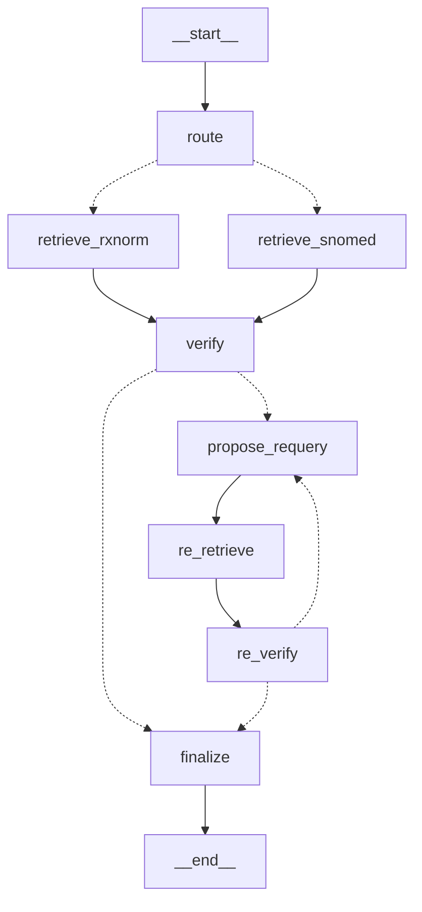

# LangGraph 实验可视化 —— graph/standardization_graph.py · V11

> 文件:`backend/graph/standardization_graph.py`、`backend/graph/render_graph.py`、`项目梳理/L3_pipeline.mmd`
> 衔接:第 14/15 篇讲生产主状态机和多源反思;第 19 篇讲 V10 旧实验为什么被删。本篇讲 V11 重新引入的 LangGraph:它不是生产热路径,而是把“单个缩写 mapping 的标准化旅程”显式画成图,并用 parity 测试证明图包装和生产结果一致。
> **V11 必看定位**:生产入口仍是 `ABBRService.expand_verify_with_retry()` 和 `POST /expand/simple`。`StandardizationGraph` 不被 FastAPI 调用,不替代主链路;它的价值是可视化、备用入口、parity 回归测试。

## 核心速记

> 1. **图的粒度**:不是整句主流程,而是单个 mapping 的标准化流程:`route -> retrieve_snomed/rxnorm -> verify -> propose_requery -> re_retrieve -> re_verify -> finalize`。
> 2. **不进热路径**:`api/main.py` 不调用 graph;线上请求仍走 `ABBRService.expand_verify_with_retry()`。
> 3. **节点只调现有服务**:图节点复用 `ABBRService._route_source()`、`retriever.retrieve()`、`verifier.verify_mappings()`、`verifier.propose_requeries()` 等现有能力。
> 4. **有 parity 验证**:`render_graph.py` 同时跑生产函数和 graph 包装,比较最终文本、success、mapping_states、chosen concept_id。
> 次要(trivia):`项目梳理/L3_pipeline.mmd` 是渲染出的 Mermaid 图,不是业务源码。

## 这一段在解决什么

V11 生产链路已经收敛成一个清晰的函数:

```python
ABBRService.expand_verify_with_retry(text)
```

它能跑 benchmark,也能被 FastAPI 调用。

那为什么还要 LangGraph?

因为这段逻辑虽然能跑,但有几个控制流不容易一眼看清:

```text
Drug 到底什么时候走 RxNorm?
非 Drug 什么时候走 SNOMED?
verify 后为什么还会 propose_requery?
反思最多循环几次?
什么时候 finalize?
```

`standardization_graph.py` 把这段“单个 mapping 的标准化旅程”画成显式状态图:

```text
route
  ├─ Drug → retrieve_rxnorm
  └─ else → retrieve_snomed
      ↓
verify
  ├─ finalize
  └─ propose_requery → re_retrieve → re_verify
                         ├─ finalize
                         └─ propose_requery ...
```

它的目标不是让系统更“能干”,而是让已有控制流更可读、更可验证。

## 和 V9 LangGraph 的关键区别

旧 V9 文档里的 LangGraph 是:

```text
expand -> standardize -> verify -> reflect
```

它想把整条主流程塞进图里,并和函数版并存。

V11 的做法变了:

| 维度 | V9 旧图 | V11 当前图 |
|---|---|---|
| 粒度 | 整句流程 | 单个 mapping 的标准化流程 |
| 是否生产热路径 | 曾经想替代/靠近主流程 | 明确不进热路径 |
| 核心展示 | expand/standardize/verify/reflect | route、双源检索、verify、反思重检索 |
| 与主链路关系 | 两套逻辑并存,维护成本高 | 图包装复用 service,用 parity 对齐生产输出 |
| 工程态度 | 框架化主流程 | 函数先行,框架只做可视化和回归 |

这个转变很重要:

```text
V11 不是为了贴 LangGraph 标签而改生产链路。
它先把普通函数主链路做稳,再用 LangGraph 画出关键控制流。
```

## 核心1 · MappingState:图里的共享状态

`standardization_graph.py` 定义:

```python
class MappingState(TypedDict, total=False):
    text: str
    expanded_text: str
    record: dict
    reflect_iter: int
    result: dict
```

字段含义:

| 字段 | 含义 |
|---|---|
| `text` | 原始输入文本 |
| `expanded_text` | 已做确定性替换后的文本 |
| `record` | 当前这个缩写 mapping 的完整状态 |
| `reflect_iter` | 当前反思轮数 |
| `result` | finalize 后输出的 record |

这里最核心的是 `record`。

它沿用了第 14 篇状态机的 record 形状:

```python
{
    "abbreviation": "...",
    "source": "...",
    "candidates": [...],
    "coverage": {...},
    "expansion": "...",
    "label": "...",
    "domain": "...",
    "std_cache": None,
    "std_concept": None,
    "status": "PENDING",
    "failure": None,
}
```

Graph 节点不是传一堆函数参数,而是不断读写这个 state:

```text
route 写 source
retrieve 写 std_cache
verify 写 std_concept/status/failure
requery 写 _requeries/_tried/_rank_before
finalize 写 result
```

这就是 LangGraph 的基本价值:把隐式局部变量变成显式状态流。

## 核心2 · route:显式多源路由

第一个节点:

```python
def n_route(self, state):
    r = state["record"]
    r["source"] = self.svc._route_source(r.get("domain"))
    r.setdefault("_tried", {r["expansion"].strip().lower()})
    r["_reflect_stop"] = False
    return {"record": r}
```

它做三件事:

1. 根据 `domain` 写入 `source`;
2. 初始化 `_tried`,避免反思时重复检索原词;
3. 初始化 `_reflect_stop=False`。

真正的分支在 `_build()` 里:

```python
g.add_conditional_edges(
    "route",
    lambda s: (
        "retrieve_rxnorm"
        if s["record"].get("domain") == "Drug"
        else "retrieve_snomed"
    ),
    {
        "retrieve_rxnorm": "retrieve_rxnorm",
        "retrieve_snomed": "retrieve_snomed",
    },
)
```

也就是说图上能清楚看到:

```text
domain == Drug  → retrieve_rxnorm
其它             → retrieve_snomed
```

这正是 L3 多源路由的可视化落点。

## 核心3 · retrieve_snomed / retrieve_rxnorm

两个检索节点共用内部函数 `_retrieve(r, source)`:

```python
docs = self.svc.retriever.retrieve(
    query=r["expansion"],
    top_k=10,
    domain_filter=None,
    domain_boost=r.get("domain"),
    score_threshold=0.6,
    source=source,
)
```

区别只在 `source`:

```python
def n_retrieve_snomed(self, state):
    self._retrieve(state["record"], "snomed")

def n_retrieve_rxnorm(self, state):
    self._retrieve(state["record"], "rxnorm")
```

检索结果会被压成标准候选列表:

```python
r["std_cache"] = [
    {
        "concept_id": ...,
        "concept_name": ...,
        "domain_id": ...,
        "concept_code": ...,
        "score": ...,
        "rerank_score": ...,
    }
    for d in docs[:10]
]
```

这和生产链路一致:graph 不自己查 Milvus,仍通过 `MedicalRetriever` 走同一套检索/重排逻辑。

## 核心4 · verify:标准概念忠实性判定

`n_verify()` 调:

```python
verification = svc.verifier.verify_mappings(
    original_text=text,
    expanded_text=expanded,
    mapping_standardizations=[{
        "abbreviation": r["abbreviation"],
        "expansion": r["expansion"],
        "candidates": r["std_cache"],
    }],
)
```

注意:这里是逐 mapping 调用 verifier,而生产主链路里可能是批量 mapping 调用。

文件顶部已经诚实说明:

```text
verify 逐 mapping 调用,与生产批量调用方式不同 → 结果级一致,非逐字节等价。
```

判定逻辑:

```python
faithful = bool(v and v.get("standardization_faithful") is True)
valid = faithful and chosen_index 合法
```

如果 valid:

```python
r["std_concept"] = r["std_cache"][ci]
r["status"], r["failure"] = "CODED", None
```

如果没有忠实概念:

```python
r["status"] = "WITHHELD"
r["failure"] = {
    "type": "CODE_WITHHELD",
    "stage": "standardization",
    "reason": ...,
    "evidence": {
        "retrieved_top": [...]
    },
}
```

这和 V11 的安全策略一致:

```text
宁可 WITHHELD,也不强行给错标准码。
```

## 核心5 · 反思入口:_enter_reflect

verify 后是否进入反思,由 `_enter_reflect()` 决定:

```python
def _enter_reflect(self, state):
    r = state["record"]
    if state.get("reflect_iter", 0) >= self.max_reflect_iter:
        return "finalize"
    if r.get("_reflect_stop"):
        return "finalize"
    return "propose_requery" if _reflectable(r) else "finalize"
```

默认:

```python
max_reflect_iter = 2
```

`_reflectable(r)` 定义:

```python
return r.get("status") in ("CODED", "WITHHELD") and not _is_exact(r)
```

含义:

```text
只有已经 CODED/WITHHELD,且当前标准概念不是 expansion 精确同名时,才考虑反思。
```

如果已经精确同名:

```text
expansion = "chest pain"
chosen concept_name = "Chest pain"
```

就不反思。

## 核心6 · propose_requery:让 verifier 只提检索词

`n_propose_requery()` 做的是“提出新搜索词”,不是直接选概念:

```python
requeries = svc.verifier.propose_requeries(
    r["expansion"],
    chosen_name,
    seen
) or []
```

它还记录当前质量秩:

```python
r["_rank_before"] = svc._std_rank(r)
```

并过滤掉已经试过的词:

```python
tried = r.setdefault("_tried", {r["expansion"].strip().lower()})
new_terms = [q for q in requeries if q.strip().lower() not in tried]
```

如果没有新词:

```python
r["_reflect_stop"] = True
```

否则:

```python
r["_requeries"] = new_terms
reflect_iter += 1
```

这体现了 V11 对 LLM 的约束:

```text
LLM 不能直接创造最终标准概念。
LLM 只能提出新的检索词。
最终概念仍必须来自 Milvus 检索候选,再由 verifier 复判。
```

## 核心7 · re_retrieve / re_verify:反思后重检索复判

`n_re_retrieve()` 会对每个 requery 再检索:

```python
docs = svc.retriever.retrieve(
    query=rq,
    top_k=10,
    domain_filter=None,
    domain_boost=r.get("domain"),
    score_threshold=0.6,
    source=svc._route_source(r.get("domain")),
)
```

然后把新旧候选按 `concept_id` 合并:

```python
pool = {c["concept_id"]: c for c in r["std_cache"]}
```

候选池扩大后保留前 15 个:

```python
new_cands = sorted(..., key=lambda c: float(c.get("score") or 0), reverse=True)[:15]
```

如果候选池没有变大:

```python
r["_reflect_stop"] = True
```

`n_re_verify()` 再对 `new_cands` 做一次 verifier:

```python
verification = svc.verifier.verify_mappings(... candidates=new_cands ...)
```

如果选出 faithful concept,再进入采纳规则。

这里有一个保守点:

```python
if refined.get("concept_name", "").strip().lower() in requery_names:
```

也就是说,反思采纳要求选中的 concept_name 和 requery phrase 匹配。这能防漂移,但也可能错过“忠实但不同名”的候选。

采纳分两类:

```text
1. 横移:质量秩没有变好,只在首轮采纳,之后停止;
2. 变好:质量秩严格变高,采纳并允许继续。
```

如果不可采纳:

```python
r["_reflect_stop"] = True
```

## 核心8 · finalize 和 run:外层拼回整句

图本身处理单个 mapping:

```python
def n_finalize(self, state):
    return {"result": state["record"]}
```

但 `StandardizationGraph.run(text)` 会负责整句外层编排:

1. 调 `svc._get_abbreviation_candidates(text)` 找所有缩写;
2. 为每个缩写建立 record;
3. 用 `svc._build_expanded_text_deterministic(text, visible)` 构造 expanded text;
4. 对每个 `PENDING` record 调 `self.app.invoke(...)`;
5. 拼回 `final_result`。

最终返回形状:

```python
{
    "original_text": text,
    "final_expanded_text": expanded,
    "success": success,
    "final_result": {
        "expanded_text": expanded,
        "mappings": [...],
        "mapping_standardizations": [...],
        "mapping_states": [...],
    },
}
```

这个形状是为了和生产 `expand_verify_with_retry()` 的关键输出对齐,方便 parity 比较。

## render_graph.py 做什么

`render_graph.py` 有两个职责:

### 1. 生成 Mermaid 图

```python
mmd = g.mermaid()
out = BACKEND_DIR.parent / "项目梳理" / "L3_pipeline.mmd"
out.write_text(mmd, encoding="utf-8")
```

当前 `L3_pipeline.mmd` 的核心节点:

```text
route
retrieve_snomed
retrieve_rxnorm
verify
propose_requery
re_retrieve
re_verify
finalize
```

### 2. 做 graph vs production parity

样例:

```python
SAMPLES = [
    "The patient has CP and DM.",
    "The patient took ASA for chest pain.",
    "Patient reports SOB.",
    "zzz qqq.",
]
```

比较签名:

```python
def _sig(res):
    return (
        res.get("final_expanded_text"),
        res.get("success"),
        states,
        stds,
    )
```

它比较:

| 比较项 | 含义 |
|---|---|
| `final_expanded_text` | 最终扩写文本 |
| `success` | 整体成功标记 |
| `mapping_states` | 每个缩写的 abbreviation/expansion/status |
| `mapping_standardizations` | 每个 mapping 的 chosen `concept_id` |

输出会显示:

```text
=== parity: graph vs expand_verify_with_retry ===
[PASS] ...
PARITY: ALL PASS
```

这就是 graph 包装“不改变行为”的证据。

## 当前 Mermaid 图

当前渲染文件 `项目梳理/L3_pipeline.mmd` 的结构:



这个图的重点不是“节点很多”,而是两个 V11 关键控制流被画出来了:

```text
1. Drug / 非 Drug 的多源路由岔路;
2. verify 后的有界反思重检索回环。
```

## 与 FastAPI / Benchmark 的关系

明确关系:

```text
POST /expand/simple
  ↓
ABBRService.expand_verify_with_retry()
  ↓
生产主链路
```

而 graph 是:

```text
python backend/graph/render_graph.py
  ↓
StandardizationGraph.run()
  ↓
可视化 + parity
```

FastAPI 不调用:

```python
from graph.standardization_graph import StandardizationGraph
```

Benchmark 主脚本也不调用 graph:

```python
service.expand_verify_with_retry(...)
```

所以:

```text
改 graph 不应该改变线上行为;
改生产主链路后,应该用 render_graph.py 检查 graph 是否还对齐。
```

## 诚实边界

这部分面试时要讲清楚,反而加分。

| 边界 | 说明 |
|---|---|
| 不进生产热路径 | 它不是线上 orchestrator,只是可视化/备用入口 |
| 粒度是单 mapping | 外层多 mapping 编排仍在 `run()` 包装里 |
| 逐 mapping verify | 和生产批量 verify 不是逐字节等价,只做结果级 parity |
| 样例 parity 不等于全量证明 | `render_graph.py` 当前只测 4 个样例 |
| 图化不等于能力提升 | 真能力来自候选召回、检索、verifier、反思策略 |
| 依赖环境 | 运行 parity 需要 Milvus、LLM key、langgraph 可用 |

这就是“框架待在它有价值的位置”:

```text
它负责让流程可见、可对齐。
它不负责给项目凭空增加准确率。
```

## 为什么这样设计更健康

V9 的经验是:

```text
先把逻辑塞进 LangGraph,容易形成两套主流程。
```

V11 的设计顺序是:

```text
1. 先把普通函数主链路做稳;
2. benchmark 确认主链路效果;
3. 再用 LangGraph 复刻关键控制流;
4. 用 parity 防止图包装偏离生产。
```

这比“为框架而框架”稳。

可以理解成:

```text
ABBRService = 真正发动机
StandardizationGraph = 透明外壳 + 流程图 + 对齐测试
```

## 面试怎么讲

可以这样说:

> V11 里我没有把 LangGraph 放进生产热路径。生产还是 `expand_verify_with_retry` 这个轻量状态机,因为它更直接、更容易 benchmark。LangGraph 我用在可视化和 parity 上:把单个 mapping 的标准化过程画成 `route -> retrieve_rxnorm/retrieve_snomed -> verify -> propose_requery -> re_retrieve -> re_verify -> finalize`,这样 Drug 到 RxNorm、非 Drug 到 SNOMED,以及反思重检索回环都很清楚。`render_graph.py` 会同时跑 graph 和生产函数,比较最终文本、状态和 concept_id,确保图包装没有改行为。

如果被问“那 LangGraph 给生产带来了什么”,可以直接说:

> 它没有进生产热路径,这是有意选择。这个规模下 LangGraph 的 checkpoint、流式、人审、多 agent 编排还没真正挣到成本;我让它做它当前最值钱的事:可视化复杂控制流,并作为 parity 回归测试。核心能力仍在 retrieval、verifier 和状态机本身。

## 常见误解

| 误解 | 正确理解 |
|---|---|
| V11 线上接口走 LangGraph | 不走,线上接口走 `ABBRService.expand_verify_with_retry()` |
| LangGraph 是为了提升 accuracy | 不是,主要是可视化和 parity |
| graph 里重写了一套检索/verify | 没有,节点调用现有 `svc.retriever` 和 `svc.verifier` |
| Mermaid 文件是核心代码 | 不是,它是渲染产物 |
| parity ALL PASS 代表全量无差异 | 不代表,只是样例级回归检查 |

## 一句话总结

`backend/graph/standardization_graph.py` 是 V11 的 LangGraph 可视化包装:它把单个 mapping 的多源路由、标准概念检索、verifier 判定和有界反思重检索画成显式状态图;生产热路径仍是 `ABBRService.expand_verify_with_retry()`。`render_graph.py` 负责生成 `L3_pipeline.mmd` 并做 graph vs production parity,确保框架只负责可视化和对齐,不悄悄改变系统行为。
