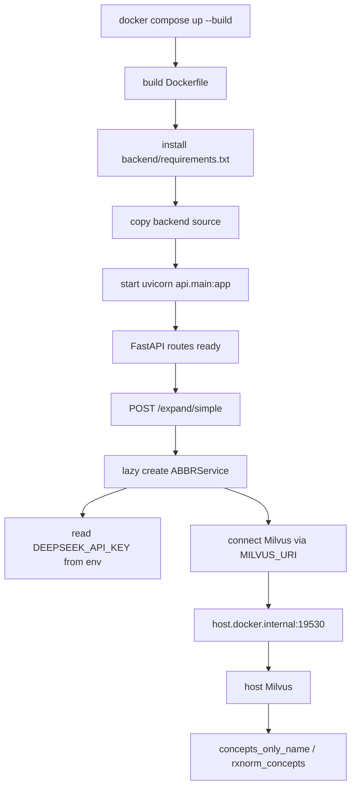

# Docker 容器化与运行环境 —— Dockerfile / docker-compose.yml · V11

> 文件:`Dockerfile`、`docker-compose.yml`、`backend/requirements.txt`、`backend/.env`(运行时注入,不要泄露)
> 衔接:第 16 篇讲 FastAPI 如何启动;第 20 篇讲 LangGraph 可视化包装。本篇讲项目怎么被打包成 API 容器,以及容器运行时如何连接宿主机上的 Milvus、读取 DeepSeek key、加载 HuggingFace/embedding 模型。
> **V11 必看定位**:当前 Docker 只容器化 **API 服务**。Milvus 没有被 compose 编排进去;SNOMED/RxNorm 两个 collection 需要宿主机上的 Milvus 先准备好。它不是完整“一键全套部署”,而是“一键起 API 容器 + 连接外部 Milvus”。

## 核心速记

> 1. **Dockerfile 构建 API 镜像**:`python:3.10-slim` → 安装 `backend/requirements.txt` → 复制 `backend/` → `uvicorn api.main:app --host 0.0.0.0 --port 8000`。
> 2. **compose 只起 api 一个服务**:`medical-nlp-api`,端口 `8000:8000`,读取 `backend/.env`,覆盖 `MILVUS_URI=http://host.docker.internal:19530`。
> 3. **Milvus 在宿主机**:容器内 `127.0.0.1` 是容器自己,所以用 `host.docker.internal` 访问宿主机 Milvus。
> 4. **V11 多源默认**:compose 只显式设置 `MILVUS_COLLECTION_NAME=concepts_only_name`;RxNorm collection 依赖代码默认 `MILVUS_RXNORM_COLLECTION=rxnorm_concepts`。
> 次要(trivia):当前没有 `.dockerignore`,`COPY backend ./backend` 有把 `backend/.env` 打进镜像的风险。

## 这一段在解决什么

开发时可以在本机直接跑:

```powershell
cd backend
uvicorn api.main:app --host 127.0.0.1 --port 8000
```

但换一台机器就会遇到一串问题:

```text
Python 版本是什么?
依赖装哪些?
uvicorn 怎么起?
环境变量怎么注入?
容器里怎么连 Milvus?
```

Dockerfile + docker-compose 的作用就是把这些运行规则写死:

```text
Dockerfile       = 怎么构建 API 镜像
docker-compose   = 怎么启动 API 容器、注入配置、映射端口
requirements.txt = Python 依赖清单
```

当前部署边界:

```text
宿主机:
  ├─ Milvus :19530
  ├─ concepts_only_name collection
  └─ rxnorm_concepts collection

Docker 容器:
  └─ FastAPI API :8000
```

也就是说,API 被容器化了,向量数据库还在宿主机/外部服务。

## 核心1 · Dockerfile 怎么构建镜像

当前 Dockerfile:

```dockerfile
FROM python:3.10-slim
ENV PYTHONUNBUFFERED=1

WORKDIR /app

COPY backend/requirements.txt ./requirements.txt

RUN pip install --upgrade pip && \
    pip install --no-cache-dir -r requirements.txt

COPY backend ./backend

WORKDIR /app/backend

EXPOSE 8000

CMD ["uvicorn", "api.main:app", "--host", "0.0.0.0", "--port", "8000"]
```

构建流程:

```text
python:3.10-slim
  ↓
进入 /app
  ↓
只复制 requirements.txt
  ↓
pip install 依赖
  ↓
复制 backend 源码
  ↓
进入 /app/backend
  ↓
启动 uvicorn api.main:app
```

最重要的设计是:

```text
先 COPY requirements.txt
再 COPY backend 源码
```

因为 Docker 是分层缓存:

| 改动 | 影响 |
|---|---|
| 只改 Python 业务代码 | 依赖层不变,不用重新 pip install |
| 改 `requirements.txt` | 才会重新安装依赖 |

这个项目依赖里有 `torch / transformers / sentence-transformers`,安装成本不低,所以依赖层缓存很重要。

## 核心2 · 为什么 uvicorn 要监听 0.0.0.0

Dockerfile 的启动命令:

```dockerfile
CMD ["uvicorn", "api.main:app", "--host", "0.0.0.0", "--port", "8000"]
```

不能写成只监听:

```text
127.0.0.1
```

原因:

```text
容器内 127.0.0.1 = 容器自己内部
宿主机要通过端口映射访问容器服务
所以服务必须监听 0.0.0.0
```

compose 里:

```yaml
ports:
  - "8000:8000"
```

表示:

```text
宿主机 localhost:8000
  ↓
转发到容器 8000
  ↓
uvicorn / FastAPI
```

所以容器启动后,访问:

```text
http://localhost:8000/docs
```

应该能看到 FastAPI docs,前提是服务初始化没有因为依赖/Milvus/Key 报错。

## 核心3 · docker-compose.yml 做了什么

当前 compose:

```yaml
services:
  api:
    build: .
    container_name: medical-nlp-api

    ports:
      - "8000:8000"

    env_file:
      - backend/.env

    environment:
      MILVUS_URI: http://host.docker.internal:19530
      MILVUS_COLLECTION_NAME: concepts_only_name

    restart: unless-stopped
```

逐项解释:

| 配置 | 作用 |
|---|---|
| `build: .` | 用根目录 Dockerfile 构建镜像 |
| `container_name` | 容器名固定为 `medical-nlp-api` |
| `ports` | 宿主机 8000 映射到容器 8000 |
| `env_file` | 把 `backend/.env` 注入容器,通常包含 `DEEPSEEK_API_KEY` |
| `environment` | 覆盖/补充环境变量,这里主要改 Milvus 地址 |
| `restart: unless-stopped` | 容器异常退出后自动重启,除非手动停止 |

启动命令:

```powershell
docker compose up --build
```

停止:

```powershell
docker compose down
```

查看日志:

```powershell
docker logs medical-nlp-api
```

## 核心4 · 容器怎么连接宿主机 Milvus

本地开发时,`StdService` 默认:

```python
self.milvus_uri = os.getenv("MILVUS_URI", "http://127.0.0.1:19530")
```

在本机直接跑 Python 时,这个默认值可以连到宿主机 Milvus。

但在容器里:

```text
127.0.0.1:19530
```

指向的是容器自己,不是宿主机。

所以 compose 覆盖成:

```yaml
MILVUS_URI: http://host.docker.internal:19530
```

网络关系:

```text
宿主机
  └─ Milvus :19530
       ▲
       │ host.docker.internal:19530
       │
Docker 容器
  └─ medical-nlp-api :8000
```

这就是:

```text
同一份代码
本地默认连 127.0.0.1
容器通过 env 覆盖连 host.docker.internal
```

## 核心5 · V11 多源 collection 配置

V11 的 `StdService` 支持两个 collection:

```python
self.collections = {
    "snomed": os.getenv("MILVUS_COLLECTION_NAME", "concepts_only_name"),
    "rxnorm": os.getenv("MILVUS_RXNORM_COLLECTION", "rxnorm_concepts"),
}
```

compose 显式设置了:

```yaml
MILVUS_COLLECTION_NAME: concepts_only_name
```

但没有显式设置:

```yaml
MILVUS_RXNORM_COLLECTION
```

这不是当前错误,因为代码默认:

```text
rxnorm_concepts
```

所以当前容器期望宿主机 Milvus 里至少有:

```text
concepts_only_name   # SNOMED
rxnorm_concepts      # RxNorm,药品输入首次触发时 load
```

如果只建了 SNOMED,常规疾病/症状缩写还能跑,但药品路径如 `ASA -> aspirin` 走 RxNorm 时会因为 collection 不存在或不可 load 报错。

更稳的 compose 可以显式补上:

```yaml
MILVUS_RXNORM_COLLECTION: rxnorm_concepts
```

这样部署配置和代码默认值就不靠隐含约定。

## 核心6 · requirements.txt 说明

当前依赖:

```text
fastapi / uvicorn
langchain-deepseek
langchain-huggingface
langgraph
sentence-transformers / transformers / torch
pymilvus
pandas
python-dotenv
```

对应项目模块:

| 依赖 | 用途 |
|---|---|
| `fastapi`, `uvicorn` | API 服务 |
| `langchain-deepseek` | DeepSeek LLM 调用 |
| `langchain-huggingface` | embedding / HuggingFace 集成 |
| `langgraph` | 第 20 篇的可视化图包装 |
| `sentence-transformers`, `transformers`, `torch` | bge-m3 embedding、Medical-NER 模型 |
| `pymilvus` | 连接 Milvus 向量库 |
| `pandas` | 离线建库脚本读写 CSV |
| `python-dotenv` | 本地加载 `.env` |

注意:

```text
langgraph 在依赖里,但不代表生产 API 走 LangGraph。
```

它只是让 `backend/graph/` 里的可视化/parity 工具能运行。

## 启动时真实会发生什么

容器启动后:

```text
uvicorn api.main:app
  ↓
加载 FastAPI app
  ↓
注册路由
  ↓
等待请求
```

第 16 篇讲过,`ABBRService` 是懒加载:

```python
service = None

def get_service():
    global service
    if service is None:
        service = ABBRService()
    return service
```

所以容器启动到 `/docs` 不一定会立刻加载所有模型、连接 Milvus、初始化 LLM。

第一次调用:

```http
POST /expand/simple
```

才会进入:

```text
ABBRService()
  ↓
读取 DEEPSEEK_API_KEY
  ↓
初始化候选召回/coverage/verifier
  ↓
加载 embedding/NER 相关模型
  ↓
连接 Milvus 并 load 默认 SNOMED collection
```

药品路径第一次查 RxNorm 时,`StdService._ensure_loaded()` 才会 load `rxnorm_concepts`。

这解释了一个现象:

```text
/health OK 不代表 Milvus/LLM/模型都 OK。
第一次真实请求才会暴露深层依赖问题。
```

## 运行前置条件

要让容器真正处理请求,至少需要:

1. **宿主机 Milvus 正在运行**

```text
http://127.0.0.1:19530
```

从容器看是:

```text
http://host.docker.internal:19530
```

2. **SNOMED collection 已建好**

```text
concepts_only_name
```

3. **RxNorm collection 已建好**

```text
rxnorm_concepts
```

至少药品标准化要依赖它。

4. **backend/.env 有 DeepSeek key**

```text
DEEPSEEK_API_KEY=...
```

5. **容器能访问或已有模型缓存**

首次加载 HuggingFace/embedding 模型可能需要下载权重。如果网络不可用且镜像/volume 没缓存,首次请求会失败或很慢。

## 当前诚实边界

### 1. 只容器化 API,不是完整一键部署

compose 只有:

```yaml
services:
  api:
```

没有:

```yaml
milvus:
etcd:
minio:
```

所以它不是完整生产编排。

更准确的说法:

```text
当前 Docker 化解决的是 API 运行环境复现;
向量库仍依赖外部/宿主机服务。
```

### 2. 没有 .dockerignore,存在密钥打包风险

当前根目录没有 `.dockerignore`。

Dockerfile:

```dockerfile
COPY backend ./backend
```

如果 `backend/.env` 存在,它会被复制进镜像层。

这和 compose 的:

```yaml
env_file:
  - backend/.env
```

是两回事。

更安全做法:

```text
用 .dockerignore 排除 backend/.env
密钥只在容器运行时通过 env_file 注入
不要进入镜像层
```

### 3. 模型权重没有预装

依赖装好了不等于模型权重在镜像里。

这些模型可能在首次请求下载:

```text
BAAI/bge-m3
Clinical-AI-Apollo/Medical-NER
```

生产化更稳的做法:

```text
预下载模型进镜像
或挂载 HuggingFace cache volume
或在内网镜像源/模型仓库拉取
```

### 4. host.docker.internal 的平台差异

在 Windows/Mac Docker Desktop 上一般可用。

Linux 上不一定默认可用,可能需要:

```yaml
extra_hosts:
  - "host.docker.internal:host-gateway"
```

如果部署到 Linux 服务器,这是一个常见坑。

### 5. 缺少 healthcheck 和深层依赖探测

compose 里没有:

```yaml
healthcheck:
```

FastAPI `/health` 也只是浅层 API 存活。

生产化建议增加:

```text
Milvus 连通性检查
collection 存在性检查
LLM key 是否存在
模型是否可加载
```

但这些深检查要小心:如果在启动时强制做,会让容器冷启动很慢。

## 数据流总图



## 面试怎么讲

可以这样说:

> 我用 Dockerfile 和 compose 把 API 服务容器化。Dockerfile 先复制 requirements 安装依赖,再复制 backend 代码,这样依赖层能被 Docker cache 复用。容器里用 uvicorn 监听 `0.0.0.0:8000`,compose 把宿主机 8000 映射进去,并通过 `env_file` 注入 DeepSeek key。Milvus 当前没有放进 compose,而是宿主机已有服务;容器内不能用 `127.0.0.1` 连宿主机,所以用 `host.docker.internal:19530` 覆盖 `MILVUS_URI`。V11 有 SNOMED 和 RxNorm 两个 collection,SNOMED 显式配置为 `concepts_only_name`,RxNorm 走代码默认 `rxnorm_concepts`。

如果追问“一键部署了吗”,要诚实说:

> 还不是完整一键。当前是一键起 API 容器,但 Milvus、SNOMED/RxNorm 建库、模型缓存仍依赖外部准备。下一步会把 Milvus 也纳入 compose,补 healthcheck、.dockerignore、模型缓存 volume 和 Linux 下的 host-gateway 配置。

## 常见误解

| 误解 | 正确理解 |
|---|---|
| `docker compose up` 会同时启动 Milvus | 不会,当前只定义了 `api` 服务 |
| 容器内 `127.0.0.1:19530` 是宿主机 Milvus | 不是,容器内 127.0.0.1 是容器自己 |
| `/health` OK 说明 Milvus/LLM 都 OK | 不说明,当前 `/health` 是浅层 API 存活 |
| requirements 里有 langgraph 说明线上走图 | 不说明,LangGraph 是可视化/parity 工具 |
| `env_file` 安全地解决了密钥问题 | 还不够,没有 `.dockerignore` 时 `.env` 可能被 COPY 进镜像 |
| 只配置 `MILVUS_COLLECTION_NAME` 就覆盖了所有库 | 只覆盖 SNOMED;RxNorm 走 `MILVUS_RXNORM_COLLECTION` 或默认 `rxnorm_concepts` |

## 优化方向

1. **增加 `.dockerignore`**

至少排除:

```text
backend/.env
__pycache__/
*.pyc
.venv/
项目梳理/
```

2. **compose 编排 Milvus**

把 Milvus 及其依赖服务纳入 compose,再用 `depends_on` 管启动顺序。

3. **显式配置 RxNorm collection**

```yaml
MILVUS_RXNORM_COLLECTION: rxnorm_concepts
```

避免隐式默认值造成部署误解。

4. **模型缓存 volume**

挂载 HuggingFace cache,避免每次重建/换容器都下载模型。

5. **增加 healthcheck**

可分浅层和深层:

```text
/health       API 存活
/ready        Milvus + collection + key + model ready
```

6. **Linux 兼容 host-gateway**

```yaml
extra_hosts:
  - "host.docker.internal:host-gateway"
```

7. **非 root 用户运行**

减少容器安全风险。

8. **依赖体积优化**

评估 CPU-only torch、镜像源、多阶段构建、模型预热层。

## 一句话总结

V11 的 Docker 配置把 FastAPI 后端封装成 API 容器:镜像用 `python:3.10-slim` 安装 `backend/requirements.txt`,运行 `uvicorn api.main:app`,compose 映射 8000 端口并注入 `.env`;Milvus 仍在宿主机,容器通过 `host.docker.internal:19530` 连接,默认使用 SNOMED `concepts_only_name` 和 RxNorm `rxnorm_concepts`。这解决了 API 运行环境复现,但还不是完整一键生产部署。
