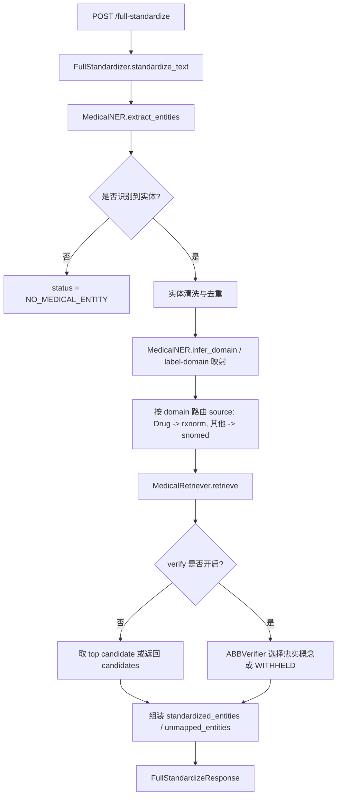

# full-standardize 全文医学实体标准化实施方案

> 当前状态：本文是后续扩展设计文档，尚未实现对应路由。  
> 目标：给未来补充“完整医学术语文本也能识别并标准化”的功能提供可执行方案，同时不污染现有 `/expand/simple` 缩写标准化主链路。

---

## 1. 为什么需要这个新功能

现在 V11 主链路是：

```text
医学缩写发现
  -> 候选扩写
  -> coverage 判断
  -> 确定性替换
  -> 标准概念检索
  -> verifier 选择 CODED / WITHHELD
```

它适合处理：

```text
The patient has SOB and CP.
```

输出：

```text
SOB -> shortness of breath -> Dyspnea
CP  -> chest pain -> Chest pain
```

但如果输入本来就是完整医学术语：

```text
The patient has Rheumatoid Arthritis with joint pain and morning stiffness.
```

当前 `/expand/simple` 不会抽取 `Rheumatoid Arthritis`，因为它只处理缩写，不做整句 NER 标准化。

所以未来如果要支持完整医学术语文本，应该新增一条独立链路：

```text
/full-standardize
输入完整临床文本
  -> NER 抽取医学实体
  -> domain/source 路由
  -> StdService / MedicalRetriever 检索标准概念
  -> verifier 可选校验
  -> 返回 standardized_entities
```

---

## 2. 和现有 `/expand/simple` 的边界

### 2.1 `/expand/simple` 继续负责什么

```text
缩写扩写 + 缩写标准化
```

典型输入：

```text
The patient has SOB and CP.
The patient has RA with joint pain.
The ABG revealed respiratory acidosis.
```

核心输出：

```text
expanded_text
mappings
mapping_states
standardized_entities
```

它的单位是：

```text
缩写 record
```

### 2.2 `/full-standardize` 负责什么

```text
全文医学实体识别 + 标准概念标准化
```

典型输入：

```text
The patient has Rheumatoid Arthritis with joint pain and morning stiffness.
The patient has shortness of breath and chest pain.
The patient took aspirin.
```

核心输出：

```text
entities
standardized_entities
unmapped_entities
```

它的单位是：

```text
NER entity
```

### 2.3 不能混在一起的原因

如果把全文实体标准化强塞进 `/expand/simple`，会导致几个问题：

```text
1. success 语义混乱：
   缩写扩写成功和全文实体标准化成功不是同一件事。

2. mapping_states 语义混乱：
   现在 mapping_states 是缩写 record 状态，不是所有医学实体状态。

3. benchmark 口径混乱：
   现有 benchmark 多数是缩写任务，不应该突然把完整医学实体也纳入同一准确率。

4. 前端解释混乱：
   Analyze 页面目前是“缩写标准化工作台”，不是完整临床 NLP 工作台。
```

所以建议新增路由，不改现有主链路定位。

---

## 3. 需要覆盖的输入场景

### 3.1 输入本来就是完整医学术语

示例：

```text
The patient has Rheumatoid Arthritis.
The patient reports shortness of breath and chest pain.
```

期望：

```text
NER 识别 Rheumatoid Arthritis / shortness of breath / chest pain
检索 SNOMED/RxNorm
返回标准概念
```

注意：

```text
这不是“扩写”。
expanded_text 应该不存在，或者等于原文但不作为主输出。
```

### 3.2 输入是普通非医学文本

示例：

```text
the one
hello world
```

期望：

```text
entities = []
standardized_entities = []
status = NO_MEDICAL_ENTITY
```

前端说明：

```text
未检测到医学实体。
当前全文标准化链路只处理可被 NER 识别出的医学实体。
```

### 3.3 输入里有系统没有识别出来的缩写

示例：

```text
The patient has XYZ.
The patient has rare local abbreviation ABCD.
```

这里有两种可能：

```text
1. 如果走 /expand/simple：
   可能是 NO_CANDIDATES / NOT_EXPANDED。

2. 如果走 /full-standardize：
   NER 可能完全不识别 XYZ，因为它不是完整医学实体。
```

期望：

```text
/full-standardize 不应该强行猜缩写。
如果用户想处理缩写，应提示使用 /expand/simple。
```

前端可提示：

```text
未检测到可标准化医学实体。
如果文本中包含未写全的医学缩写，请使用缩写标准化链路。
```

### 3.4 输入过短或上下文不足

示例：

```text
RA
CP
SOB
```

这种输入对两个链路都很敏感：

```text
/expand/simple 可能能处理，因为它就是缩写链路。
/full-standardize 不一定应该处理，因为 NER 不一定能安全判断。
```

建议：

```text
full-standardize 对过短文本保持保守。
如果只有一个全大写短 token，优先提示用户改用缩写标准化链路。
```

---

## 4. 建议新增 API

### 4.1 路由

```text
POST /full-standardize
```

### 4.2 请求体

建议新增：

```python
class FullStandardizeRequest(BaseModel):
    text: str
    verify: bool = True
    top_k: int = 10
```

说明：

```text
text:
  输入临床文本。

verify:
  是否让 LLM verifier 在候选中做忠实性选择。
  第一版可以先默认 True，但也可以先做 retrieve-only 版本。

top_k:
  每个实体检索候选数量。
```

### 4.3 响应体

建议新增：

```python
class FullStandardizeResponse(BaseModel):
    success: bool
    status: str
    text: str
    entities: list[dict]
    standardized_entities: list[dict]
    unmapped_entities: list[dict]
    summary: dict
```

字段语义：

```text
success:
  是否至少有一个医学实体被成功标准化。

status:
  OK
  NO_MEDICAL_ENTITY
  ENTITY_DETECTED_BUT_UNMAPPED
  PARTIAL
  ERROR

entities:
  NER 抽出的原始医学实体。

standardized_entities:
  成功绑定标准概念的实体。

unmapped_entities:
  识别到了医学实体，但没有安全绑定标准概念的实体。

summary:
  entity_count
  coded_count
  withheld_count
  no_entity_count
```

---

## 5. 后端模块设计

### 5.1 新增服务层

建议新增文件：

```text
backend/services/full_standardizer.py
```

类名：

```python
class FullStandardizer:
    def __init__(self):
        self.ner = MedicalNER()
        self.retriever = MedicalRetriever()
        self.verifier = ABBVerifier()  # 可选

    def standardize_text(self, text: str, verify: bool = True, top_k: int = 10) -> dict:
        ...
```

职责：

```text
1. 调 MedicalNER.extract_entities(text)
2. 对实体做清洗、去重、短实体过滤
3. 对每个实体推断 domain/source
4. 调 MedicalRetriever.retrieve()
5. 可选调 verifier 从候选里选择忠实概念
6. 组装 standardized_entities / unmapped_entities
```

### 5.2 为什么不复活旧 MedicalStandardizer

项目之前已经清理掉旧的 `medical_standardizer.py` 主路径，原因是它属于早期整句级编排，和 V11 缩写状态机混在一起会造成盲肠。

如果未来做全文标准化，建议新建 `FullStandardizer`，不要恢复旧模块。

原因：

```text
1. 命名更清楚：
   FullStandardizer = 全文医学实体标准化。

2. 边界更清楚：
   不负责缩写扩写，不生成 expanded_text。

3. 输出更清楚：
   以 NER entity 为单位，不以 abbreviation record 为单位。

4. 面试更好解释：
   “我把缩写链路和全文实体标准化链路拆开，避免 success 和 benchmark 口径混淆。”
```

---

## 6. 核心处理流程

### 6.1 流程图



### 6.2 数据流示例

输入：

```text
The patient has Rheumatoid Arthritis with joint pain and morning stiffness.
```

NER：

```json
[
  {
    "text": "Rheumatoid Arthritis",
    "label": "DISEASE_DISORDER",
    "score": 0.98,
    "start": 16,
    "end": 36
  },
  {
    "text": "joint pain",
    "label": "SIGN_SYMPTOM",
    "score": 0.94,
    "start": 42,
    "end": 52
  },
  {
    "text": "morning stiffness",
    "label": "SIGN_SYMPTOM",
    "score": 0.91,
    "start": 57,
    "end": 74
  }
]
```

标准化结果：

```json
{
  "success": true,
  "status": "OK",
  "standardized_entities": [
    {
      "text": "Rheumatoid Arthritis",
      "domain": "Condition",
      "source": "snomed",
      "concept_id": "...",
      "concept_name": "Rheumatoid arthritis",
      "concept_code": "...",
      "score": 0.96,
      "status": "CODED"
    }
  ],
  "unmapped_entities": []
}
```

---

## 7. 实体清洗策略

NER 原始输出不能直接全部检索，需要轻量清洗。

建议规则：

```text
1. 去重：
   同 text + start + end 只保留一次。

2. 过短过滤：
   长度 < 3 且不是白名单医学词时跳过。

3. 非医学标签过滤：
   只保留能映射到 domain 的 label。

4. 低置信度过滤：
   score < 0.75 的实体进入 low_confidence_entities，不直接标准化。

5. 过度重叠处理：
   如果两个实体 span 重叠，优先保留更长且 score 更高的实体。
```

注意：

```text
这一步不能太激进。
第一版宁可少过滤，把不能安全编码的交给 verifier WITHHELD。
```

---

## 8. domain/source 路由

复用当前 `MedicalNER.NER_LABEL_TO_DOMAIN`：

```text
DISEASE_DISORDER       -> Condition
SIGN_SYMPTOM           -> Condition
BIOLOGICAL_STRUCTURE   -> Spec Anatomic Site
MEDICATION             -> Drug
DIAGNOSTIC_PROCEDURE   -> Procedure
THERAPEUTIC_PROCEDURE  -> Procedure
LAB_VALUE              -> Measurement
DETAILED_DESCRIPTION   -> Observation
```

source 路由建议复用 ABBRService 当前思想：

```text
domain == Drug -> rxnorm
其他 -> snomed
```

第一版不要做 LLM 路由。

原因：

```text
目前只有 SNOMED + RxNorm 两个源。
路由本质是“药品走 RxNorm，其它走 SNOMED”。
NER domain 足够作为第一版确定性路由。
```

---

## 9. verifier 是否复用

建议第一版分两阶段做。

### 9.1 Stage 1：retrieve-only 版本

先只做：

```text
NER entity -> MedicalRetriever.retrieve -> 返回 top candidates
```

用途：

```text
验证 NER 抽取、domain/source 路由、Milvus 检索是否通。
```

输出可以包含：

```text
candidates
top_candidate
retrieval_score
```

### 9.2 Stage 2：加入 verifier

再加：

```text
候选列表 -> verifier -> CODED / WITHHELD
```

理由：

```text
全文实体标准化也需要“宁可不给码，不给错码”。
仅靠向量 top1 容易把近义、上位词、组合词错绑。
```

注意：

```text
ABBRVerifier 当前可能默认围绕 abbreviation/expansion 语义设计。
如果复用，要检查 prompt 是否需要改成 entity-level verify。
必要时新增 FullEntityVerifier，避免把“缩写扩写”的语义写死。
```

---

## 10. 成功状态设计

不要复用 `/expand/simple` 的：

```text
expansion_success
standardization_success
mapping_states
```

建议全文标准化使用：

```text
entity_detection_success
standardization_success
success
```

定义：

```text
entity_detection_success:
  NER 至少识别到一个可处理医学实体。

standardization_success:
  所有可处理医学实体都 CODED。

success:
  至少有一个医学实体 CODED。
```

为什么 `success` 不等于所有都 CODED：

```text
全文医学实体标准化天然可能部分成功。
例如一句话里有疾病、症状、非常抽象的描述。
如果要求全部 CODED 才 success，用户会看不到有用结果。
```

但必须在 `summary` 中明确：

```text
entity_count
coded_count
withheld_count
unmapped_count
```

这样不会夸大结果。

---

## 11. 前端设计建议

不要塞进当前 Analyze 页面第一版主流程。

建议后期在 Analyze 下增加一个模式切换：

```text
Analyze
  - 缩写标准化
  - 全文实体标准化
```

### 11.1 缩写标准化页面

继续调用：

```text
POST /expand/simple
```

展示：

```text
expanded_text
当前单句诊断 mapping_states
Raw JSON
```

### 11.2 全文实体标准化页面

调用：

```text
POST /full-standardize
```

展示：

```text
原文
识别出的医学实体
标准概念
source: snomed/rxnorm
status: CODED/WITHHELD/LOW_CONFIDENCE
Raw JSON
```

空状态文案：

```text
未检测到可标准化医学实体。
当前链路只处理 NER 能识别出的医学实体；如果文本中包含缩写，请使用缩写标准化模式。
```

---

## 12. Benchmark 设计

全文标准化不能混用现有缩写 benchmark。

建议新增：

```text
backend/evaluation/full_standardize_cases.json
backend/evaluation/run_full_standardize_benchmark.py
```

### 12.1 Case 类型

至少包含：

```text
1. complete_medical_terms
   完整医学术语，例如 Rheumatoid Arthritis / chest pain。

2. non_medical_text
   普通文本，例如 the one。

3. abbreviation_should_not_be_handled_here
   缩写文本，例如 SOB and CP，用来验证 full-standardize 不抢缩写链路职责。

4. low_context_short_text
   RA / CP 这类短输入，用来验证保守策略。

5. drug_terms
   aspirin / metformin，用来验证 RxNorm 路由。
```

### 12.2 评估口径

建议分三层：

```text
entity_detection_correct:
  NER 是否抽到 gold entity。

concept_mapping_correct:
  抽到的 entity 是否映射到 gold concept。

safe_abstention_correct:
  对普通文本、低上下文短词、缩写链路文本，是否没有强行错误编码。
```

不要只用一个 accuracy。

原因：

```text
全文标准化错误可能来自 NER，也可能来自检索，也可能来自 verifier。
必须拆开看，才知道问题在哪一层。
```

---

## 13. 推荐实施顺序

### Step 1：只做文档和接口契约

```text
新增 FullStandardizeRequest / FullStandardizeResponse 草案。
不接生产前端。
```

### Step 2：实现 FullStandardizer retrieve-only

```text
MedicalNER.extract_entities
MedicalRetriever.retrieve
返回 entities + candidates
```

### Step 3：新增 `/full-standardize`

```text
在 backend/api/main.py 增加懒加载 full_standardizer。
不要复用 ABBRService 的 service 全局变量。
```

建议：

```python
full_standardizer = None

def get_full_standardizer():
    global full_standardizer
    if full_standardizer is None:
        full_standardizer = FullStandardizer()
    return full_standardizer
```

### Step 4：加最小测试

```text
1. Rheumatoid Arthritis 能抽实体并检索候选。
2. the one 返回 NO_MEDICAL_ENTITY。
3. SOB and CP 不作为 full-standardize 的主要成功样例。
```

### Step 5：加入 verifier

```text
确认 ABBVerifier prompt 是否适合 entity-level。
不适合就新增 FullEntityVerifier。
```

### Step 6：前端增加模式切换

```text
Analyze -> 缩写标准化 / 全文实体标准化
```

### Step 7：新增独立 benchmark 和错误分析

```text
不要混入当前 74 条 abbreviation benchmark。
```

---

## 14. 风险与边界

### 14.1 NER 不是万能的

```text
如果 NER 没抽到实体，后续检索就没有输入。
```

所以不要把 `/full-standardize` 宣传成完整医学理解系统。

更准确说法：

```text
基于医学 NER 的实体级标准化能力。
```

### 14.2 普通文本不能误判为医学实体

```text
the one
```

应该返回：

```text
NO_MEDICAL_ENTITY
```

不能强行检索。

### 14.3 缩写文本不要被全文路由抢走

```text
SOB and CP
```

应该优先走 `/expand/simple`。

如果用户在 full-standardize 模式输入缩写，前端可以提示：

```text
检测到疑似缩写输入，建议使用缩写标准化模式。
```

但第一版不一定要自动切换。

### 14.4 verifier prompt 可能需要重写

缩写 verifier 的核心语义是：

```text
abbreviation + expansion + candidates
```

全文实体 verifier 的核心语义是：

```text
entity text + sentence context + candidates
```

二者相似，但不完全一样。

---

## 15. 面试表达

可以这样说：

> 当前 V11 的主链路定位是医学缩写标准化，所以 `/expand/simple` 只处理缩写 record。对于已经写全的医学术语，系统不会强行走缩写扩写，这是我刻意保留的边界。后续如果要做完整医学实体标准化，我会新增 `/full-standardize` 路由，先用 MedicalNER 抽取实体，再按 domain 路由到 SNOMED/RxNorm 检索，并用 verifier 做忠实性校验。这样可以避免把缩写扩写成功率和全文实体标准化成功率混在一个 success 里。

更短版本：

> 我把“缩写标准化”和“全文实体标准化”拆成两条链路。前者解决 SOB/CP/RA 这种缩写，后者未来用 NER 抽取 Rheumatoid Arthritis、chest pain 这种完整术语再标准化。拆开是为了让状态、评估和前端解释都保持清楚。

---

## 16. 最终建议

现阶段：

```text
不要实现 /full-standardize。
只保留为后续扩展方案。
当前 Analyze 页面只需要对 no target abbreviation 做准确提示。
```

后续简历或项目展示需要增强时，再按本文方案分阶段补：

```text
FullStandardizer service
POST /full-standardize
独立前端模式
独立 benchmark
独立 error analysis
```

