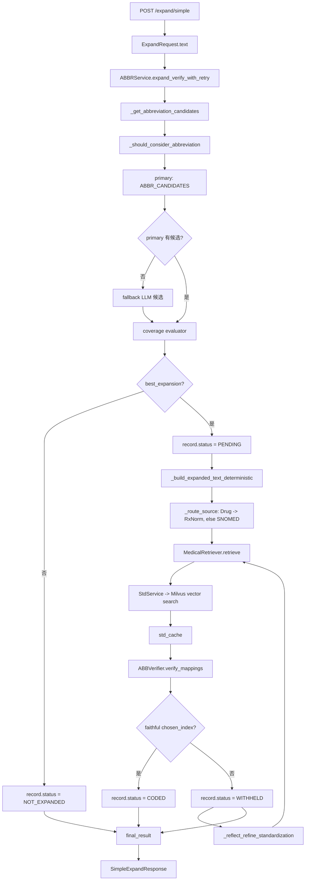

# 02_主链路样例跟踪：ASA、CP、SOB 是怎么一路走完的

> 这一章只做一件事：用一句话把 V11 主链路从入口讲到返回结果。
> 不再按模块跳读，而是按一次请求真实经过的顺序看。

---

## 这章你要先记住什么

项目的核心不是“调用 LLM 扩写缩写”。

更准确的说法是：

> 系统把医学缩写处理拆成候选召回、覆盖度判断、确定性替换、标准概念检索、LLM 忠实性校验、反思重检索这几步。LLM 不直接自由改写整句，而是被放在几个受控位置做判断。

本章统一用这句话：

```text
The patient took ASA for CP and denies SOB.
```

你可以把它想成一次用户请求。

---

## 0. 先看这句话里有什么难点

```text
The patient took ASA for CP and denies SOB.
```

这句话里有三个医学缩写：

| 缩写 | 可能扩写 | 为什么有难度 |
|---|---|---|
| `ASA` | aspirin / American Society of Anesthesiologists / 其他 | `took ASA` 更像药品，所以后面应走 RxNorm |
| `CP` | chest pain / cerebral palsy / 其他 | `for CP` 需要结合临床上下文判断 |
| `SOB` | shortness of breath | 常见症状缩写，但仍不能跳过候选和校验 |

这句话刚好能串起项目的大部分核心设计：

```text
缩写识别
  → 候选召回
  → 覆盖度判断
  → 确定性替换
  → SNOMED/RxNorm 路由
  → 向量检索
  → LLM verifier
  → 反思重检索
  → API 返回
```

---

## 1. 用户请求先进入 FastAPI

入口文件：

```text
backend/api/main.py
```

请求接口：

```text
POST /expand/simple
```

请求体模型：

```python
class ExpandRequest(BaseModel):
    text: str
```

所以用户实际传入的是：

```json
{
  "text": "The patient took ASA for CP and denies SOB."
}
```

FastAPI 入口函数做的事很少：

```python
result = abbr_service.expand_verify_with_retry(
    text=request.text,
    max_retries=2
)
```

也就是说，API 层不负责理解医学、不负责扩写、不负责检索。它只负责：

1. 接收 `text`。
2. 懒加载 `ABBRService`。
3. 调用主状态机。
4. 把内部结果压缩成外部响应。

面试说法：

> FastAPI 层很薄，只做请求接收和响应整理。真正的业务编排集中在 `ABBRService.expand_verify_with_retry`，这样入口不会混入候选召回、标准化、校验这些复杂逻辑。

---

## 2. 第一次进入主状态机

核心函数：

```text
backend/services/abbr_service.py
ABBRService.expand_verify_with_retry()
```

函数一开始做三件事：

```python
attempts = []
candidate_infos = self._get_abbreviation_candidates(text)
current_abbreviation_candidates = candidate_infos
```

你可以先把它理解成：

```text
先别急着替换原文。
先问：这句话里有哪些缩写？每个缩写有哪些候选扩写？哪些候选可信？
```

这一阶段的输出叫：

```text
candidate_infos
```

这是后面所有处理的原材料。

---

## 3. 系统先找“哪些 token 值得当缩写处理”

函数：

```text
_get_abbreviation_candidates(text)
```

它先把文本粗略拆成词：

```text
The / patient / took / ASA / for / CP / and / denies / SOB
```

然后每个 token 都过一个 gate：

```text
_should_consider_abbreviation(raw_token, known_abbrs)
```

这个 gate 的目的不是“准确识别所有缩写”，而是先挡掉明显不该进入后续链路的普通词。

规则可以简化理解为：

| token | 处理结果 | 原因 |
|---|---|---|
| `The` | 跳过 | 普通词，不是已知缩写，也不是全大写 |
| `patient` | 跳过 | 普通小写词 |
| `took` | 跳过 | 普通小写词 |
| `ASA` | 放行 | 全大写，且可能是缩写 |
| `for` | 跳过 | 普通小写词 |
| `CP` | 放行 | 全大写，且可能是缩写 |
| `and` | 跳过 | 普通小写词 |
| `denies` | 跳过 | 普通小写词 |
| `SOB` | 放行 | 全大写，且可能是缩写 |

所以这一步之后，真正进入候选召回的只有：

```text
ASA, CP, SOB
```

面试说法：

> 我先做了一个轻量 gate，避免把普通词都丢给 LLM 或候选召回。已知缩写直接放行，未知但全大写、长度合理的 token 才允许进入 fallback，这样能控制误召回。

---

## 4. 每个缩写先走主候选词典

主候选召回器：

```text
backend/services/abbr_candidate_retriever.py
ABBRCandidateRetriever.retrieve()
```

它查的是：

```text
backend/data/abbr_candidates.py
ABBR_CANDIDATES
```

返回结构很简单：

```python
{
  "abbreviation": abbr,
  "expansion": c["expansion"],
  "domain": c.get("domain")
}
```

用人话说：

```text
输入一个缩写 CP
返回它可能对应的多个完整医学术语
每个候选可以带一个 domain
```

例如示意：

```json
[
  {
    "abbreviation": "CP",
    "expansion": "chest pain",
    "domain": "Condition"
  },
  {
    "abbreviation": "CP",
    "expansion": "cerebral palsy",
    "domain": "Condition"
  }
]
```

注意：这里还没有决定 `CP` 一定是 `chest pain`。这里只是把可能选项拿出来。

面试说法：

> 第一层候选来自结构化缩写候选库。它不是直接给最终答案，而是把问题从“自由生成扩写”变成“在候选集合里选择最合适的扩写”。

---

## 5. 主候选没有结果时才走 fallback

fallback 召回器：

```text
backend/services/abbr_candidate_fallback_retriever.py
ABBRCandidateFallbackRetriever.retrieve()
```

它的作用是：

```text
如果主候选词典没有这个缩写，就让 LLM 基于上下文生成少量候选。
```

但 fallback 比 primary 更危险，因为它是 LLM 现造候选，所以后面会更严格：

```python
if candidate_source == "fallback":
    conf = coverage.get("confidence") or 0.0
    if (not coverage.get("coverage_ok")) or conf < 0.8:
        best = None
```

意思是：

```text
fallback 候选如果上下文证据不够强，就宁可不扩写。
```

在我们的样例里，假设 `ASA`、`CP`、`SOB` 都能从主候选词典拿到候选，那么它们的：

```text
candidate_source = "primary"
```

面试说法：

> fallback 只解决词典覆盖不足的问题，但它不是无条件相信 LLM。fallback 生成的候选必须经过 coverage，而且置信度门槛更高，否则直接放弃扩写。

---

## 6. coverage evaluator 决定“候选够不够用”

覆盖度评估器：

```text
backend/services/abbr_candidate_coverage_evaluator.py
ABBRCandidateCoverageEvaluator.evaluate()
```

它拿到三样东西：

```python
original_text = "The patient took ASA for CP and denies SOB."
abbreviation = "CP"
candidates = [...]
```

它要回答的不是：

```text
最终标准概念是什么？
```

而是：

```text
候选集合里有没有至少一个合理扩写？
哪一个是当前上下文最合适的 best_expansion？
```

返回结构是：

```json
{
  "abbreviation": "CP",
  "coverage_ok": true,
  "confidence": 0.86,
  "plausible_candidates": ["chest pain"],
  "best_expansion": "chest pain",
  "reason": "The context supports chest pain.",
  "issues": []
}
```

这是示意结构，不是本机真实运行结果。真实值取决于 LLM 返回。

这一步特别关键，因为它把候选分成两种：

| 情况 | 后续状态 |
|---|---|
| 有 `best_expansion` | 进入 `PENDING`，准备标准化 |
| 没有 `best_expansion` | 进入 `NOT_EXPANDED`，原文不替换 |

比如：

```text
CP → best_expansion = chest pain → PENDING
SOB → best_expansion = shortness of breath → PENDING
ASA → best_expansion = aspirin → PENDING
```

如果某个缩写覆盖度不足：

```text
XYZ → best_expansion = None → NOT_EXPANDED
```

面试说法：

> coverage evaluator 是扩写前的安全闸门。它只判断候选集合是否覆盖了当前语境下的合理含义，并选择一个 best expansion。没有足够证据时，不进入替换和标准化。

---

## 7. candidate_infos 长什么样

经过候选召回和 coverage 后，主状态机会拿到 `candidate_infos`。

用样例近似表示：

```json
[
  {
    "abbreviation": "ASA",
    "candidates": [
      {"abbreviation": "ASA", "expansion": "aspirin", "domain": "Drug"}
    ],
    "filtered_candidates": [
      {"abbreviation": "ASA", "expansion": "aspirin", "domain": "Drug"}
    ],
    "coverage": {
      "coverage_ok": true,
      "confidence": 0.9,
      "plausible_candidates": ["aspirin"],
      "best_expansion": "aspirin"
    },
    "candidate_source": "primary",
    "best_expansion": "aspirin",
    "chosen_label": null,
    "chosen_domain": "Drug"
  },
  {
    "abbreviation": "CP",
    "best_expansion": "chest pain",
    "chosen_domain": "Condition",
    "candidate_source": "primary"
  },
  {
    "abbreviation": "SOB",
    "best_expansion": "shortness of breath",
    "chosen_domain": "Condition",
    "candidate_source": "primary"
  }
]
```

这一步你要盯住 4 个字段：

| 字段 | 意义 |
|---|---|
| `abbreviation` | 原文里的缩写 |
| `candidates` | 候选扩写列表 |
| `best_expansion` | coverage 选出的最佳扩写 |
| `chosen_domain` | 后续路由到 SNOMED/RxNorm 的依据 |

---

## 8. candidate_infos 被转成统一 records

主状态机不会直接拿 `candidate_infos` 一路传到底，而是转成统一的 `records`。

代码里每个 record 长这样：

```python
rec = {
    "abbreviation": info.get("abbreviation"),
    "source": info.get("candidate_source"),
    "candidates": info.get("candidates") or [],
    "coverage": info.get("coverage") or {},
    "expansion": best if best else None,
    "label": info.get("chosen_label"),
    "domain": info.get("chosen_domain"),
    "std_cache": None,
    "std_concept": None,
    "status": "PENDING" if best else "NOT_EXPANDED",
    "failure": None,
}
```

这一步是整个 V11 很重要的重构点。

以前你可以想象成：

```text
候选结果一份
扩写结果一份
标准化结果一份
校验结果一份
失败原因一份
```

这样读起来就很散。

V11 改成：

```text
每个缩写一条 record，从头走到尾。
```

例如 `CP` 的 record 初始状态：

```json
{
  "abbreviation": "CP",
  "source": "primary",
  "expansion": "chest pain",
  "domain": "Condition",
  "std_cache": null,
  "std_concept": null,
  "status": "PENDING",
  "failure": null
}
```

如果某个缩写没有选出扩写：

```json
{
  "abbreviation": "XYZ",
  "expansion": null,
  "status": "NOT_EXPANDED",
  "failure": {
    "type": "ABBR_NOT_EXPANDED",
    "stage": "coverage",
    "reason": "coverage withheld expansion (not confident enough)"
  }
}
```

面试说法：

> V11 里我把每个缩写抽象成一个生命周期 record。候选、扩写、标准化候选、最终 concept、状态、失败原因都挂在同一个 record 上，这样可以做到 per-mapping failure isolation，不会因为一个缩写失败影响整句。

---

## 9. 先做确定性文本替换

函数：

```text
_build_expanded_text_deterministic(text, _visible(records))
```

它只替换满足条件的 record：

```python
r["expansion"] and r["status"] != "ABSTAIN"
```

然后用正则 token 边界替换：

```python
pattern = re.compile(rf"\b{re.escape(abbr)}\b")
```

为什么这一步重要？

因为它不让 LLM 直接重写整句话。

原文：

```text
The patient took ASA for CP and denies SOB.
```

确定性替换后：

```text
The patient took aspirin for chest pain and denies shortness of breath.
```

这一步的特点：

| 设计 | 目的 |
|---|---|
| 只替换 chosen record | 没通过 coverage 的缩写不动 |
| token 边界匹配 | 避免 `CP` 误伤 `CPR` |
| 从后往前替换 | 避免替换后字符位置错乱 |
| 不让 LLM 生成整句 | 避免自由改写和幻觉 |

面试说法：

> 扩写后的文本是确定性生成的，不是 LLM 直接写出来的。LLM 只提供候选选择和校验信号，真正修改原文时走可控替换逻辑。

---

## 10. PENDING record 进入标准概念检索

接下来进入 retry loop：

```python
for attempt_index in range(max_retries + 1):
    pending = [r for r in records if r["status"] == "PENDING"]
```

也就是说，只有 `PENDING` 的缩写才会去查标准概念。

对每个 pending record，调用：

```python
docs = self.retriever.retrieve(
    query=r["expansion"],
    top_k=10,
    domain_filter=None,
    domain_boost=r.get("domain"),
    score_threshold=0.6,
    source=self._route_source(r.get("domain")),
)
```

这里最重要的是两个字段：

```text
query = expansion
source = _route_source(domain)
```

比如：

| 缩写 | expansion | domain | source |
|---|---|---|---|
| `ASA` | `aspirin` | `Drug` | `rxnorm` |
| `CP` | `chest pain` | `Condition` | `snomed` |
| `SOB` | `shortness of breath` | `Condition` | `snomed` |

路由函数很短：

```python
return "rxnorm" if domain == "Drug" else "snomed"
```

所以现在你可以明确回答之前那个问题：

> 当前 V11 是两个 Milvus collection，不是一个 collection 里的两个字段。

在 `StdService` 里：

```python
self.collections = {
    "snomed": os.getenv("MILVUS_COLLECTION_NAME", "concepts_only_name"),
    "rxnorm": os.getenv("MILVUS_RXNORM_COLLECTION", "rxnorm_concepts"),
}
```

面试说法：

> 标准化时我按医学实体来源做了路由。药品类扩写走 RxNorm collection，其他疾病、症状、检查等走 SNOMED collection。这样可以减少跨体系检索导致的错误映射。

---

## 11. MedicalRetriever 做向量检索和规则重排

检索器：

```text
backend/services/medical_retriever.py
MedicalRetriever.retrieve()
```

它先调用：

```python
self.std_service.search_similar_terms(query=query, limit=top_k, source=source)
```

`StdService` 做的事是：

```text
query
  → embedding_model.embed_query(query)
  → MilvusClient.search(...)
  → 返回 concept_id / concept_name / domain_id / concept_code / FSN / score
```

然后 `MedicalRetriever` 做一层规则重排：

| 规则 | 效果 |
|---|---|
| concept_name 完全等于 query | 加分 |
| concept_name 以 query 开头 | 加分 |
| concept_name 包含 query | 加分 |
| domain_id 等于 domain_boost | 加分 |
| 名称过长 | 扣分 |

最后每个标准概念候选会变成：

```json
{
  "page_content": "Concept Name:chest pain\nFully Specified Name:...\nDomain:Condition\nConcept Code:...",
  "metadata": {
    "input": "chest pain",
    "concept_id": "...",
    "concept_name": "Chest pain",
    "domain_id": "Condition",
    "concept_code": "...",
    "score": 0.82,
    "rerank_score": 1.12
  }
}
```

这一步后，record 里的 `std_cache` 会被填上：

```json
{
  "abbreviation": "CP",
  "expansion": "chest pain",
  "std_cache": [
    {
      "concept_id": "...",
      "concept_name": "Chest pain",
      "domain_id": "Condition",
      "concept_code": "...",
      "score": 0.82,
      "rerank_score": 1.12
    }
  ],
  "std_concept": null,
  "status": "PENDING"
}
```

注意：到这里还没有最终选中标准概念。向量检索只给候选，不直接拍板。

面试说法：

> 向量检索负责召回候选概念，规则重排负责把明显更接近 query 或 domain 更匹配的候选排前面。但最终是否忠实，不完全相信向量分数，还要经过 verifier。

---

## 12. verifier 在候选中选择忠实标准概念

校验器：

```text
backend/services/abbr_verifier.py
ABBVerifier.verify_mappings()
```

它拿到的是：

```python
original_text
expanded_text
mapping_standardizations
```

其中 `mapping_standardizations` 长这样：

```json
[
  {
    "abbreviation": "CP",
    "expansion": "chest pain",
    "candidates": [
      {
        "concept_id": "...",
        "concept_name": "Chest pain",
        "domain_id": "Condition",
        "score": 0.82
      }
    ]
  }
]
```

verifier 的任务不是重新判断 `CP` 是否应该扩成 `chest pain`。

代码里的 prompt 已经明确写了：

```text
Your job is NOT to re-judge whether the abbreviation expansion is correct.
That decision has already been made by the abbreviation coverage stage.
```

它真正判断的是：

```text
这个 expansion 和这些候选标准概念，哪个是忠实映射？
```

返回结构示意：

```json
{
  "sentence_validity": {
    "is_valid": true,
    "confidence": 1.0,
    "reason": "Expansion validity is decided upstream by coverage.",
    "issues": []
  },
  "mapping_validations": [
    {
      "abbreviation": "CP",
      "expansion": "chest pain",
      "chosen_index": 0,
      "standardization_faithful": true,
      "reason": "The candidate denotes the same clinical finding."
    }
  ],
  "overall_valid": true
}
```

主状态机读取：

```python
chosen_index = v.get("chosen_index")
faithful = v.get("standardization_faithful") is True
```

如果：

```text
faithful = true
chosen_index 是合法整数
```

就把：

```python
r["std_concept"] = r["std_cache"][chosen_index]
r["status"] = "CODED"
```

如果 verifier 不敢选：

```python
r["std_concept"] = None
r["status"] = "WITHHELD"
```

状态含义：

| 状态 | 意义 |
|---|---|
| `CODED` | 已扩写，并成功绑定标准概念 |
| `WITHHELD` | 已扩写，但标准概念不敢选 |

面试说法：

> verifier 不是开放式生成 concept id，而是在检索候选里做忠实性选择。它可以选择某个候选，也可以 abstain。这样 LLM 被限制在可控候选集内，降低了幻觉风险。

---

## 13. WITHHELD 时进入反思重检索

如果某个 record 变成 `WITHHELD`，主状态机会调用：

```python
self._reflect_refine_standardization(r, text, current_expanded_text)
```

它的目的不是重新扩写缩写，而是：

```text
标准概念没找好时，换一个同义检索词再查一次。
```

流程：

```text
当前 expansion
  → verifier.propose_requeries(...)
  → 得到最多 2 个同义检索词
  → MedicalRetriever.retrieve(...)
  → 新候选并入 std_cache
  → verifier.verify_mappings(...)
  → 如果更好，更新 std_concept
```

比如 `shortness of breath` 如果第一次检索没找到好概念，反思可能提出：

```text
dyspnea
```

然后用 `dyspnea` 重检索。

但这里有保守限制：

- 不允许反思随便换意思。
- 只接受同义或规范检索词。
- 只有标准化质量更好才更新。
- 默认最大迭代次数来自 `REFLECT_MAX_ITER`，默认 2。

面试说法：

> 反思不是让 LLM 重新编答案，而是让它提出等价的检索 phrasing，用来改善标准概念召回。最后仍然要经过 verifier 校验，且只有质量提升才采纳。

---

## 14. 最终结果从 records 汇总出来

循环结束后，主状态机会重新构造最终 expanded_text：

```python
current_expanded_text = self._build_expanded_text_deterministic(text, _visible(records))
```

然后只把这些状态算作 resolved：

```python
resolved = [r for r in records if r["status"] in ("CODED", "WITHHELD")]
```

这点很重要：

| 状态 | 是否进入最终 mappings | 原因 |
|---|---|---|
| `CODED` | 是 | 扩写成功，标准概念也选中 |
| `WITHHELD` | 是 | 扩写成功，但标准概念保守 withheld |
| `NOT_EXPANDED` | 否 | 没有扩写 |
| `ABSTAIN` | 否 | 放弃 |

最终 `final_result` 里会有：

```json
{
  "expanded_text": "The patient took aspirin for chest pain and denies shortness of breath.",
  "mappings": [
    {
      "abbreviation": "ASA",
      "expansion": "aspirin",
      "label": null,
      "source": "primary"
    },
    {
      "abbreviation": "CP",
      "expansion": "chest pain",
      "label": null,
      "source": "primary"
    },
    {
      "abbreviation": "SOB",
      "expansion": "shortness of breath",
      "label": null,
      "source": "primary"
    }
  ],
  "mapping_standardizations": [
    {
      "abbreviation": "ASA",
      "expansion": "aspirin",
      "candidates": ["..."],
      "chosen_concept": {
        "concept_id": "...",
        "concept_name": "aspirin",
        "domain_id": "Drug",
        "concept_code": "..."
      }
    }
  ],
  "mapping_states": [
    {
      "abbreviation": "ASA",
      "expansion": "aspirin",
      "status": "CODED",
      "failure": null
    }
  ]
}
```

仍然强调：上面是结构示意，不是实际运行输出。实际 concept id、score、候选顺序要看本地 Milvus 和 LLM 返回。

---

## 15. API 返回给用户的是简化版

`/expand/simple` 不会把所有 attempts、coverage、std_cache 都返回给用户。

它只返回：

```python
return {
    "success": result.get("success", False),
    "expanded_text": final_result.get("expanded_text", request.text),
    "mappings": final_result.get("mappings", []),
    "standardized_entities": standardized_entities,
}
```

外部响应大概长这样：

```json
{
  "success": true,
  "expanded_text": "The patient took aspirin for chest pain and denies shortness of breath.",
  "mappings": [
    {
      "abbreviation": "ASA",
      "expansion": "aspirin",
      "label": null,
      "source": "primary"
    },
    {
      "abbreviation": "CP",
      "expansion": "chest pain",
      "label": null,
      "source": "primary"
    }
  ],
  "standardized_entities": [
    {
      "abbreviation": "ASA",
      "expansion": "aspirin",
      "concept_id": "...",
      "concept_name": "aspirin",
      "concept_code": "...",
      "domain_id": "Drug",
      "score": 0.82
    }
  ]
}
```

你可以这样理解：

```text
内部结果很丰富，是为了调试、评估、错误归因。
外部 simple 接口只给用户最需要的扩写文本和标准化实体。
```

面试说法：

> 对外接口返回的是简化结果，避免暴露太多中间状态；但内部保留 attempts、mapping_states、coverage、std_cache 等信息，方便 benchmark 和错误分析定位问题。

---

## 16. 整条链路画成一张图



---

## 17. 你面试时怎么把这一章讲出来

30 秒版本：

> 我的项目不是简单让 LLM 扩写医学缩写，而是把缩写标准化拆成一个受控 pipeline。用户输入病历文本后，系统先识别可能的缩写，再从候选词典或 fallback LLM 里召回扩写候选，coverage evaluator 判断是否有足够上下文支持。通过后，文本替换是确定性的，不让 LLM 直接改写整句。之后系统根据 domain 把药品路由到 RxNorm，把其他医学概念路由到 SNOMED，用向量检索召回标准概念，再由 verifier 在候选中选择忠实映射；如果没有好候选，就反思生成同义检索词重查，最后保守返回 CODED 或 WITHHELD 状态。

2 分钟版本：

> 这个项目的主入口是 FastAPI 的 `/expand/simple`，它接收一段临床文本，然后调用 `ABBRService.expand_verify_with_retry`。主状态机首先用 `_get_abbreviation_candidates` 找出值得处理的缩写 token，比如 `ASA`、`CP`、`SOB`。每个缩写先查结构化候选词典，词典没有才走 LLM fallback。候选拿到以后，不是马上替换，而是先由 coverage evaluator 判断候选集合里是否有当前上下文支持的合理扩写，并选出 `best_expansion`。
>
> V11 的关键设计是把每个缩写变成一条 record，里面包含 abbreviation、candidate source、expansion、domain、std_cache、std_concept、status 和 failure。这样一个缩写失败不会影响其他缩写。只有有 `best_expansion` 的 record 才会进入 `PENDING`，否则就是 `NOT_EXPANDED`。
>
> 文本扩写不是 LLM 生成整句，而是 `_build_expanded_text_deterministic` 做 token 边界替换，所以能避免幻觉和误替换。之后系统根据 domain 做多源标准化：药品走 RxNorm collection，其他走 SNOMED collection。检索层先用 embedding 在 Milvus 里召回候选，再用规则重排提升精确匹配和 domain 匹配的结果。
>
> 最后 verifier 不自由生成 concept id，而是在检索候选里判断哪个概念和 expansion 忠实一致。如果找到就变成 `CODED`，找不到就 `WITHHELD`，并可以进入反思重检索，用等价检索词再查一次。最终 API 返回 expanded_text、mappings 和 standardized_entities，内部还保留 attempts 和 mapping_states 用于评估和错误分析。

---

## 18. 你现在应该真正掌握的 8 个点

看完这一章，不要求你背所有代码，只要求能回答这 8 个问题：

| 问题 | 你应该怎么答 |
|---|---|
| 入口在哪？ | `backend/api/main.py` 的 `/expand/simple` |
| 主状态机在哪？ | `ABBRService.expand_verify_with_retry` |
| 怎么找缩写？ | token gate + 已知缩写/全大写 fallback |
| 候选从哪来？ | 优先 `ABBR_CANDIDATES`，没有才 LLM fallback |
| 为什么不直接替换？ | 先 coverage 判断是否有上下文支持 |
| 文本怎么改？ | `_build_expanded_text_deterministic` 确定性替换 |
| 标准化查哪个库？ | `Drug -> rxnorm`，其他 -> `snomed` |
| verifier 做什么？ | 在候选标准概念里选忠实映射，不自由生成 concept |

---

## 19. 下一章应该看什么

下一章建议写：

```text
03_records状态机详解_为什么V11比旧版更稳.md
```

因为你现在已经知道主链路了，下一步最该吃透的是：

```text
为什么所有模块都围绕 record.status 转？
为什么 CODED / WITHHELD / NOT_EXPANDED / ABSTAIN 这么设计？
这些状态怎么帮助错误分析和面试表达？
```

