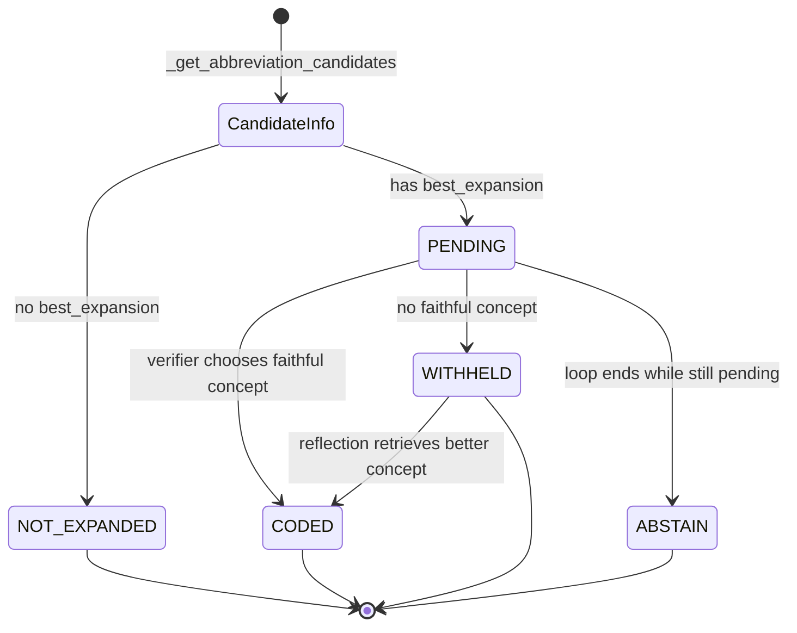

# 03_records 状态机详解：为什么 V11 比旧版更稳

> 这一章只讲一个核心：`records`。
> 如果 02 是“请求怎么从头走到尾”，那么 03 就是“每个缩写在系统内部到底怎么活、怎么死、怎么留下失败原因”。

---

## 先说结论

V11 的核心稳定性来自一个设计：

> 不再把一句话当成一个整体黑盒处理，而是把句子里的每个缩写都变成一条独立 record，从候选召回、扩写、标准化、校验、失败原因一路追踪到底。

这意味着：

```text
一句话里有 3 个缩写
  不再是 1 个整体结果
  而是 3 条独立生命周期
```

例如：

```text
The patient took ASA for CP and denies SOB.
```

系统内部会更像这样：

```text
ASA record
CP record
SOB record
```

每一条 record 都有自己的：

- 候选来源
- 候选扩写
- 选中的 expansion
- domain
- 标准化候选
- 最终标准概念
- 当前状态
- 失败原因

这就是为什么 V11 比早期版本更容易调试、更容易评估、更适合面试讲。

---

## 1. 为什么需要 records

如果不用 records，系统很容易变成这样：

```text
candidate_infos
expanded_text
mappings
standardization
verification
attempts
errors
```

这些变量看起来都有用，但问题是：

```text
CP 的候选在哪里？
CP 为什么扩成 chest pain？
CP 标准化候选有哪些？
CP 为什么最终没有 concept？
SOB 失败了吗，还是只有 CP 失败？
ASA 是走 SNOMED 还是 RxNorm？
```

如果所有结果都分散在不同列表里，你就必须靠下标、缩写字符串、临时字段去拼。

V11 的 record 解决的是这个问题：

```text
所有和某个缩写有关的信息，都写回这一个缩写自己的 record。
```

所以你可以把它理解成：

```text
record = 一个缩写在系统里的病例档案
```

---

## 2. record 是从 candidate_infos 转出来的

入口在：

```text
backend/services/abbr_service.py
ABBRService.expand_verify_with_retry()
```

函数先得到：

```python
candidate_infos = self._get_abbreviation_candidates(text)
```

`candidate_infos` 更像候选召回阶段的结果。

然后主状态机会把它转成 `records`：

```python
records = []
for info in candidate_infos:
    best = info.get("best_expansion")
    rec = {
        "abbreviation": info.get("abbreviation"),
        "source": info.get("candidate_source"),
        "candidates": info.get("candidates") or [],
        "coverage": info.get("coverage") or {},
        "expansion": best if best else None,
        "label": info.get("chosen_label"),
        "domain": info.get("chosen_domain"),
        "std_cache": None,
        "std_concept": None,
        "status": "PENDING" if best else "NOT_EXPANDED",
        "failure": None,
    }
```

这一步非常关键。

因为从这里开始，系统不再主要关心“候选召回结果列表”，而是关心：

```text
每条 record 的 status 是什么？
下一步应该处理哪些 status？
失败原因要写到哪里？
```

---

## 3. record 字段逐个解释

### `abbreviation`

原文里的缩写。

例如：

```json
{
  "abbreviation": "CP"
}
```

它是后面匹配 verifier 返回、最终输出 mappings、错误分析时最重要的身份字段。

---

### `source`

候选来源。

可能值主要有：

| source | 含义 |
|---|---|
| `primary` | 来自主候选词典 `ABBR_CANDIDATES` |
| `fallback` | 主候选没有时，由 LLM fallback 生成 |
| `none` | 两层召回都没有候选 |

它回答的是：

```text
这个 expansion 是从可靠词典来的，还是 LLM 兜底来的？
```

这对调试很重要。因为 fallback 候选更容易不稳定，所以代码里给 fallback 设置了更严格的 coverage 门槛。

---

### `candidates`

这个缩写所有候选扩写。

例如：

```json
[
  {
    "abbreviation": "CP",
    "expansion": "chest pain",
    "domain": "Condition"
  },
  {
    "abbreviation": "CP",
    "expansion": "cerebral palsy",
    "domain": "Condition"
  }
]
```

注意：`candidates` 不是最终答案，只是备选池。

---

### `coverage`

coverage evaluator 的判断结果。

它说明：

```text
候选集合里有没有合理扩写？
置信度多少？
哪些候选在当前上下文里 plausible？
best_expansion 是谁？
为什么？
```

示意：

```json
{
  "coverage_ok": true,
  "confidence": 0.86,
  "plausible_candidates": ["chest pain"],
  "best_expansion": "chest pain",
  "reason": "The context supports chest pain.",
  "issues": []
}
```

`coverage` 是从“候选召回”走向“真正扩写”的闸门。

---

### `expansion`

最终准备用来替换原文的扩写。

它来自：

```python
best = info.get("best_expansion")
```

如果有 best：

```json
{
  "expansion": "chest pain"
}
```

如果没有 best：

```json
{
  "expansion": null
}
```

这里你要记住：

```text
没有 expansion，就不会替换原文，也不会进入标准化。
```

---

### `domain`

候选对应的医学域。

例如：

| expansion | domain |
|---|---|
| `aspirin` | `Drug` |
| `chest pain` | `Condition` |
| `shortness of breath` | `Condition` |

它后面会影响标准库路由：

```python
return "rxnorm" if domain == "Drug" else "snomed"
```

所以：

```text
domain = Drug       → 查 RxNorm collection
domain != Drug      → 查 SNOMED collection
```

---

### `std_cache`

标准概念候选缓存。

刚创建 record 时：

```json
{
  "std_cache": null
}
```

等进入标准化检索后，它会被填成：

```json
{
  "std_cache": [
    {
      "concept_id": "...",
      "concept_name": "Chest pain",
      "domain_id": "Condition",
      "concept_code": "...",
      "score": 0.82,
      "rerank_score": 1.12
    }
  ]
}
```

它回答的是：

```text
系统为这个 expansion 找到了哪些标准概念候选？
```

---

### `std_concept`

最终选中的标准概念。

刚开始：

```json
{
  "std_concept": null
}
```

如果 verifier 认为某个候选忠实：

```json
{
  "std_concept": {
    "concept_id": "...",
    "concept_name": "Chest pain",
    "domain_id": "Condition",
    "concept_code": "...",
    "score": 0.82,
    "rerank_score": 1.12
  }
}
```

它回答的是：

```text
这个缩写扩写后，最终绑定到了哪个 SNOMED/RxNorm 概念？
```

---

### `status`

record 的当前生命周期状态。

这是本章最重要的字段。

V11 里主要有 5 个状态：

| 状态 | 含义 |
|---|---|
| `NOT_EXPANDED` | 没有选出可靠扩写，不替换原文 |
| `PENDING` | 已选出 expansion，等待标准化 |
| `CODED` | 已扩写，并成功绑定标准概念 |
| `WITHHELD` | 已扩写，但标准概念不敢选 |
| `ABSTAIN` | 多轮结束后仍没处理完，保守放弃 |

你可以把它想成一个小状态机：

```text
候选召回 + coverage
    ↓
有 best_expansion? 
    ├─ 否 → NOT_EXPANDED
    └─ 是 → PENDING
              ↓
          标准概念检索 + verifier
              ↓
          忠实候选?
              ├─ 是 → CODED
              └─ 否 → WITHHELD
                         ↓
                    反思重检索可能救回
                         ↓
                       CODED 或保持 WITHHELD
```

---

### `failure`

失败原因。

如果 record 正常：

```json
{
  "failure": null
}
```

如果 coverage 阶段没有扩写：

```json
{
  "failure": {
    "type": "ABBR_NOT_EXPANDED",
    "stage": "coverage",
    "reason": "coverage withheld expansion (not confident enough)",
    "evidence": {
      "coverage_confidence": 0.42,
      "coverage_ok": false,
      "candidates_seen": ["..."]
    }
  }
}
```

如果标准化阶段不敢选概念：

```json
{
  "failure": {
    "type": "CODE_WITHHELD",
    "stage": "standardization",
    "reason": "no faithful SNOMED concept among retrieved candidates",
    "evidence": {
      "retrieved_top": ["Chest pain rating", "Chest pain service"]
    }
  }
}
```

这个字段的价值非常大。

因为它让你不只是知道：

```text
系统错了
```

而是知道：

```text
系统在哪个阶段错了
为什么错
当时看到了哪些证据
```

---

## 4. 状态一：`NOT_EXPANDED`

触发位置：

```python
"status": "PENDING" if best else "NOT_EXPANDED"
```

也就是说：

```text
没有 best_expansion → NOT_EXPANDED
```

常见原因：

- 主候选词典没有候选。
- fallback 也没有候选。
- coverage evaluator 认为候选不适合当前上下文。
- fallback 置信度低于阈值。

例子：

```text
Patient has XYZ.
```

如果系统找不到可靠候选：

```json
{
  "abbreviation": "XYZ",
  "expansion": null,
  "status": "NOT_EXPANDED",
  "failure": {
    "type": "ABBR_NOT_EXPANDED",
    "stage": "coverage"
  }
}
```

为什么这个状态重要？

因为它体现了项目的保守策略：

```text
不确定就不扩写。
```

面试说法：

> `NOT_EXPANDED` 表示系统识别到一个可能缩写，但没有足够证据选择扩写。这个状态比强行扩写更安全，尤其在医疗文本里，错误扩写可能改变临床语义。

---

## 5. 状态二：`PENDING`

触发条件：

```text
coverage 阶段选出了 best_expansion
```

例如：

```json
{
  "abbreviation": "CP",
  "expansion": "chest pain",
  "domain": "Condition",
  "status": "PENDING"
}
```

`PENDING` 的意思不是“失败”，而是：

```text
扩写已经决定了，但标准概念还没处理。
```

主状态机后面只处理 `PENDING`：

```python
pending = [r for r in records if r["status"] == "PENDING"]
```

也就是说：

- `NOT_EXPANDED` 不会去查 SNOMED/RxNorm。
- 已经 `CODED` 的不会重复查。
- 当前轮只处理还没完成标准化的 record。

面试说法：

> `PENDING` 是扩写和标准化之间的中间状态。它表示 expansion 已经通过 coverage，但还需要检索标准概念并经过 verifier 校验。

---

## 6. 状态三：`CODED`

触发位置：

```python
if r["std_concept"]:
    r["status"] = "CODED"
    r["failure"] = None
```

它意味着：

```text
这个缩写已经扩写成功，并且找到了忠实标准概念。
```

例如：

```json
{
  "abbreviation": "CP",
  "expansion": "chest pain",
  "std_concept": {
    "concept_name": "Chest pain",
    "domain_id": "Condition"
  },
  "status": "CODED",
  "failure": null
}
```

`CODED` 是最理想状态。

但注意：

```text
CODED 不是只靠向量分数决定的。
```

必须满足：

1. `MedicalRetriever` 找到候选。
2. `ABBVerifier.verify_mappings()` 返回 `standardization_faithful = true`。
3. `chosen_index` 是合法整数。
4. `chosen_index` 指向 `std_cache` 里的候选。

所以 `CODED` 代表的是：

```text
检索候选 + LLM 忠实性校验都通过。
```

面试说法：

> `CODED` 是最终成功状态，表示 expansion 不仅被确定性替换到了文本里，而且被 verifier 认为可以忠实映射到某个标准医学概念。

---

## 7. 状态四：`WITHHELD`

触发位置：

```python
else:
    r["status"] = "WITHHELD"
    r["failure"] = {
        "type": "CODE_WITHHELD",
        "stage": "standardization",
        ...
    }
```

它意味着：

```text
扩写可以做，但标准概念不敢选。
```

这是 V11 很重要的保守设计。

例如：

```json
{
  "abbreviation": "CP",
  "expansion": "chest pain",
  "std_cache": [
    {"concept_name": "Chest pain rating"},
    {"concept_name": "Pain management service"}
  ],
  "std_concept": null,
  "status": "WITHHELD",
  "failure": {
    "type": "CODE_WITHHELD",
    "stage": "standardization",
    "reason": "no faithful SNOMED concept among retrieved candidates"
  }
}
```

它和 `NOT_EXPANDED` 的区别：

| 状态 | 扩写文本会不会改？ | 标准概念有没有选？ |
|---|---|---|
| `NOT_EXPANDED` | 不会 | 没有 |
| `WITHHELD` | 会 | 没有 |

为什么 `WITHHELD` 仍然算 resolved？

因为主状态机里：

```python
resolved = [r for r in records if r["status"] in ("CODED", "WITHHELD")]
```

也就是说：

```text
WITHHELD 表示扩写问题已经解决，但编码问题保守放弃。
```

这是一个比“全部失败”更细的结果。

面试说法：

> `WITHHELD` 是为了区分“扩写是可信的”和“标准概念不可信”。在医疗场景下，我宁可返回扩写文本但不绑定 concept，也不强行给一个可能错误的标准编码。

---

## 8. 状态五：`ABSTAIN`

触发位置：

```python
if r["status"] == "PENDING":
    r["status"] = "ABSTAIN"
    r["failure"] = {
        "type": "EXPANSION_ABSTAIN",
        "stage": "coverage",
        ...
    }
```

它出现在 retry loop 结束后，仍然还有 record 卡在 `PENDING` 的情况。

理论上常见路径里：

```text
PENDING → CODED
PENDING → WITHHELD
```

但系统仍然留了兜底：

```text
如果循环结束还有 PENDING，就标记 ABSTAIN。
```

这是一种防御式编程：

```text
不要让半成品状态悄悄流到最终结果里。
```

面试说法：

> `ABSTAIN` 是兜底状态，防止 record 在多轮处理后仍停留在中间态。它保证最终输出里每个缩写都有明确生命周期结论。

---

## 9. 状态机图



---

## 10. 用 ASA、CP、SOB 走一遍状态变化

原文：

```text
The patient took ASA for CP and denies SOB.
```

### 初始 candidate_infos

示意：

```json
[
  {
    "abbreviation": "ASA",
    "best_expansion": "aspirin",
    "chosen_domain": "Drug",
    "candidate_source": "primary"
  },
  {
    "abbreviation": "CP",
    "best_expansion": "chest pain",
    "chosen_domain": "Condition",
    "candidate_source": "primary"
  },
  {
    "abbreviation": "SOB",
    "best_expansion": "shortness of breath",
    "chosen_domain": "Condition",
    "candidate_source": "primary"
  }
]
```

### 转成 records

```json
[
  {
    "abbreviation": "ASA",
    "expansion": "aspirin",
    "domain": "Drug",
    "std_cache": null,
    "std_concept": null,
    "status": "PENDING",
    "failure": null
  },
  {
    "abbreviation": "CP",
    "expansion": "chest pain",
    "domain": "Condition",
    "std_cache": null,
    "std_concept": null,
    "status": "PENDING",
    "failure": null
  },
  {
    "abbreviation": "SOB",
    "expansion": "shortness of breath",
    "domain": "Condition",
    "std_cache": null,
    "std_concept": null,
    "status": "PENDING",
    "failure": null
  }
]
```

### 检索标准概念

路由结果：

| record | domain | source |
|---|---|---|
| ASA | `Drug` | `rxnorm` |
| CP | `Condition` | `snomed` |
| SOB | `Condition` | `snomed` |

此时每条 record 的 `std_cache` 被填充。

### verifier 后的理想状态

示意：

```json
[
  {
    "abbreviation": "ASA",
    "status": "CODED",
    "std_concept": {"concept_name": "aspirin"}
  },
  {
    "abbreviation": "CP",
    "status": "CODED",
    "std_concept": {"concept_name": "Chest pain"}
  },
  {
    "abbreviation": "SOB",
    "status": "CODED",
    "std_concept": {"concept_name": "Shortness of breath"}
  }
]
```

### 如果 SOB 标准化不可靠

另一种可能：

```json
[
  {
    "abbreviation": "ASA",
    "status": "CODED"
  },
  {
    "abbreviation": "CP",
    "status": "CODED"
  },
  {
    "abbreviation": "SOB",
    "status": "WITHHELD",
    "failure": {
      "type": "CODE_WITHHELD",
      "stage": "standardization"
    }
  }
]
```

这时整句不是完全失败。

更准确的解释是：

```text
ASA 和 CP 已经成功编码。
SOB 已经扩写，但标准概念 withheld。
```

这个粒度对面试和错误分析都很重要。

---

## 11. 为什么 `WITHHELD` 还会出现在最终 mappings

代码里：

```python
resolved = [r for r in records if r["status"] in ("CODED", "WITHHELD")]
```

然后：

```python
final_mappings = [
    {
        "abbreviation": r["abbreviation"],
        "expansion": r["expansion"],
        "label": r["label"],
        "source": r["source"]
    }
    for r in resolved
]
```

所以 `WITHHELD` 会进入 `mappings`。

原因是：

```text
mappings 记录的是缩写 → 扩写是否成立。
standardized_entities 记录的是扩写 → 标准概念是否成立。
```

这两个问题被拆开了。

| 层次 | 问题 | 结果位置 |
|---|---|---|
| 扩写层 | `CP` 是否能扩成 `chest pain` | `mappings` |
| 标准化层 | `chest pain` 是否能绑定 SNOMED 概念 | `standardized_entities` / `chosen_concept` |

所以：

```text
WITHHELD 仍可有 expansion，但没有 chosen_concept。
```

面试说法：

> 我把 expansion 和 standardization 解耦了。一个缩写可以扩写成功，但标准概念因为不够忠实而 withheld。这样比把整个样例判成失败更符合真实医疗 NLP 的不确定性。

---

## 12. success 是怎么计算的

主状态机里：

```python
success = len(_expanded(records)) > 0 and all(
    r["status"] in ("CODED", "WITHHELD") for r in _expanded(records)
)
```

拆开看：

### 条件 1：至少有一个扩写

```python
len(_expanded(records)) > 0
```

如果一句话里没有任何可靠扩写：

```text
success = False
```

### 条件 2：所有已经扩写的 record 都到达终态

```python
r["status"] in ("CODED", "WITHHELD")
```

也就是说：

```text
只要一个缩写已经被扩写，它最后要么 CODED，要么 WITHHELD。
不能还停在 PENDING。
```

为什么 `WITHHELD` 也算 success？

因为这里的 success 更偏向：

```text
扩写流程是否完成，而不是每个扩写是否都有标准编码。
```

如果你面试时被追问，可以这样说：

> 当前 `success` 的语义更接近“缩写扩写流程是否完成”。标准化是否成功要看 `standardized_entities` 或 `mapping_states` 中每个 record 的 `CODED/WITHHELD` 状态。如果要做更严格 API，可以再增加 `all_coded` 这类字段。

这句话很重要，因为它体现你知道系统边界，不会把现在的 success 夸大成“所有医学标准化都成功”。

---

## 13. mapping_states 为什么重要

最终 `final_result` 里会返回：

```python
"mapping_states": [
    {
        "abbreviation": r["abbreviation"],
        "expansion": r["expansion"],
        "status": r["status"],
        "failure": r["failure"]
    }
    for r in records
]
```

它是给谁用的？

不是主要给普通 API 用户看，而是给：

- benchmark
- error collector
- error analysis
- 后续人工排查

例如 `run_benchmark.py` 里会读取：

```python
collect_unresolved(
    text=case["text"],
    records=final_result.get("mapping_states", []),
    source="benchmark:main",
    gold_abbrs=gold_abbrs,
)
```

`error_collector.py` 会把有 `failure` 的 record 写入：

```text
backend/logs/unresolved_cases.jsonl
```

记录字段包括：

- `failure_type`
- `stage`
- `abbreviation`
- `expansion`
- `reason`
- `evidence`
- `expected`

这就让错误分析可以回答：

```text
最近失败最多的是 coverage 问题，还是 standardization 问题？
哪个缩写最常出错？
哪些 expansion 经常 CODE_WITHHELD？
```

面试说法：

> `mapping_states` 是我做错误分析的关键桥梁。生产链路里的每个失败都会带 failure type、stage、reason 和 evidence，benchmark 可以直接收集这些状态做归因，而不是只知道最终对错。

---

## 14. V11 状态机解决了哪些旧问题

### 问题 1：一句话里多个缩写互相影响

旧思路容易变成：

```text
整句成功 or 整句失败
```

V11：

```text
ASA 成功
CP 成功
SOB withheld
```

这叫 per-mapping failure isolation。

---

### 问题 2：不知道失败发生在哪一层

旧思路可能只看到：

```text
结果不对
```

V11 可以看到：

```text
ABBR_NOT_EXPANDED / coverage
CODE_WITHHELD / standardization
EXPANSION_ABSTAIN / coverage
GOLD_MISMATCH / expansion
```

这对后续优化非常重要。

---

### 问题 3：扩写成功和标准化成功混在一起

旧思路容易把这两个问题合并：

```text
缩写处理成功了吗？
```

V11 拆成：

```text
缩写是否扩写成功？
扩写是否绑定标准概念成功？
绑定是否忠实？
```

这更符合医疗 NLP 的真实难度。

---

### 问题 4：LLM 出错后难排查

V11 把 LLM 放在受控节点：

- coverage evaluator
- verifier
- reflection requery

并且把它的结果写回 record。

所以出错时可以看：

```text
是 coverage 选错 best_expansion？
还是 verifier 没选 concept？
还是 reflection 没找到更好检索词？
```

---

## 15. 你要能手画的数据流

面试前，你至少要能凭记忆画出这个：

```text
candidate_infos
    ↓
records 初始化
    ↓
status = PENDING / NOT_EXPANDED
    ↓
PENDING → retrieve → std_cache
    ↓
verify_mappings
    ↓
std_concept ?
    ├─ yes → CODED
    └─ no  → WITHHELD → reflection maybe CODED
    ↓
mapping_states + final_result
    ↓
error_collector / benchmark
```

这比背 20 个文件名重要得多。

---

## 16. 面试怎么讲 records 状态机

30 秒版本：

> V11 里我把每个缩写都抽象成一条 record，而不是只维护整句级结果。record 从候选召回开始就记录 abbreviation、candidates、coverage、expansion、domain、std_cache、std_concept、status 和 failure。这样每个缩写可以独立从 `PENDING` 走到 `CODED`、`WITHHELD` 或 `NOT_EXPANDED`，一个缩写失败不会污染整句。最终 `mapping_states` 还会进入 benchmark 和 error analysis，用于定位失败发生在 coverage 还是 standardization。

2 分钟版本：

> 早期版本的问题是中间结果比较散，比如候选、扩写、标准化、校验结果都在不同结构里，多个缩写同时出现时很难判断到底哪个缩写在哪个阶段失败。V11 我把每个缩写变成统一 record。初始化时，如果 coverage 给出了 `best_expansion`，record 就进入 `PENDING`；否则就是 `NOT_EXPANDED`，并写入 coverage 阶段的 failure。
>
> `PENDING` 的 record 会进入标准化检索。系统根据 domain 决定查 SNOMED 还是 RxNorm，把检索结果写进 `std_cache`，然后 verifier 在候选中判断哪个标准概念和 expansion 忠实一致。如果 verifier 选中了合法候选，record 就变成 `CODED`；如果没有忠实候选，就变成 `WITHHELD`，表示扩写可以保留，但标准概念不强行绑定。之后 reflection 可以尝试提出同义检索词重查，如果找到更好的概念，再把 `WITHHELD` 救回 `CODED`。
>
> 这个设计的好处是 per-mapping failure isolation。比如一句话里 ASA 和 CP 成功，SOB 标准化失败，系统不会把整句话粗暴判成失败，而是分别记录每个缩写的状态和原因。最终 `mapping_states` 会被 benchmark 和 error collector 使用，帮助我统计失败类型，比如 coverage 不足、standardization withheld 或 gold mismatch。

---

## 17. 这一章你真正要记住的 6 句话

1. `record` 是一个缩写从候选召回到最终输出的生命周期档案。
2. `PENDING` 表示扩写已确定，但标准化还没完成。
3. `CODED` 表示扩写和标准概念绑定都成功。
4. `WITHHELD` 表示扩写成功，但标准概念不敢强行绑定。
5. `NOT_EXPANDED` 表示 coverage 阶段不够可靠，原文不替换。
6. `mapping_states` 是错误分析和 benchmark 归因的入口。

---

## 18. 下一章建议

下一章建议写：

```text
04_候选召回与coverage闸门_为什么不让LLM直接扩写.md
```

因为现在你已经知道 record 是骨架，下一步就该看：

```text
record.expansion 到底是怎么被选出来的？
为什么需要 primary candidates？
为什么 fallback 要更严格？
coverage evaluator 到底防了什么风险？
```

