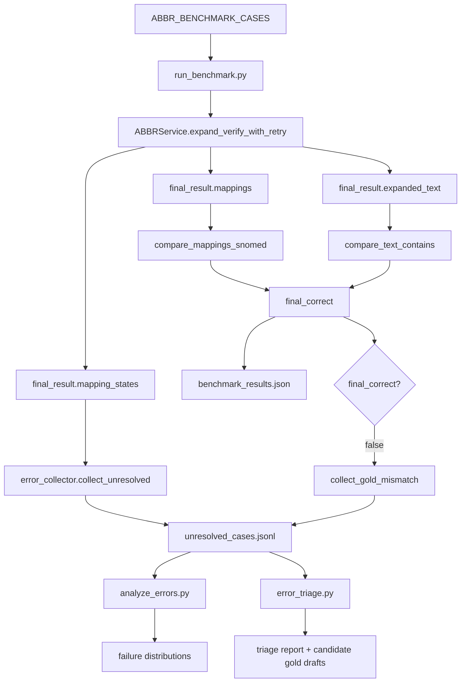

# 10_Benchmark 与 ErrorAnalysis：系统怎么知道自己错在哪

> 这一章接着 09 讲：
> API 已经能返回结果了，但项目不能只靠“看起来不错”。你需要知道它怎么评估、怎么记录失败、怎么定位下一步改哪里。

---

## 先说结论

V11 的评估闭环可以分成 4 层：

```text
Benchmark cases
  ↓
run_benchmark.py 跑主链路并判对错
  ↓
error_collector.py 收集失败状态和 gold mismatch
  ↓
analyze_errors.py / error_triage.py 做错误聚类和归因
```

一句话：

> benchmark 告诉你“对不对”，error analysis 告诉你“错在哪一层、下一步该改什么”。

---

## 1. 为什么需要评估闭环

这个项目里有很多会影响结果的环节：

- 缩写 token gate
- 主候选词典
- fallback LLM
- coverage evaluator
- 确定性替换
- SNOMED/RxNorm 检索
- verifier 忠实性判断
- 反思重检索

如果只看一两条样例，很容易误判：

```text
这次输出对了 → 系统变好了
这次输出错了 → prompt 要改
```

但真实情况可能是：

| 表面现象 | 真实原因可能是 |
|---|---|
| 没扩写 | 候选词典缺、coverage 拒绝、fallback 不敢扩 |
| 扩错了 | 候选集错误、coverage 选错、gold 有争议 |
| 扩写对但没 code | 检索没召回、verifier 过严、库里没有忠实概念 |
| benchmark 错 | gold label 太窄、可接受同义词没加 |

所以需要闭环：

```text
跑一批样例
  → 记录对错
  → 收集失败原因
  → 归因
  → 决定改词典、改检索、改 verifier，还是改 gold
```

---

## 2. 主 benchmark 入口

文件：

```text
backend/evaluation/run_benchmark.py
```

测试集：

```text
backend/evaluation/abbr_benchmark_cases.py
ABBR_BENCHMARK_CASES
```

主流程：

```python
for case in ABBR_BENCHMARK_CASES:
    result = service.expand_verify_with_retry(
        text=case["text"],
        max_retries=2
    )
```

也就是说：

```text
benchmark 跑的就是生产主链路 ABBRService.expand_verify_with_retry()
```

这点很重要。

它不是单独写一套假逻辑评估。

面试说法：

> 主 benchmark 直接调用生产主状态机 `expand_verify_with_retry`，所以评估的是实际 API 背后的核心逻辑，而不是另写一套离线假流程。

---

## 3. 每个 case 里通常有什么

benchmark case 通常包括：

```json
{
  "id": "case_id",
  "category": "basic",
  "text": "The patient has CP and SOB.",
  "expected_mappings": [
    {"abbreviation": "CP", "expansion": "chest pain"},
    {"abbreviation": "SOB", "expansion": "shortness of breath"}
  ],
  "expected_text_contains": "chest pain"
}
```

核心字段：

| 字段 | 用途 |
|---|---|
| `text` | 输入原文 |
| `expected_mappings` | 期望缩写扩写 |
| `expected_text_contains` | 期望最终文本包含某片段 |
| `category` | 分类统计准确率 |

`category` 可以帮助你看：

```text
基础缩写好不好？
否定表达好不好？
未知缩写 abstain 好不好？
CASI 真实样例好不好？
```

---

## 4. benchmark 取系统哪些输出

主脚本里：

```python
final_result = result.get("final_result", {})
predicted_mappings = final_result.get("mappings", [])
final_expanded_text = final_result.get("expanded_text", "")
```

也就是只拿：

| 系统输出 | 用来评估什么 |
|---|---|
| `mappings` | 缩写扩写是否对 |
| `expanded_text` | 文本中是否保留/包含期望片段 |

这对应 09 章：

```text
mappings = 扩写层结果
expanded_text = 最终可见文本
```

---

## 5. mapping_correct 怎么判

主 benchmark 调：

```python
is_correct = compare_mappings_snomed(
    service,
    case["expected_mappings"],
    predicted_mappings
)
```

这个函数在：

```text
backend/evaluation/concept_match.py
```

它不是简单字符串完全相等。

它采用混合判等：

```text
1. 缩写集合必须完全一致。
2. 每个缩写的 expansion 如果字符串相同，算对。
3. 如果字符串不同，但两个 expansion 能映射到同一 SNOMED concept_id，也算语义等价。
```

例如：

```text
primary care provider
primary care physician
```

字符串不同，但如果标准化后 concept_id 一样，可以算等价。

这个设计比纯字符串评估更贴近医学标准化任务。

但它也有边界：

```text
只有当两个 expansion 都能可靠落到库里时，concept_id 判等才生效。
库外扩写仍退回字符串判等。
```

面试说法：

> 评估时我没有只做字符串硬匹配，而是允许 expansion 映射到同一 SNOMED concept_id 时算语义等价。但缩写集合必须完全一致，这样能防止系统多扩或少扩。

---

## 6. 为什么缩写集合必须一致

`compare_mappings_snomed()` 里有一条硬规则：

```python
if set(pred.keys()) != set(gold.keys()):
    return False
```

也就是说：

```text
预测出来的缩写集合必须和 gold 一样。
```

这样可以惩罚两类错误：

### 少扩

gold 里有：

```text
CP, SOB
```

系统只扩：

```text
CP
```

错。

### 多扩

gold 里只有：

```text
SOB
```

系统还把某个不该扩的 `ABC` 扩了。

错。

这对防止过度扩写很重要。

面试说法：

> 我要求缩写集合完全一致，因为医学缩写任务不仅要扩对，还要知道什么时候不扩。多扩和少扩都应该算错。

---

## 7. text_check 是什么

除了 mapping_correct，benchmark 还会做：

```python
text_check = compare_text_contains(
    final_text=final_expanded_text,
    expected_text_contains=case.get("expected_text_contains")
)
```

它检查：

```text
最终 expanded_text 是否包含某个期望片段。
```

主要用于：

```text
否定表达、上下文保留、最终文本可见性
```

例如：

```text
The patient denies CP.
```

期望：

```text
denies chest pain
```

系统不能扩写成：

```text
has chest pain
```

虽然当前项目的文本替换是确定性的，理论上不会主动改否定词，但这个检查仍然能防止未来改动破坏语义。

---

## 8. final_correct 怎么来

主脚本里：

```python
final_correct = is_correct and text_check["correct"]
```

也就是说一个 case 要对，必须同时满足：

```text
mapping 对
文本包含检查也对
```

统计：

```python
accuracy = correct / total
```

还会按 category 统计：

```python
category_stats[category]["total"]
category_stats[category]["correct"]
```

输出保存到：

```text
backend/evaluation/benchmark_results.json
```

---

## 9. benchmark 失败时不只是打印

主 benchmark 还会做两类错误收集。

### 1. 收集 runtime known-unknowns

```python
collect_unresolved(
    text=case["text"],
    records=final_result.get("mapping_states", []),
    source="benchmark:main",
    gold_abbrs=gold_abbrs,
)
```

这里用的是：

```text
mapping_states
```

也就是每个缩写的：

```text
status + failure
```

### 2. 收集 gold mismatch

如果最终不正确：

```python
collect_gold_mismatch(
    text=case["text"],
    stage="expansion",
    source="benchmark:main",
    expected=case["expected_mappings"],
    predicted=predicted_mappings,
)
```

这会记录：

```text
expected != predicted
```

所以系统能同时知道：

```text
内部哪里 withheld/not expanded
外部和 gold 对比哪里不一致
```

---

## 10. error_collector 记录什么

文件：

```text
backend/services/error_collector.py
```

默认日志：

```text
backend/logs/unresolved_cases.jsonl
```

每条失败记录包含：

```json
{
  "ts": "2026-...",
  "text": "...",
  "source": "benchmark:main",
  "failure_type": "CODE_WITHHELD",
  "stage": "standardization",
  "abbreviation": "SOB",
  "expansion": "shortness of breath",
  "reason": "...",
  "evidence": {
    "retrieved_top": ["..."]
  },
  "expected": false
}
```

核心字段：

| 字段 | 意义 |
|---|---|
| `failure_type` | 错误类型 |
| `stage` | 发生阶段 |
| `abbreviation` | 哪个缩写 |
| `expansion` | 当时扩写是什么 |
| `reason` | 失败原因 |
| `evidence` | 当时证据 |
| `expected` | 根据 gold 判断这个失败是否预期内 |

常见 `failure_type`：

| failure_type | 意义 |
|---|---|
| `ABBR_NOT_EXPANDED` | coverage 阶段不敢扩 |
| `EXPANSION_ABSTAIN` | 多轮后放弃 |
| `COVERAGE_FAILED` | 整体没有任何可用扩写 |
| `CODE_WITHHELD` | 扩写有了，但标准概念不敢选 |
| `GOLD_MISMATCH` | 系统输出和 gold 不一致 |

---

## 11. expected 字段是干什么的

`error_collector._expected_for()` 里有逻辑：

```python
if failure_type in ("ABBR_NOT_EXPANDED", "EXPANSION_ABSTAIN", "COVERAGE_FAILED"):
    return abbr not in gold_abbrs
```

意思是：

```text
如果某个缩写不在 gold 里，
系统拒绝扩写它，
这可能是预期内的正确 abstain。
```

例如：

```text
Patient has XYZ.
```

gold 里没有 `XYZ`。

系统 `NOT_EXPANDED`，这可能是好事。

所以 `expected=True` 的失败记录，在默认错误分析里会被隐藏。

这是为了避免把正确拒绝扩写当成错误。

面试说法：

> error collector 会根据 gold 判断某些 abstain 是否是预期内行为。比如 gold 不要求扩写 XYZ，系统拒绝扩写就不应该当成真错误分析。

---

## 12. analyze_errors 做什么

文件：

```text
backend/evaluation/analyze_errors.py
```

它读取：

```text
backend/logs/unresolved_cases.jsonl
```

默认过滤：

```python
recs = [r for r in raw if r.get("expected") is not True]
```

也就是：

```text
隐藏 expected=True 的预期内拒绝扩写。
```

然后统计：

- 按 `failure_type`
- 按 `abbreviation`
- 按 `CODE_WITHHELD` 的 expansion
- 按 `source`
- 按 `stage`
- 每种 failure_type 给一个样例

它回答的是：

```text
现在最多的问题是哪类？
哪个缩写最常出错？
是 coverage 阶段多，还是 standardization 阶段多？
```

这是快速粗粒度排查工具。

---

## 13. error_triage 做什么

文件：

```text
backend/evaluation/error_triage.py
```

它更重，属于离线分析。

流程：

```text
读取 unresolved_cases.jsonl
  ↓
隐藏 expected=True
  ↓
按 (failure_type, stage) 聚类
  ↓
LLM 提根因假设
  ↓
用真实数据自检假设
  ↓
再让 LLM 根据自检结果写中文执行摘要
```

它输出：

```text
backend/logs/triage/error_triage_report.md
backend/logs/triage/candidate_gold_cases.json
```

注意这个脚本的设计边界：

```text
LLM 只提假设和写总结。
真实判断要经过数据自检。
不会自动改代码或 gold。
```

面试说法：

> 我后期做了离线错误 triage：先按 failure_type 和 stage 聚类，再让 LLM 提根因假设，但这些假设还要用真实词典和 Milvus 检索自检。LLM 不直接决定结论，也不自动改代码。

---

## 14. triage 里的 lever 是什么

`error_triage.py` 定义了几个可改杠杆：

```text
dictionary | lib_coverage | retrieval | verify_rubric | gold_labeling | other
```

它们对应：

| lever | 意义 | 可能动作 |
|---|---|---|
| `dictionary` | 缩写候选词典缺 | 补 `ABBR_CANDIDATES` |
| `lib_coverage` | 标准概念库缺 | 扩大 SNOMED/RxNorm 数据 |
| `retrieval` | 库里有但没召回 | 调 embedding/rerank/threshold |
| `verify_rubric` | verifier 规则过严/过松 | 改 prompt/rubric |
| `gold_labeling` | benchmark gold 有问题 | 人工复核 gold |
| `other` | 其他原因 | 单独分析 |

这能把“错了”转成“该改哪一层”。

---

## 15. concept benchmark 是什么

文件：

```text
backend/evaluation/run_concept_benchmark.py
```

主 benchmark 测的是整条链路：

```text
缩写识别 + 候选 + coverage + 检索 + verifier + 反思
```

concept benchmark 只测标准化层：

```text
给定正确 expansion
  ↓
检索 top-10
  ↓
verify chosen_index
  ↓
反思
  ↓
判断 chosen concept 是否符合 prefer/accept
```

它绕过 coverage，专门回答：

```text
如果 expansion 已经对了，标准化能不能选对 concept？
```

指标：

| 指标 | 意义 |
|---|---|
| `PASS` | 是否命中忠实/可接受概念 |
| `canonical` | 是否命中最规范 prefer 概念 |

两者差距表示：

```text
标准化已经忠实，但还不够规范，反思/检索仍有提升空间。
```

---

## 16. parallel benchmark 是什么

文件：

```text
backend/evaluation/run_benchmark_parallel.py
```

它和主 benchmark 的评分逻辑一致，只是执行方式变成并行。

为什么能并行？

```text
每个 benchmark case 互相独立。
主要等待时间来自 LLM API。
```

它用：

```python
ThreadPoolExecutor
```

并且每个线程有自己的 `ABBRService`：

```python
threading.local()
```

原因：

```text
ABBRService 里有 NER pipeline、embedding、Milvus client 等对象，不保证线程安全。
```

所以：

```text
并行版是为了加速评估，不改变评估口径。
```

面试说法：

> 并行 benchmark 只是把 case 执行并发化，评分口径和串行版一致。每个线程维护自己的 service，避免模型和 Milvus client 线程安全问题。

---

## 17. 整个评估闭环图



---

## 18. 这个闭环怎么指导改项目

如果错误集中在：

### `ABBR_NOT_EXPANDED / coverage`

可能要看：

- 候选词典是否缺 sense。
- fallback 是否过严。
- coverage prompt 是否不理解上下文。

### `CODE_WITHHELD / standardization`

可能要看：

- SNOMED/RxNorm 是否缺概念。
- retriever 有没有召回正确候选。
- verifier 是否过严。
- reflection 是否没有提出好 requery。

### `GOLD_MISMATCH / expansion`

可能要看：

- 系统真的扩错了。
- gold 标签太窄。
- accept 同义词没补。
- 系统多扩了不该扩的缩写。

### 某个 abbreviation 高频出错

可能要看：

- 这个缩写多义性太强。
- 候选列表顺序/覆盖不足。
- 需要加类别或上下文特征。

---

## 19. 面试怎么讲这章

30 秒版本：

> 我不是只靠看单条输出调 prompt，而是做了 benchmark 和错误分析闭环。主 benchmark 直接跑生产主链路，比较 expected mappings 和 predicted mappings，同时检查 expanded_text 是否保留关键片段。失败时，系统会把 mapping_states 里的 failure_type、stage、reason、evidence 写入统一 JSONL，再用 analyze_errors 统计错误分布，必要时用 error_triage 按 failure_type/stage 聚类，让 LLM 提假设并用真实词典和 Milvus 自检。

2 分钟版本：

> 这个项目后期我重点做了可评估和可归因。`run_benchmark.py` 会遍历 benchmark cases，直接调用 `ABBRService.expand_verify_with_retry`，拿到 `final_result.mappings` 和 `expanded_text`。扩写判断不是只做字符串硬匹配，而是通过 `compare_mappings_snomed` 支持字符串相同或者两个 expansion 映射到同一 SNOMED concept_id 时算等价，同时要求缩写集合完全一致，防止多扩和少扩。
>
> 每个 case 最终用 `mapping_correct && text_check.correct` 得到 final_correct，并按 category 统计准确率，结果写入 `benchmark_results.json`。同时，benchmark 会把内部的 `mapping_states` 交给 error collector，收集 `ABBR_NOT_EXPANDED`、`CODE_WITHHELD`、`COVERAGE_FAILED` 等运行时失败；如果预测和 gold 不一致，还会记录 `GOLD_MISMATCH`。
>
> 后续 `analyze_errors.py` 会从统一 JSONL 里统计 failure_type、stage、abbreviation、withheld expansion 等分布。更重的 `error_triage.py` 会按 `(failure_type, stage)` 聚类，让 LLM 提根因假设，再用真实词典和 Milvus 检索做自检，避免 LLM 自己编结论。这样我能判断下一步该补候选词典、扩标准库、调检索、改 verifier rubric，还是复核 gold。

---

## 20. 你要记住的 8 句话

1. 主 benchmark 直接跑生产主链路。
2. `mappings` 用来判扩写，`expanded_text` 用来判文本保留。
3. `compare_mappings_snomed()` 支持字符串相同或 SNOMED concept_id 等价。
4. 缩写集合必须完全一致，多扩少扩都算错。
5. `mapping_states` 会进入 error collector。
6. `unresolved_cases.jsonl` 是统一错误日志。
7. `analyze_errors.py` 看错误分布，`error_triage.py` 做更重的根因假设和自检。
8. 评估闭环的目的不是自动改代码，而是指导下一步该改哪一层。

---

## 21. 下一章建议

下一章建议写：

```text
11_项目技术亮点与面试讲法_怎么把它讲成一个完整项目.md
```

因为现在从 02 到 10 已经把主链路和评估闭环走完了，下一步应该把这些技术细节压缩成：

```text
1 分钟项目介绍
3 分钟技术架构
常见追问回答
如何诚实讲局限和改进
```

