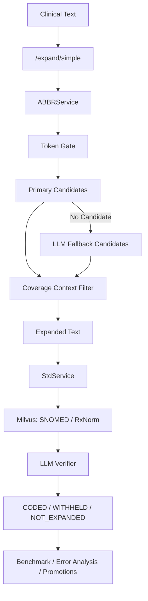

# GitHub 上传准备与项目展示指南

本文用于回答两个问题：

```text
1. medical-nlp 项目上传 GitHub 前需要做哪些准备？
2. 这个项目在 GitHub 上应该怎么展示，才能让别人看懂、愿意点开、方便面试讲解？
```

这不是代码实现文档，而是交付前的项目整理指南。

---

## 1. GitHub 上传不是简单“上传文件”

一个项目上传 GitHub，至少要处理 5 件事：

```text
1. 安全：不要把 API key、.env、模型缓存、大型数据、日志传上去。
2. 可读：别人打开仓库后，README 能看懂你做了什么。
3. 可运行：别人知道怎么配置环境、怎么启动、怎么建库、怎么测试。
4. 可展示：有截图、流程图、功能说明、技术亮点。
5. 可维护：目录干净，旧文件、备份文件、盲肠文件不要混在主路径里。
```

对你这个项目来说，GitHub 的目标不是让所有人马上复现完整医学标准化环境，而是让别人快速理解：

```text
这是一个医学缩写扩写与标准化系统。
它有后端主链路、前端工作台、benchmark、错误分析、fallback 候选沉淀、日志和 Docker 部署。
```

---

## 2. 上传前第一优先级：安全检查

### 2.1 绝对不能上传的内容

以下内容不应该进入 GitHub：

```text
backend/.env
任何 API key
DeepSeek / OpenAI / 其他 LLM 密钥
Milvus 本地 volume 数据
backend/logs/
model_cache/
.venv/
__pycache__/
*.pyc
大体积原始数据 CSV
本地临时运行日志
```

当前项目尤其要注意：

```text
backend/.env
model_cache/
backend/logs/
backend/data/snomed_clinical.csv
backend/data/rxnorm_clinical.csv
```

原因：

```text
.env 里可能有真实密钥。
model_cache/ 可能非常大。
logs/ 可能包含运行细节或请求信息。
snomed_clinical.csv / rxnorm_clinical.csv 可能体积大，也可能涉及数据授权问题。
```

---

### 2.2 当前 .gitignore 需要重点检查

当前 `.gitignore` 已经包含：

```text
.venv/
venv/
__pycache__/
*.pyc
.env
.env.*
backend/logs/
backend/data/snomed_clinical.csv
backend/data/rxnorm_clinical.csv
backend/evaluation/benchmark_results.json
backend/evaluation/error_analysis_report.json
```

但现在还有两个问题要注意。

第一个问题：

```text
.env.*
```

会把：

```text
.env.example
```

也一起忽略。

而 GitHub 项目通常应该提交：

```text
.env.example
```

给别人看需要配置哪些环境变量，但不能提交真实：

```text
.env
```

所以后续建议改成：

```gitignore
.env
.env.local
.env.*.local
!.env.example
```

第二个问题：

当前 `git status` 里出现：

```text
?? model_cache/
```

说明 `model_cache/` 还没有被 `.gitignore` 忽略。

后续建议加入：

```gitignore
model_cache/
.run-logs/
```

---

## 3. 上传前第二优先级：文件清理

### 3.1 先分清三类文件

上传前要把文件分成三类：

```text
必须上传
  项目源码、配置模板、README、关键文档、测试 cases。

可以上传但要谨慎
  小型 benchmark cases、小型示例数据、技术总结文档。

不应该上传
  密钥、日志、缓存、大型数据、临时输出、个人路径文件。
```

---

### 3.2 建议上传的核心目录

建议保留：

```text
backend/api/
backend/services/
backend/utils/
backend/tools/
backend/evaluation/ 中的脚本和小型测试 cases
backend/data/abbr_candidates.py
frontend/
Dockerfile
docker-compose.yml
README.md
.env.example
.gitignore
项目梳理/交付版整理/
```

其中 `项目梳理/交付版整理/` 可以作为项目文档资产保留，尤其是：

```text
V11后端技术总结_前端设计前置版.md
V11前端技术总结.md
GitHub上传准备与项目展示指南.md
```

---

### 3.3 建议不要上传的目录和文件

不要上传：

```text
.venv/
model_cache/
backend/logs/
.run-logs/
backend/evaluation/benchmark_results.json
backend/evaluation/error_analysis_report.json
backend/evaluation/fallback_candidate_promotions.json
backend/evaluation/fallback_candidate_promotions.md
backend/evaluation/benchmark_results.backup_*.json
```

这些属于：

```text
运行产物
本地缓存
本轮评估结果
临时备份
```

它们不适合作为源码提交。

---

## 4. 上传前第三优先级：README

当前仓库根目录没有 README 文件。

GitHub 项目最重要的展示文件就是：

```text
README.md
```

别人打开仓库后，第一眼看到的就是 README。

README 不应该写成纯技术流水账，而应该像项目主页一样讲清楚：

```text
这个项目解决什么问题？
为什么需要它？
怎么运行？
核心链路是什么？
有什么功能？
如何验证？
技术亮点是什么？
项目边界是什么？
```

---

## 5. README 推荐结构

建议 README 按下面结构写。

### 5.1 项目标题

```markdown
# Medical NLP V11: Clinical Abbreviation Expansion and Standardization
```

中文也可以：

```markdown
# Medical NLP V11：医学缩写扩写与标准化系统
```

---

### 5.2 一句话介绍

建议写：

```text
一个面向临床文本的医学缩写扩写与标准化系统，支持缩写候选召回、上下文消歧、SNOMED/RxNorm 标准概念映射、Benchmark 评估、错误分析和 fallback 候选沉淀。
```

这句话比“医疗 NLP 项目”更具体。

---

### 5.3 项目边界

一定要诚实写清楚：

```text
当前 V11 主链路聚焦医学缩写扩写与标准化，不是完整的全实体 NER 标准化系统。
```

原因：

```text
这体现你知道系统边界。
面试时不会被追问“为什么完整医学术语输入没有处理”时被动。
```

---

### 5.4 核心功能

可以写：

```text
- 医学缩写识别与扩写
- primary 缩写候选库
- fallback LLM 候选生成
- coverage 上下文筛选
- SNOMED / RxNorm 双 collection 标准化检索
- LLM verifier 忠实概念校验
- WITHHELD 安全拒绝机制
- Benchmark 上传与评估
- Error Analysis + LLM Triage
- fallback 成功候选沉淀回 primary
- 前后端 request_id 日志串联
- Docker Compose 部署
```

---

### 5.5 技术栈

建议写：

```text
Backend:
  Python
  FastAPI
  Pydantic
  Milvus
  pymilvus
  pandas
  bge-m3 embedding
  LLM API

Frontend:
  Native HTML / CSS / JavaScript
  FastAPI static hosting

Infrastructure:
  Docker
  Docker Compose
  Milvus standalone
  etcd
  MinIO

Evaluation:
  benchmark cases
  error_analysis_report
  LLM triage report
```

---

### 5.6 系统流程图

README 里建议放一张 Mermaid 图：



这能帮助面试官或招聘方快速看懂。

---

## 6. GitHub 展示建议

### 6.1 首页要放截图

建议至少放 4 张截图：

```text
1. Analyze 页面：SOB and CP 成功扩写和标准化。
2. Benchmark Overview：准确率、分类正确/失败、失败案例。
3. Error Analysis：错误类型饼图和 LLM Triage 卡片。
4. Fallback Promotions：候选沉淀和写入 primary。
```

截图可以放在：

```text
docs/images/
```

README 中引用：

```markdown

```

截图比长篇文字更适合 GitHub 展示。

---

### 6.2 README 要有“快速启动”

建议写两个启动方式：

```text
Docker 启动
本地 Python 启动
```

但优先展示 Docker。

Docker 版本：

```powershell
docker compose up -d --build
docker compose exec api python tools/rebuild_milvus.py
docker compose exec api python tools/rebuild_rxnorm_milvus.py
```

打开：

```text
http://127.0.0.1:8000/app
```

测试输入：

```text
The patient has SOB and CP.
```

---

### 6.3 README 要有“配置说明”

因为项目用 LLM，需要告诉别人：

```text
复制 .env.example 为 backend/.env
填写自己的 API key
```

例如：

```powershell
Copy-Item backend\.env.example backend\.env
```

`.env.example` 应该只放变量名，不放真实值：

```env
DEEPSEEK_API_KEY=
DEEPSEEK_BASE_URL=
DEEPSEEK_MODEL=
MILVUS_URI=http://127.0.0.1:19530
MILVUS_COLLECTION_NAME=concepts_only_name
MILVUS_RXNORM_COLLECTION=rxnorm_concepts
```

---

### 6.4 README 要写清楚数据说明

如果不上传完整 `snomed_clinical.csv` / `rxnorm_clinical.csv`，README 要说明：

```text
大体积标准概念 CSV 不随仓库提交。
需要根据数据准备脚本生成，或使用自己的标准医学概念数据。
```

可写：

```text
Due to size and licensing considerations, full SNOMED/RxNorm source CSV files are not committed to this repository.
```

中文：

```text
由于体积和数据授权原因，完整 SNOMED/RxNorm CSV 不随仓库提交。
```

这比让别人运行时报 FileNotFoundError 却不知道原因要好很多。

---

## 7. GitHub 仓库建议目录结构

建议最终看起来像这样：

```text
medical-nlp/
  README.md
  .gitignore
  .env.example
  Dockerfile
  docker-compose.yml

  backend/
    api/
    services/
    utils/
    tools/
    evaluation/
    data/

  frontend/
    index.html
    app.js
    styles.css
    utils/

  docs/
    images/
    architecture.md
    docker.md
    benchmark.md

  项目梳理/
    交付版整理/
```

如果你想让 GitHub 更专业，建议把中文交付文档保留，同时新增英文或中英混合 README。

---

## 8. 上传前 Git 检查流程

### 8.1 查看当前状态

```powershell
git status --short
```

重点看：

```text
有没有 .env
有没有 model_cache
有没有 backend/logs
有没有 .venv
有没有大 CSV
有没有 backup json
```

---

### 8.2 查看将要提交的文件

```powershell
git status
```

如果有不确定文件，用：

```powershell
git diff -- 文件路径
```

或者：

```powershell
git diff --stat
```

---

### 8.3 检查是否误提交密钥

可以搜索：

```powershell
rg "API_KEY|SECRET|TOKEN|sk-|deepseek|OPENAI|password|access_key" .
```

注意：

```text
搜索时可能会扫到 .env。
但 .env 不应该被提交。
真正重要的是确认 git staged files 里没有密钥。
```

---

### 8.4 检查大文件

```powershell
Get-ChildItem -Recurse | Sort-Object Length -Descending | Select-Object -First 30 FullName,Length
```

重点排除：

```text
模型缓存
Milvus 数据
大型 CSV
日志
虚拟环境
```

---

## 9. 建议的上传前任务清单

按优先级排序：

```text
P0. 确认 .env 没有进入 Git。
P0. 把 model_cache/ 加入 .gitignore。
P0. 确认 backend/logs/ 不进入 Git。
P0. 确认 .venv/ 不进入 Git。
P0. 清理或忽略 benchmark_results.backup_*.json。

P1. 新增 README.md。
P1. 新增 backend/.env.example。
P1. README 写清楚 Docker 启动和建库顺序。
P1. README 写清楚项目边界。

P2. 增加 docs/images 截图。
P2. 增加 docs/docker.md 或链接到已有 Docker 文档。
P2. 整理 benchmark 上传测试 cases。

P3. 检查 GitHub 展示用文档是否路径清晰。
P3. 根据最终文件状态做一次 git diff 审查。
P3. 创建第一次 GitHub commit。
```

---

## 10. 这个项目在 GitHub 上应该主打什么

不要主打：

```text
“我做了一个医疗 NLP 项目”
```

这样太泛。

建议主打：

```text
“一个带评估闭环的医学缩写扩写与标准化系统”
```

亮点可以写成：

```text
1. 状态机式缩写处理，而不是一次性 LLM prompt。
2. primary + fallback 双候选源。
3. coverage 上下文消歧。
4. SNOMED / RxNorm 双标准概念库。
5. verifier 安全拒绝，避免错误编码。
6. benchmark + error analysis + LLM triage。
7. fallback 成功候选沉淀回 primary。
8. 前后端 request_id 日志串联。
9. Docker Compose 一键启动 API + Milvus。
10. 前端工作台可直接演示完整链路。
```

这比单纯写“用了 FastAPI、Milvus、LLM”更有说服力。

---

## 11. 面试时 GitHub 怎么讲

可以这样说：

```text
这个仓库我整理成了一个可展示的医学缩写标准化系统。
后端主链路是 FastAPI + ABBRService 状态机，缩写先走 primary 候选库，没有候选时再走 LLM fallback，但 fallback 不会直接采纳，而是经过 coverage 上下文筛选和 verifier 校验。

标准化层使用 Milvus，SNOMED 和 RxNorm 分成两个 collection，普通医学概念走 SNOMED，药品类概念走 RxNorm。

我还做了 benchmark 上传运行、错误分析、LLM triage 和 fallback 成功候选沉淀，让系统不仅能跑，还能知道哪里错、为什么错，以及如何把成功 fallback 结果沉淀回 primary 候选库。

前端是一个由 FastAPI 托管的轻量工作台，可以直接演示 Analyze、Benchmark、Error Analysis 和 Fallback Promotions。Docker Compose 负责启动 API、Milvus、etcd 和 MinIO。
```

---

## 12. GitHub 上传的大致命令顺序

如果本地仓库已经初始化 git：

```powershell
git status
git add README.md .gitignore Dockerfile docker-compose.yml backend frontend 项目梳理/交付版整理
git status
git commit -m "Prepare Medical NLP V11 for GitHub delivery"
```

创建 GitHub 仓库后：

```powershell
git remote add origin https://github.com/你的用户名/medical-nlp.git
git branch -M main
git push -u origin main
```

如果远程已经存在：

```powershell
git remote -v
git push
```

注意：

```text
不要在没检查 .env / logs / model_cache 前直接 git add .
```

更稳的方式是：

```powershell
git add 指定文件
```

而不是：

```powershell
git add .
```

---

## 13. 当前项目上传前特别提醒

基于当前仓库状态，上传前尤其要处理：

```text
1. 当前没有 README.md，需要新增。
2. 当前 model_cache/ 还显示为未跟踪，应加入 .gitignore。
3. 当前 .env.* 会忽略 .env.example，后续要调整。
4. backend/evaluation/error_analysis_report.json 是运行产物，通常不应提交。
5. backend/evaluation/fallback_candidate_promotions.json / .md 是运行产物，通常不应提交。
6. benchmark_results.backup_*.json 不应提交。
7. backend/data/snomed_clinical.csv / rxnorm_clinical.csv 已被忽略，但 README 要解释如何准备。
8. 项目梳理中的交付文档可以保留，但不要让根目录显得杂乱。
```

---

## 14. 建议下一步

建议接下来按这个顺序做：

```text
1. 清理 .gitignore。
2. 新增 backend/.env.example。
3. 新增 README.md。
4. 新增 docs/images 截图目录。
5. 检查 git status。
6. 决定哪些 benchmark cases 文件保留。
7. 做第一次 GitHub commit。
8. 推送到 GitHub。
```

现在最不建议做的是：

```text
直接 git add .
```

因为当前项目里还有缓存、生成物、备份文件和本地运行产物，需要先筛一遍。
