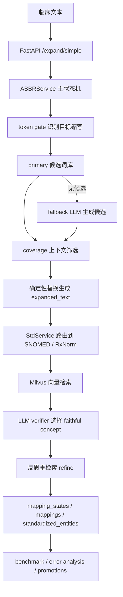

# V11 后端技术总结：缩写扩写、医学标准化、评估闭环与 Docker 交付

本文只总结当前 medical-nlp V11 的后端部分。前端页面、交互设计和前端日志会单独整理。

这份文档的目的不是罗列文件，而是帮你形成一个能讲清楚项目的技术主线：

```text
临床文本输入
  -> 识别医学缩写
  -> 召回扩写候选
  -> 用上下文选择可信扩写
  -> 将扩写结果映射到标准医学概念库
  -> 输出结构化结果、失败原因和诊断信息
  -> 用 benchmark / error analysis / fallback promotions 形成迭代闭环
```

---

## 1. 当前项目到底在做什么

V11 后端的主目标是：

```text
医学缩写扩写与标准化系统
```

它不是泛化的“整句所有医学实体标准化系统”。当前主链路处理的是：

```text
句子中的目标医学缩写
  -> expansion
  -> standard concept
```

典型例子：

```text
SOB -> shortness of breath -> Dyspnea
CP  -> chest pain          -> Chest pain
RA  -> rheumatoid arthritis -> Rheumatoid arthritis
```

这个边界很重要。系统会对缩写做细粒度处理，但如果输入本身已经是完整医学术语，例如：

```text
The patient has rheumatoid arthritis.
```

当前主链路不会把 `rheumatoid arthritis` 当成新目标实体重新做完整 NER 标准化。这类能力未来应作为单独的 `/full-standardize` 路由扩展，而不是混入现有缩写链路。

---

## 2. 后端整体分层

当前后端可以按 9 层理解：

```text
1. FastAPI 接口层
2. ABBRService 缩写主状态机
3. primary / fallback 候选召回层
4. coverage 上下文筛选层
5. 确定性文本替换层
6. StdService 标准概念检索层
7. LLM verifier 与反思重检索层
8. benchmark / error analysis / promotion 评估闭环层
9. 日志与 Docker 交付层
```

对应核心文件：

```text
backend/api/main.py
backend/api/schemas.py

backend/services/abbr_service.py
backend/services/abbr_candidate_retriever.py
backend/services/abbr_candidate_fallback_retriever.py
backend/services/abbr_candidate_coverage_evaluator.py
backend/services/std_service.py
backend/services/medical_retriever.py
backend/services/abbr_verifier.py
backend/services/diagnosis_explainer.py
backend/services/medical_ner.py

backend/evaluation/run_benchmark.py
backend/evaluation/error_analysis_report.py
backend/evaluation/error_triage.py
backend/evaluation/collect_fallback_candidate_promotions.py
backend/evaluation/apply_fallback_candidate_promotions.py

backend/utils/structured_logger.py
backend/utils/trace_context.py
backend/utils/llm_factory.py
backend/utils/embedding_factory.py

backend/tools/rebuild_milvus.py
backend/tools/rebuild_rxnorm_milvus.py
```

整体数据流可以这样想：



---

## 3. API 接口层

入口文件：

```text
backend/api/main.py
```

数据模型：

```text
backend/api/schemas.py
```

当前主要接口：

```text
GET  /
GET  /health
GET  /app
POST /frontend-log

POST /expand/simple
POST /analysis/diagnose

GET  /benchmark/summary
GET  /benchmark/results
POST /benchmark/cases/run
POST /benchmark/cases/jobs
GET  /benchmark/cases/jobs/{job_id}

GET  /error-analysis/summary
GET  /error-analysis/report
GET  /error-analysis/triage

GET  /candidate-promotions
POST /candidate-promotions/apply
POST /candidate-promotions/apply-single
```

最核心接口是：

```text
POST /expand/simple
```

请求：

```json
{
  "text": "The patient has SOB and CP."
}
```

响应核心字段：

```json
{
  "request_id": "ana_...",
  "success": true,
  "expansion_success": true,
  "standardization_success": true,
  "success_breakdown": {
    "target_count": 2,
    "expanded_count": 2,
    "coded_count": 2,
    "withheld_count": 0,
    "not_expanded_count": 0
  },
  "expanded_text": "The patient has shortness of breath and chest pain.",
  "mappings": [],
  "standardized_entities": [],
  "mapping_states": []
}
```

这里有一个重要改动：V11 不再只用一个模糊的 `success`。现在拆成：

```text
success                  整体业务成功，当前等价于目标 records 全部 CODED
expansion_success         目标缩写是否都成功扩写
standardization_success   已扩写目标是否都成功标准化到 CODED
success_breakdown         具体数量拆解
```

这样前端和 benchmark 可以分清：

```text
是扩写没做出来？
还是扩写出来了但无法绑定标准概念？
还是 benchmark gold 口径不匹配？
```

---

## 4. ABBRService：缩写主状态机

核心文件：

```text
backend/services/abbr_service.py
```

核心方法：

```python
expand_verify_with_retry(text, max_retries=2)
```

它负责把一条输入文本跑完整个缩写标准化流程。

主状态对象是 `records`。一句话是一个 case，一句话里的每个目标缩写是一个 record。

record 的典型结构：

```json
{
  "abbreviation": "SOB",
  "source": "primary",
  "candidates": [],
  "coverage": {},
  "expansion": "shortness of breath",
  "domain": "Condition",
  "std_cache": [],
  "std_concept": {},
  "status": "CODED",
  "failure": null
}
```

record 生命周期大致是：

```text
PENDING
  -> CODED
  -> WITHHELD
  -> NOT_EXPANDED
  -> ABSTAIN
```

含义：

```text
PENDING
  已经有扩写，等待标准化。

CODED
  扩写可信，并成功绑定标准概念。

WITHHELD
  扩写可信，但没有找到足够忠实的标准概念，因此安全拒绝编码。

NOT_EXPANDED
  没有得到可用扩写。

ABSTAIN
  流程最终放弃该 record。
```

理解这个项目，最关键就是理解：

```text
文本不是直接一步变成标准概念。
文本先变成 records。
records 记录每个缩写从候选、扩写、检索、校验到失败原因的完整过程。
```

---

## 5. token gate：目标缩写识别

ABBRService 不是先对整句做完整 NER，而是先做 token 级缩写识别。

核心方法：

```python
_should_consider_abbreviation(raw_token, known_abbrs)
```

它决定一个 token 是否进入缩写流程。

典型规则：

```text
1. 如果 token 在 primary 缩写词库中，直接进入。
2. 未知缩写通常要求原文全大写。
3. 长度需要在合理范围内。
4. 普通小写词、数字、单字符通常跳过。
```

目的：

```text
减少把普通词误判成缩写。
减少 fallback LLM 的无意义调用。
降低低上下文过度扩写。
```

这也是为什么输入：

```text
The patient has shortness of breath and chest pain.
```

不会生成 mapping_states。因为它没有检测到需要处理的目标缩写。前端现在会提示：

```text
未检测到需要扩写的目标缩写。
```

这不是报错，而是当前系统边界。

---

## 6. 候选召回：primary + fallback

### 6.1 primary 候选库

文件：

```text
backend/data/abbr_candidates.py
```

结构：

```python
ABBR_CANDIDATES = {
    "SOB": [
        {"expansion": "shortness of breath", "domain": "Condition"},
    ],
    "DM": [
        {"expansion": "diabetes mellitus", "domain": "Condition"},
        {"expansion": "dermatomyositis", "domain": "Condition"},
    ],
}
```

重要设计：

```text
同一个 abbreviation 可以有多个 expansion。
primary 只提供候选，不直接决定最终答案。
最终选择交给 coverage。
```

这让系统可以接受：

```text
PA -> pulmonary artery
PA -> physician assistant
PA -> posteroanterior
```

具体选哪个，要看上下文。

---

### 6.2 fallback LLM 候选生成

文件：

```text
backend/services/abbr_candidate_fallback_retriever.py
```

当 primary 没有候选时，fallback 会用 LLM 生成候选列表。

它只做：

```text
生成候选
记录 reason
记录失败 evidence
```

它不做：

```text
不直接改写整句
不直接决定最终 expansion
不直接写入 primary
```

fallback 的结果必须继续经过 coverage 和标准化校验。

这条设计保证：

```text
LLM 可以补召回，但不能绕过安全筛选。
```

---

## 7. coverage：上下文筛选，不负责标准化

文件：

```text
backend/services/abbr_candidate_coverage_evaluator.py
```

coverage 解决的问题是：

```text
在当前句子上下文里，候选扩写是否合理？
如果合理，哪个 expansion 最合适？
```

它不解决：

```text
这个 expansion 是否能映射到 SNOMED / RxNorm。
```

coverage 输出通常包含：

```json
{
  "coverage_ok": true,
  "confidence": 0.95,
  "issues": [],
  "best_expansion": "shortness of breath"
}
```

如果失败，会形成结构化 failure。

当前 `NOT_EXPANDED` 已经不再只是笼统失败，而会记录更细原因：

```text
NO_CANDIDATES
CANDIDATES_REJECTED_BY_COVERAGE
AMBIGUOUS_LOW_CONTEXT
FALLBACK_ERROR
```

并尽量把 evidence 写入：

```text
primary_candidate_count
fallback_candidate_count
fallback_reason
coverage_issues
retrieval_trace
suggestion
```

这样 error analysis 和 LLM triage 能解释：

```text
到底是 primary/fallback 都没有候选？
还是有候选但 coverage 拒绝？
还是上下文不足不敢选？
还是 fallback 调用失败？
```

---

## 8. 确定性扩写文本生成

ABBRService 生成 `expanded_text` 时，不是在旧 expanded_text 上继续修改，而是：

```text
每一轮都从原始 text + 当前 records 重新渲染。
```

这样做的好处：

```text
原始 text 是事实源。
records 是状态源。
expanded_text 只是渲染结果。
```

如果反思或重检索修改了 record 状态，系统可以重新从 records 渲染，而不是在已经替换过的句子上继续替换，避免多轮残留。

替换规则也比较保守：

```text
只有有 expansion 且状态不是 ABSTAIN 的 record 才参与渲染。
NOT_EXPANDED 不替换。
ABSTAIN 不替换。
WITHHELD 可以替换，因为扩写可信，只是标准概念不敢绑定。
```

---

## 9. StdService：标准概念检索底座

文件：

```text
backend/services/std_service.py
```

StdService 负责把 expansion 送入 Milvus 做向量检索。

当前使用两个 collection：

```text
SNOMED:
  concepts_only_name

RxNorm:
  rxnorm_concepts
```

配置：

```python
self.collections = {
    "snomed": os.getenv("MILVUS_COLLECTION_NAME", "concepts_only_name"),
    "rxnorm": os.getenv("MILVUS_RXNORM_COLLECTION", "rxnorm_concepts"),
}
```

连接地址：

```python
self.milvus_uri = os.getenv("MILVUS_URI", "http://127.0.0.1:19530")
```

在 Docker Compose 内：

```text
MILVUS_URI=http://milvus:19530
```

在宿主机直接跑：

```text
MILVUS_URI=http://127.0.0.1:19530
```

检索方法：

```python
search_similar_terms(query, limit=5, source="snomed")
```

返回字段：

```text
input
concept_id
concept_name
domain_id
concept_code
FSN
score
```

source 路由逻辑：

```text
domain == Drug -> rxnorm
其它 -> snomed
```

这就是为什么药品类缩写不应该继续硬查 SNOMED，而是走 RxNorm。

---

## 10. Milvus 建库工具

SNOMED 建库脚本：

```text
backend/tools/rebuild_milvus.py
```

输入：

```text
backend/data/snomed_clinical.csv
```

输出 collection：

```text
concepts_only_name
```

RxNorm 建库脚本：

```text
backend/tools/rebuild_rxnorm_milvus.py
```

输入：

```text
backend/data/rxnorm_clinical.csv
```

输出 collection：

```text
rxnorm_concepts
```

两个脚本都会：

```text
读取 CSV
加载 bge-m3 embedding
连接 Milvus
drop 旧 collection
创建 schema
批量 embed concept_name
批量 insert
flush
load collection
执行一个自测检索
```

注意：

```text
这是 rebuild，不是 append。
如果 collection 已存在，会先删除再重建。
```

Docker 部署阶段推荐在 api 容器内执行：

```powershell
docker compose exec api python tools/rebuild_milvus.py
docker compose exec api python tools/rebuild_rxnorm_milvus.py
```

---

## 11. verifier 与反思重检索

文件：

```text
backend/services/abbr_verifier.py
```

verifier 解决的问题是：

```text
Milvus 检索出来的 top-k 概念里，哪一个真正忠实表达当前 expansion？
如果没有忠实概念，应该 WITHHELD。
```

这一步非常重要，因为向量检索只保证“相似”，不保证“医学语义等价”。

例如：

```text
Airway, Breathing, Circulation
```

Milvus 可能检索到：

```text
Breathing
Ventilation
Route of breathing
```

但这些都不是 “Airway, Breathing, Circulation” 这个组合概念本身，所以 verifier 可以选择：

```text
WITHHELD
```

反思重检索的作用是：

```text
当当前标准化候选不够好时，LLM 生成更适合检索的 search words。
系统再用新检索词查 Milvus，尝试找到更忠实的概念。
```

但反思不会随意改写原始输入。它服务的是：

```text
改进标准概念检索查询
```

而不是让 LLM 直接发明标准概念。

---

## 12. 最终输出结构

`/expand/simple` 最终输出主要有四类：

### 12.1 expanded_text

确定性替换后的文本：

```text
The patient has shortness of breath and chest pain.
```

它适合给普通使用者看。

---

### 12.2 mappings

缩写到扩写的简明映射：

```json
[
  {
    "abbreviation": "SOB",
    "expansion": "shortness of breath",
    "source": "primary",
    "status": "CODED"
  }
]
```

它适合前端展示“系统做了哪些扩写”。

---

### 12.3 standardized_entities

标准概念结果：

```json
[
  {
    "text": "shortness of breath",
    "concept_id": "312437",
    "concept_name": "Dyspnea",
    "domain_id": "Condition",
    "concept_code": "267036007",
    "score": 1.0
  }
]
```

它适合展示“扩写词最终映射到了哪个标准医学概念”。

---

### 12.4 mapping_states

完整 record 级状态：

```json
[
  {
    "abbreviation": "SOB",
    "expansion": "shortness of breath",
    "source": "primary",
    "status": "CODED",
    "coverage_ok": true,
    "coverage_confidence": 0.95,
    "failure_type": null,
    "failure_subtype": null,
    "suggestion": null
  }
]
```

它适合：

```text
前端当前单句诊断
错误分析
日志排查
benchmark 失败解释
```

---

## 13. 单句诊断

接口：

```text
POST /analysis/diagnose
```

文件：

```text
backend/services/diagnosis_explainer.py
```

作用：

```text
把 /expand/simple 返回的结构化结果，整理成更容易读的人话解释。
```

它不是重新跑标准化，而是基于已有结果解释：

```text
发生了什么
为什么失败
下一步建议
```

适合前端 Analyze 页面在用户点击“生成 LLM 诊断”时调用。

---

## 14. Benchmark 系统

核心文件：

```text
backend/evaluation/run_benchmark.py
backend/evaluation/run_benchmark_parallel.py
backend/evaluation/abbr_benchmark_cases.py
backend/evaluation/abbr_benchmark_cases_casi.py
backend/evaluation/concept_match.py
```

前端上传 cases 后，后端入口在：

```text
backend/api/main.py
```

相关接口：

```text
POST /benchmark/cases/jobs
GET  /benchmark/cases/jobs/{job_id}
POST /benchmark/cases/run
GET  /benchmark/summary
GET  /benchmark/results
```

现在推荐的前端流程是异步 job：

```text
上传 benchmark cases
  -> 后端创建 job_id
  -> 后台运行 benchmark
  -> 轮询 job progress
  -> 完成后写 benchmark_results.json
  -> 自动生成 error_analysis_report.json
  -> 自动生成 error_triage_report.md
  -> 自动生成 fallback_candidate_promotions.json
```

Benchmark 的核心判定字段：

```text
correct
expected_mappings
predicted_mappings
mapping_correct
text_check
mapping_states
success_breakdown
```

注意：

```text
benchmark correct 是测试集 gold 口径。
business success / expansion_success / standardization_success 是系统业务口径。
两者有关联，但不是同一个东西。
```

例如低上下文场景：

```text
The patient has ABC and SOB.
```

系统可能扩写 ABC，但 gold 不要求扩写 ABC。

这时：

```text
benchmark 可能判错。
标准化也可能 WITHHELD。
```

所以错误分析要同时展示：

```text
benchmark mismatch
expansion blocked
standardization failure
```

而不是混成一个笼统失败。

---

## 15. Error Analysis 与 LLM Triage

结构化错误分析：

```text
backend/evaluation/error_analysis_report.py
```

输入：

```text
backend/evaluation/benchmark_results.json
```

输出：

```text
backend/evaluation/error_analysis_report.json
```

LLM 人话归因：

```text
backend/evaluation/error_triage.py
```

输出：

```text
backend/logs/triage/error_triage_report.md
```

当前错误分析口径是：

```text
总失败集合 = benchmark_mismatch ∪ expansion_blocked ∪ standardization_failure
```

每个失败 case 可以有多个标签：

```text
仅 benchmark
扩写阻断
仅标准化
benchmark + 标准化
benchmark + 扩写阻断
```

这样设计是为了避免旧问题：

```text
一篇报告里多种统计口径来回切换，让人看不懂。
```

现在更清晰：

```text
先看整体失败集合。
再看每个失败 case 属于哪些失败标签。
最后看 LLM 给出的人话原因和建议。
```

---

## 16. fallback 成功候选沉淀

收集脚本：

```text
backend/evaluation/collect_fallback_candidate_promotions.py
```

写入脚本：

```text
backend/evaluation/apply_fallback_candidate_promotions.py
```

前端接口：

```text
GET  /candidate-promotions
POST /candidate-promotions/apply
POST /candidate-promotions/apply-single
```

沉淀规则：

```text
case.correct == true
mapping_state.source == fallback
mapping_state.status == CODED
chosen_concept exists
```

含义：

```text
只有 fallback 生成的候选，且最终成功标准化，才有资格被推荐沉淀到 primary。
```

输出：

```text
backend/evaluation/fallback_candidate_promotions.json
backend/evaluation/fallback_candidate_promotions.md
```

写入 primary 时会：

```text
按 abbreviation + expansion 去重。
同一个 abbreviation 可以保留多个 expansion。
新增候选 append 到 list，不覆盖旧候选。
每批写入只保留一个批次注释。
```

这个机制让系统形成一个闭环：

```text
fallback 成功案例
  -> 人工确认
  -> 写入 primary
  -> 下次优先走确定性候选库
  -> 减少 LLM 依赖
  -> 系统稳定性提升
```

---

## 17. 日志系统

后端日志基础设施：

```text
backend/utils/structured_logger.py
backend/utils/trace_context.py
```

日志输出目录：

```text
backend/logs/
```

当前日志文件：

```text
app.jsonl
dependency.jsonl
pipeline.jsonl
benchmark.jsonl
audit.jsonl
frontend.jsonl
```

各自职责：

```text
app.jsonl
  API 请求、服务懒加载、接口成功/失败。

dependency.jsonl
  Milvus、embedding、LLM、collection load、vector search。

pipeline.jsonl
  ABBRService 主链路开始、结束和关键状态。

benchmark.jsonl
  benchmark job / case / postprocess。

audit.jsonl
  写入 primary 候选库等有副作用操作。

frontend.jsonl
  前端上传来的浏览器侧日志。
```

日志统一特征：

```text
JSONL
RotatingFileHandler
request_id
frontend_request_id
job_id
case_id
默认不记录完整 text
默认记录 text_len / text_hash
LOG_TEXT_PREVIEW=1 时才记录短 preview
```

为什么日志和 record 不冲突？

```text
record 是业务结果的一部分，解释“这个缩写为什么变成这个状态”。
log 是运行过程的观测系统，解释“这次请求跑到哪里、依赖是否联通、耗时多少、哪里异常”。
```

简单说：

```text
record 给用户和分析报告看。
log 给开发者排查运行问题看。
```

---

## 18. Docker 部署状态

当前 Docker 相关文件：

```text
Dockerfile
docker-compose.yml
```

当前 compose 服务：

```text
api
milvus
etcd
minio
```

当前 Dockerfile 已包含：

```text
backend
frontend
```

基础镜像：

```text
python:3.12-slim
```

原因：

```text
当前 requirements 中的 pymilvus / pandas 版本不适合 Python 3.10。
本地开发环境也是 Python 3.12。
```

当前 volumes：

```text
./backend/logs:/app/backend/logs
./backend/evaluation:/app/backend/evaluation
./backend/data:/app/backend/data
./model_cache/huggingface:/root/.cache/huggingface
etcd_data:/etcd
minio_data:/minio_data
milvus_data:/var/lib/milvus
```

P1-P4 已验证：

```text
Docker 镜像包含 frontend。
compose 能启动 api / milvus / etcd / minio。
/health 可访问。
/app 可访问。
Milvus 19530 可连接。
Milvus 9091/healthz 可访问。
```

P5/P6 是后续建库步骤：

```text
docker compose exec api python tools/rebuild_milvus.py
docker compose exec api python tools/rebuild_rxnorm_milvus.py
```

P7/P8 才进入业务验证：

```text
Analyze 测试 SOB and CP。
Benchmark 上传 60 条 cases 测试。
```

---

## 19. 当前仍然存在的边界与后续方向

### 19.1 不是完整 NER 全实体标准化

当前系统主链路是缩写标准化。

如果未来要支持：

```text
完整医学术语输入
普通临床实体识别
全实体标准化
```

应该新增路由：

```text
/full-standardize
```

而不是把这件事硬塞进 `/expand/simple`。

---

### 19.2 LangGraph 不是当前主链路

项目中仍有：

```text
backend/graph/standardization_graph.py
```

但当前主要 API 链路是：

```text
FastAPI -> ABBRService
```

LangGraph 可以作为后续重构或实验方向，但不要在面试中把它说成当前线上主链路。

---

### 19.3 LLM 仍是候选和解释增强，不是最终事实源

LLM 参与：

```text
fallback 候选生成
coverage 判断
verifier 选择
反思重检索 search words
error triage 人话解释
single diagnosis 人话解释
```

但最终系统仍然靠：

```text
primary 候选库
Milvus 标准概念库
结构化状态机
安全拒绝 WITHHELD
benchmark/error-analysis 闭环
```

来约束 LLM。

这点很适合面试表达：

```text
我没有让 LLM 直接输出最终医学编码，而是让它在候选召回、上下文判断和 verifier 环节辅助决策，最终结果必须经过标准概念库和结构化状态机约束。
```

---

## 20. 面试时可以这样概括

一段比较稳的说法：

```text
这个项目是一个面向临床文本的医学缩写扩写与标准化系统。
后端主链路以 ABBRService 为状态机，先通过 token gate 找到目标缩写，再从 primary 缩写词库召回候选；如果 primary 没有候选，再用 LLM fallback 生成候选，但 fallback 结果不会直接采纳，而是继续经过 coverage 上下文筛选。

确定扩写后，系统会把 expansion 路由到标准概念检索层。普通医学概念走 SNOMED collection，药品概念走 RxNorm collection。检索使用 Milvus 向量库，之后由 LLM verifier 判断 top-k 候选里是否有忠实概念；如果没有，就返回 WITHHELD，而不是强行编码。

系统输出不只是 expanded_text，还会返回 mapping_states、success_breakdown、failure_type、failure_subtype 和 suggestion。这样 benchmark、错误分析、前端单句诊断和 fallback 候选沉淀都可以复用同一套结构化结果。

工程上我还做了 benchmark job、error analysis、LLM triage、fallback 成功候选沉淀、前后端 request_id 日志串联，以及 Docker Compose 部署，把 api、Milvus、etcd、minio 和持久化 volumes 整合到一套可运行环境里。
```

---

## 21. 后端当前最值得展示的技术点

```text
1. 缩写 record 状态机，而不是一次性 prompt 输出。
2. primary + fallback 双候选源。
3. coverage 只做上下文筛选，标准化交给后续层。
4. SNOMED / RxNorm 双 collection 路由。
5. verifier 安全拒绝 WITHHELD，避免错误编码。
6. success 拆成 expansion_success / standardization_success / success_breakdown。
7. NOT_EXPANDED 失败原因细分。
8. benchmark -> error_analysis_report -> error_triage 的闭环。
9. fallback 成功候选沉淀回 primary，减少未来 LLM 依赖。
10. request_id 串联前端、API、pipeline、dependency、benchmark 日志。
11. Docker Compose 管理 api + milvus + etcd + minio。
12. logs / evaluation / data / model cache / milvus data 持久化。
```

---

## 22. 当前 GitHub 交付前建议检查

上传 GitHub 前建议确认：

```text
1. backend/.env 不提交。
2. backend/logs/ 不提交。
3. model_cache/ 不提交。
4. Milvus volume 数据不提交。
5. benchmark_results.json 如果包含过程结果，要确认是否需要保留。
6. backup 文件是否需要清理或移到交付说明外。
7. README 中明确 Docker 启动、建库、Analyze、Benchmark 的顺序。
8. README 中说明系统边界：当前是缩写标准化，不是全实体标准化。
```

建议 README 最小运行顺序：

```text
1. 配置 backend/.env。
2. docker compose up -d --build。
3. docker compose exec api python tools/rebuild_milvus.py。
4. docker compose exec api python tools/rebuild_rxnorm_milvus.py。
5. 打开 http://127.0.0.1:8000/app。
6. 输入 The patient has SOB and CP. 验证 Analyze。
7. 上传 benchmark cases 验证评估闭环。
```
