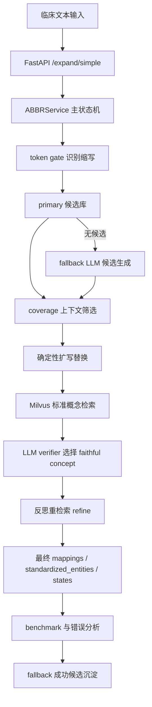

# V11 后端技术总结：缩写扩写、医学标准化与评估闭环

## 1. 项目现在到底在做什么

这个项目的后端核心目标已经从早期的“整句医学实体标准化”收敛为：

```text
识别临床文本中的医学缩写
  -> 为每个缩写召回候选扩写
  -> 根据上下文选择可信扩写
  -> 将扩写后的医学概念映射到标准医学概念库
  -> 输出扩写文本、映射结果、标准化概念和失败原因
```

所以 V11 后端的主线不是泛化 NER 全实体标准化，而是：

```text
医学缩写标准化系统
```

这个边界很重要。当前系统能很好解释：

```text
SOB -> shortness of breath -> Dyspnea
HTN -> hypertension -> Hypertensive disorder
DM -> diabetes mellitus -> Diabetes mellitus
```

但它不承诺：

```text
把一句话里的所有医学实体都完整标准化
```

这也是前端设计时要注意的第一件事：页面主任务应该围绕“缩写扩写与标准化”，而不是叫“全实体医学标准化平台”。

## 2. 后端总体分层

当前后端可以按 7 层理解：

```text
FastAPI 接口层
  -> ABBRService 主编排层
  -> 缩写候选召回层
  -> coverage 上下文筛选层
  -> 标准概念检索层
  -> verifier 校验与反思层
  -> benchmark / error analysis / candidate promotion 闭环层
```

对应文件：

```text
backend/api/main.py
backend/api/schemas.py

backend/services/abbr_service.py
backend/services/abbr_candidate_retriever.py
backend/services/abbr_candidate_fallback_retriever.py
backend/services/abbr_candidate_coverage_evaluator.py
backend/services/medical_retriever.py
backend/services/std_service.py
backend/services/abbr_verifier.py
backend/services/medical_ner.py

backend/evaluation/run_benchmark.py
backend/evaluation/run_benchmark_parallel.py
backend/evaluation/error_analysis_report.py
backend/evaluation/error_triage.py
backend/evaluation/collect_fallback_candidate_promotions.py
backend/evaluation/apply_fallback_candidate_promotions.py
```

可以把它想象成：



## 3. FastAPI 接口层

入口文件：

```text
backend/api/main.py
```

当前主要接口：

```text
GET  /
GET  /health
GET  /benchmark/summary
GET  /error-analysis/summary
POST /expand/simple
```

最重要的是：

```text
POST /expand/simple
```

输入：

```json
{
  "text": "The patient denies SOB."
}
```

输出核心字段：

```json
{
  "success": true,
  "expansion_success": true,
  "standardization_success": true,
  "success_breakdown": {},
  "expanded_text": "The patient denies shortness of breath.",
  "mappings": [],
  "standardized_entities": []
}
```

这里的接口已经适合直接做前端第一版：

```text
输入框
提交按钮
扩写后文本展示
mappings 表格
standardized_entities 表格
success_breakdown 状态卡片
```

## 4. ABBRService 是后端核心

核心文件：

```text
backend/services/abbr_service.py
```

核心方法：

```python
expand_verify_with_retry(text, max_retries=2)
```

它负责把一条文本从输入跑到最终结果。

主数据结构是 `records`，每个 record 表示一个缩写处理单元：

```json
{
  "abbreviation": "SOB",
  "source": "primary",
  "candidates": [],
  "coverage": {},
  "expansion": "shortness of breath",
  "domain": "Condition",
  "std_cache": [],
  "std_concept": {},
  "status": "CODED",
  "failure": null
}
```

理解这个项目，关键就是理解：

```text
一句话是一个 case；
一句话里每个缩写是一个 record；
record 从候选召回一直活到最终输出。
```

## 5. 缩写识别与 token gate

ABBRService 不是先对整句做 NER，而是按 token 扫描。

判断一个 token 是否进入缩写流程：

```python
_should_consider_abbreviation(raw_token, known_abbrs)
```

规则大致是：

```text
1. 如果在 ABBR_CANDIDATES 里，直接放行。
2. 如果是未知缩写，必须原文全大写，长度 2 到 8。
3. 小写未知词、数字、单字符一般跳过。
```

这个 gate 的目的：

```text
减少把普通单词误当缩写
控制 fallback LLM 的调用范围
降低低上下文过度扩写
```

## 6. 候选召回：primary + fallback

### 6.1 primary 候选库

文件：

```text
backend/data/abbr_candidates.py
```

结构：

```python
ABBR_CANDIDATES = {
    "SOB": [
        {"expansion": "shortness of breath", "domain": "Condition"},
    ],
    "DM": [
        {"expansion": "diabetes mellitus", "domain": "Condition"},
        {"expansion": "dermatomyositis", "domain": "Condition"},
    ],
}
```

注意：

```text
同一个缩写可以有多个 expansion。
primary 候选库不直接给最终答案，只提供候选集合。
```

真正选择哪个 expansion，是后面的 coverage 决定。

### 6.2 fallback LLM 候选生成

文件：

```text
backend/services/abbr_candidate_fallback_retriever.py
```

当 primary 没有候选时，fallback LLM 只生成候选列表：

```text
它不改写整句
不直接决定最终答案
不直接写入词典
```

fallback 返回：

```json
{
  "abbreviation": "ABG",
  "candidates": [
    {
      "abbreviation": "ABG",
      "expansion": "arterial blood gas",
      "source": "fallback_llm",
      "confidence": 0.8
    }
  ],
  "reason": "..."
}
```

fallback 工程失败会结构化记录：

```text
exception
invalid_json
invalid_schema
```

这会进入 `failure.evidence`，供错误分析解释。

## 7. coverage：上下文筛选，不负责标准化

文件：

```text
backend/services/abbr_candidate_coverage_evaluator.py
```

coverage 的问题是：

```text
在当前句子上下文中，这批候选里有没有合理扩写？
如果有，哪一个最合适？
```

它输出：

```json
{
  "coverage_ok": true,
  "confidence": 0.95,
  "plausible_candidates": ["shortness of breath"],
  "best_expansion": "shortness of breath",
  "reason": "...",
  "issues": []
}
```

coverage 不做 SNOMED 标准化。

标准化在后面做。

这层的价值是：

```text
把“LLM 自由扩写”变成“候选集合内选择”
```

## 8. 确定性替换 expanded_text

方法：

```python
_build_expanded_text_deterministic(text, chosen)
```

特点：

```text
按 token 边界替换，避免 CP 命中 CPR。
从后往前替换，避免 offset 错乱。
每一轮从原始 text + 当前 records 重新渲染 expanded_text。
```

所以 `expanded_text` 不是状态事实源。

事实源是：

```text
原始 text
records
```

`expanded_text` 只是根据 records 渲染出来的展示结果。

## 9. 标准化检索：Milvus + BGE-M3

文件：

```text
backend/services/std_service.py
backend/services/medical_retriever.py
```

底层向量库：

```text
Milvus
```

embedding 模型：

```text
BAAI/bge-m3
```

集合：

```text
snomed -> concepts_only_name
rxnorm -> rxnorm_concepts
```

`StdService` 负责：

```text
连接 Milvus
加载 collection
把 query 编码成向量
检索相似标准概念
```

`MedicalRetriever` 负责：

```text
调用 StdService
做规则 rerank
按 domain_filter / domain_boost 过滤或加权
返回 document-like 结果
```

重要设计：

```text
domain_boost 只是加分，不是硬过滤。
source 才决定查 snomed 还是 rxnorm。
```

也就是说：

```text
source = 查哪个集合
domain_boost = 在查到的结果里优先哪个 domain
```

## 10. domain 路由与 MedicalNER

文件：

```text
backend/services/medical_ner.py
```

当前 NER 的主要作用不是整句实体标准化，而是：

```text
对 fallback 生成的 expansion 推断 domain
```

例如：

```text
heart rate -> Measurement
arterial blood gas -> Measurement
nitroglycerin -> Drug
```

domain 会影响：

```text
source 路由：Drug -> rxnorm，其它 -> snomed
domain_boost：标准化检索重排时加权
```

这个设计使后端支持双库：

```text
SNOMED：疾病、症状、观察、操作、解剖等
RxNorm：药品
```

## 11. verifier：标准化可信性判断

文件：

```text
backend/services/abbr_verifier.py
```

核心方法：

```python
verify_mappings(original_text, expanded_text, mapping_standardizations)
```

它不是重新判断缩写扩写对不对。

它的职责是：

```text
在检索出的标准概念候选中，选择最 faithful 的概念；
如果没有任何候选能代表 expansion，就 WITHHELD。
```

结果：

```text
有 faithful concept -> CODED
没有 faithful concept -> WITHHELD
```

这就是为什么有些 case：

```text
扩写对了，但标准化失败
```

例如扩写成抽象概念、角色、形容词、组合概念时，SNOMED/RxNorm 里可能没有合适的单一标准实体。

## 12. 反思重检索

方法：

```python
_reflect_refine_standardization(...)
```

当当前标准化结果不理想时，verifier 会提出最多 2 个等价检索词：

```text
propose_requeries
```

然后系统重新检索、重新 verifier。

但它有保守条件：

```text
只允许 faithful 同义检索词
不能引入机制、病因、亚型、阶段等新信息
只有质量提升时才采纳
```

所以反思不是“随便换答案”，而是：

```text
同义检索词重查标准库
```

## 13. record 状态机

record 的主要状态：

```text
PENDING
CODED
WITHHELD
NOT_EXPANDED
ABSTAIN
```

含义：

```text
PENDING：已经有 expansion，等待标准化。
CODED：扩写成功，并绑定到标准概念。
WITHHELD：扩写可信，但没有找到 faithful 标准概念。
NOT_EXPANDED：候选召回或 coverage 阶段没有安全扩写。
ABSTAIN：流程中最终主动放弃。
```

成功口径：

```text
success = expansion_success AND standardization_success
```

其中：

```text
expansion_success：所有目标 record 都有 expansion
standardization_success：所有目标 record 都是 CODED
```

这比旧版宽松 success 更严格。

## 14. NOT_EXPANDED 的失败原因

当前 coverage 前 `NO_CANDIDATES` 拆成两个 subtype：

```text
FALLBACK_RETURNED_EMPTY
FALLBACK_FAILED
```

含义：

```text
FALLBACK_RETURNED_EMPTY：
primary 没有候选，fallback 正常调用，但返回空 candidates。

FALLBACK_FAILED：
fallback 调用、返回或解析过程失败。
```

此外 coverage 后还有：

```text
CANDIDATES_REJECTED_BY_COVERAGE
AMBIGUOUS_LOW_CONTEXT
```

这些会写入：

```text
record.failure.type
record.failure.subtype
record.failure.evidence
```

前端可以直接把这些字段展示成“为什么没有扩写”。

## 15. API 返回数据适合怎么展示

`/expand/simple` 返回适合拆成 5 个区域：

### 15.1 总状态

```text
success
expansion_success
standardization_success
success_breakdown
```

前端可以做成三张状态卡：

```text
流程结果
扩写结果
标准化结果
```

### 15.2 扩写文本

```text
expanded_text
```

适合做原文/扩写后对照。

### 15.3 缩写映射

```text
mappings
```

适合表格：

```text
abbreviation
expansion
source
status
```

### 15.4 标准概念

```text
standardized_entities
```

适合表格：

```text
abbreviation
expansion
concept_name
concept_code
domain_id
score
```

### 15.5 错误解释

当前 simple 接口没有直接返回完整 `mapping_states`。

如果前端要展示每个 record 的 failure/evidence，需要后续新增：

```text
POST /expand/debug
```

或者扩展 `/expand/simple` 增加可选字段。

## 16. benchmark 与评估系统

主要文件：

```text
backend/evaluation/run_benchmark.py
backend/evaluation/run_benchmark_parallel.py
backend/evaluation/concept_match.py
backend/evaluation/error_analysis_report.py
backend/evaluation/error_triage.py
```

当前 benchmark 结果：

```text
total_cases: 74
correct: 71
accuracy: 95.95%
business_success_count: 59
expansion_success_count: 67
standardization_success_count: 59
```

注意这些指标不是同一个口径：

```text
correct：benchmark gold 口径
expansion_success：扩写链路口径
standardization_success：标准化链路口径
business_success：端到端业务口径
```

失败标签是可重叠的：

```text
benchmark_mismatch
expansion_blocked
standardization_failure
```

所以不能简单相加。

错误分析报告采用：

```text
case 级统计整体成功/失败
record 级统计具体失败原因
```

这对前端很重要：

```text
总览卡片用 case 数
错误详情表用 record 数
```

## 17. LLM 错误分析 triage

文件：

```text
backend/evaluation/error_triage.py
```

输入：

```text
backend/evaluation/error_analysis_report.json
```

输出：

```text
backend/logs/triage/error_triage_report.md
backend/logs/triage/candidate_gold_cases.json
```

作用：

```text
把结构化错误报告交给 DeepSeek，
生成更适合人阅读的中文错误分析。
```

它会读取：

```text
failure_type
failure_subtype
fallback_called
fallback_candidate_count
fallback_reason
fallback_error_kind
coverage_issues
retrieved_top
```

因此它不是“重新跑系统”，而是：

```text
对当前这一轮 benchmark 结果做解释
```

## 18. fallback 成功候选沉淀

新增文件：

```text
backend/evaluation/collect_fallback_candidate_promotions.py
backend/evaluation/apply_fallback_candidate_promotions.py
```

这个机制解决的问题：

```text
如果 fallback 生成了扩写，并且最终 CODED，
说明这个候选经过 coverage + 标准化 + verifier 验证过。
它可以作为候选库扩充建议。
```

第一步只提取展示：

```powershell
python backend/evaluation/collect_fallback_candidate_promotions.py
```

输出：

```text
backend/evaluation/fallback_candidate_promotions.json
backend/evaluation/fallback_candidate_promotions.md
```

当前提取结果：

```text
total_items: 21
new_item_count: 21
already_exists_count: 0
```

第二步才写入 primary：

```powershell
python backend/evaluation/apply_fallback_candidate_promotions.py --backup
```

写入规则：

```text
同一缩写 key 下是 list
新增 expansion 只 append
已存在同 expansion 就 skipped
不覆盖、不删除已有候选
每次写入只加一个批次时间备注
```

这个功能很适合前端做成：

```text
候选提升清单页面
  -> 展示本轮可沉淀候选
  -> 用户勾选
  -> 点击“加入 primary”
  -> 调用 apply 逻辑
```

## 19. LangGraph 可视化

文件：

```text
backend/graph/standardization_graph.py
backend/graph/render_graph.py
```

它不是生产主链路，而是：

```text
把标准化过程可视化成 route / retrieve / verify / reflect 的图结构
```

适合：

```text
面试展示
项目讲解
前端流程图设计参考
```

不要把它理解成当前 API 的唯一执行引擎。

当前生产热路径仍然是：

```text
ABBRService.expand_verify_with_retry
```

## 20. 当前后端的优点

### 20.1 链路清楚

```text
candidate retrieval
coverage
standardization retrieval
verification
reflection
error analysis
candidate promotion
```

每层职责比较明确。

### 20.2 保守性强

系统不是直接相信 LLM：

```text
fallback 只生成候选
coverage 从候选里选
verifier 只从检索候选里选 concept
反思只生成检索词
候选沉淀先展示再写入
```

### 20.3 错误可解释

失败不只是 false，而是有：

```text
status
failure.type
failure.subtype
failure.stage
failure.reason
failure.evidence
```

这对前端展示和面试讲解都很重要。

### 20.4 支持自我增强

fallback 成功候选可以沉淀回 primary。

系统会逐步减少对 fallback 的依赖。

## 21. 当前后端还需要注意的问题

### 21.1 simple API 不够 debug

`/expand/simple` 对用户友好，但不返回完整 `mapping_states`。

前端如果要做专业分析页，需要新增：

```text
/expand/debug
```

返回完整 attempts、mapping_states、failure evidence。

### 21.2 benchmark 与业务成功口径要解释清楚

前端指标不要只展示一个 accuracy。

建议展示：

```text
Benchmark Accuracy
Expansion Success
Standardization Success
Overall Business Success
```

并说明：

```text
错误标签可重叠，不能简单相加。
```

### 21.3 LLM 调用成本与等待时间

主链路会调用：

```text
fallback retriever
coverage evaluator
verifier
reflection requery
triage
```

前端需要 loading 状态和错误提示。

## 22. 下一步前端设计建议

建议前端第一版做 4 个页面：

### 22.1 缩写标准化工作台

核心功能：

```text
输入临床文本
点击分析
展示 expanded_text
展示 mappings
展示 standardized_entities
展示 success_breakdown
```

### 22.2 Benchmark 仪表盘

读取：

```text
GET /benchmark/summary
```

展示：

```text
总 case 数
accuracy
分类正确率
business / expansion / standardization 成功数
```

当前 API 还只返回基础 summary，如果要展示更多，需要扩展接口。

### 22.3 错误分析页面

读取：

```text
GET /error-analysis/summary
backend/logs/triage/error_triage_report.md
```

展示：

```text
失败 case 列表
失败标签
record 状态
LLM 中文解释
下一步建议
```

### 22.4 fallback 候选沉淀页面

读取：

```text
backend/evaluation/fallback_candidate_promotions.json
```

展示：

```text
abbreviation
expansion
domain
support_count
case_ids
chosen_concept
already_exists
```

交互：

```text
勾选候选
点击加入 primary
后端调用 apply_fallback_candidate_promotions 逻辑
```

## 23. 面试时的一段总说法

可以这样讲：

> 这个项目现在是一个医学缩写扩写与标准化系统。后端不是让 LLM 直接改写整句话，而是把任务拆成候选召回、上下文 coverage、向量标准化检索、LLM verifier 校验和反思重检索几个阶段。候选优先来自本地 primary 词典，词典没有时才用 fallback LLM 生成候选；coverage 只在候选集合里选择，不允许自由发明；标准化阶段通过 BGE-M3 + Milvus 检索 SNOMED/RxNorm，再由 verifier 从候选概念里选择 faithful concept。最终每个缩写都有 record 状态，例如 CODED、WITHHELD、NOT_EXPANDED，并带有失败原因和 evidence。评估系统按 case 统计整体成功率，按 record 统计错误原因，同时还可以把 fallback 成功且标准化成功的候选沉淀回 primary 候选库，形成一个可审核的系统增强闭环。

## 24. 一句话记忆

这个后端的核心不是：

```text
LLM 直接回答
```

而是：

```text
候选召回 + 上下文选择 + 标准库检索 + 校验拒绝 + 错误分析 + 候选沉淀
```

这就是它最值得展示的技术主线。
