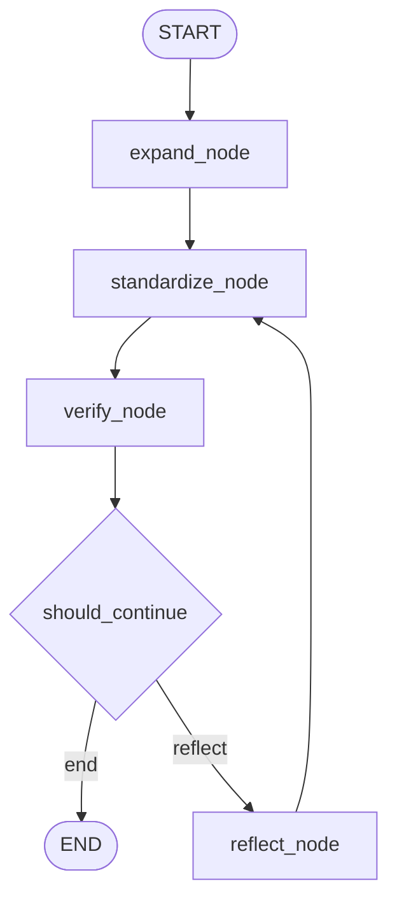
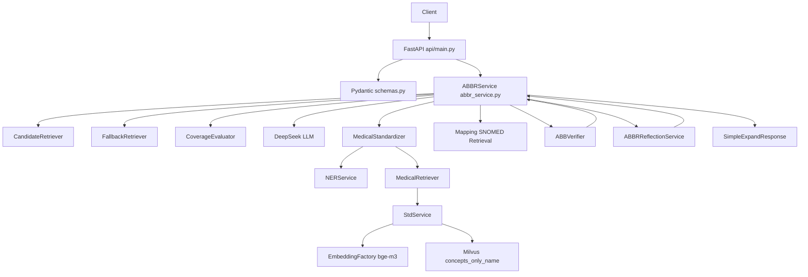

# 项目地图 Project Map

> 目标：从代码结构角度理解项目如何启动、如何接收请求、如何调用服务、如何完成检索、校验、反思、评估与错误分析。
>
> 说明：本文档基于当前仓库代码生成。为了保持清晰，目录树省略 `.venv/`、`__pycache__/`、缓存文件和大部分编译产物。

---

## Part 1 项目总览

### 项目名称

Medical NLP Standardization Platform

### 项目目标

将医学 NLP Pipeline 封装为一个可通过 FastAPI 调用、可通过 Benchmark 评估、可通过 Error Analysis 分析、可通过 Docker 部署的后端项目。

### 技术栈

| 类别 | 技术 |
| --- | --- |
| Web API | FastAPI, Uvicorn, Pydantic |
| LLM | DeepSeek Chat, langchain-deepseek |
| Workflow | LangGraph |
| Embedding | BAAI/bge-m3, langchain-huggingface, sentence-transformers |
| Vector DB | Milvus, pymilvus |
| NLP Model | HuggingFace Transformers, Clinical-AI-Apollo/Medical-NER |
| Data | SNOMED sample CSV, abbreviation candidate dict |
| Evaluation | Python benchmark scripts, JSON reports |
| Deployment | Dockerfile, docker-compose |

### 核心能力

- 缩写扩写
- 医学 NER
- SNOMED 标准化检索
- Candidate Retrieval
- Fallback Candidate Retrieval
- Coverage Evaluation
- Verification
- Reflection
- Retry Loop
- Benchmark
- Error Analysis
- FastAPI
- Docker
- LangGraph Workflow

---

## Part 2 项目目录树

```text
medical-nlp/
├── Dockerfile
├── docker-compose.yml
├── PROJECT_TECHNICAL_DOCUMENTATION.md
├── 项目解析.md
└── backend/
    ├── requirements.txt
    ├── Medical NLP 项目错误分析（Error Analysis V1).md
    ├── api/
    │   ├── main.py
    │   └── schemas.py
    ├── services/
    │   ├── abbr_service.py
    │   ├── abbr_candidate_retriever.py
    │   ├── abbr_candidate_fallback_retriever.py
    │   ├── abbr_candidate_coverage_evaluator.py
    │   ├── abbr_reflection_service.py
    │   ├── abbr_verifier.py
    │   ├── mapping_support_verifier.py
    │   ├── medical_standardizer.py
    │   ├── medical_retriever.py
    │   ├── ner_service.py
    │   ├── std_service.py
    │   ├── test.py
    │   └── 笔记.md
    ├── graph/
    │   ├── abbr_graph.py
    │   ├── abbr_graph_nodes.py
    │   ├── abbr_graph_state.py
    │   ├── export_graph.py
    │   ├── test_abbr_graph.py
    │   ├── test_graph_cases.py
    │   └── abbr_workflow.png
    ├── evaluation/
    │   ├── abbr_eval_cases.py
    │   ├── abbr_benchmark_cases.py
    │   ├── evaluate_abbr_expansion.py
    │   ├── run_benchmark.py
    │   ├── benchmark_results.json
    │   ├── error_analysis_report.py
    │   ├── error_analysis_report.json
    │   ├── error_taxonomy_old.py
    │   └── error_taxonomy_report.json
    ├── data/
    │   ├── abbr_candidates.py
    │   ├── SNOMED_5000.csv
    │   └── snomed_sample.csv
    ├── utils/
    │   ├── embedding_config.py
    │   └── embedding_factory.py
    ├── tools/
    │   ├── create_milvus_db.py
    │   └── show_snomed_file.py
    └── tests at backend root/
        ├── test_abbr_service.py
        ├── test_abbr_retry.py
        ├── test_abbr_verify.py
        ├── test_medical_retriever.py
        ├── test_medical_standardizer.py
        ├── test_mapping_support_verifier.py
        └── ...
```

### 目录职责说明

| 目录 | 职责 |
| --- | --- |
| `backend/api/` | FastAPI 服务入口、HTTP 路由、请求响应模型 |
| `backend/services/` | 核心服务层，负责扩写、检索、标准化、校验、反思 |
| `backend/graph/` | LangGraph 状态定义、节点定义、工作流编排、图导出与图测试 |
| `backend/evaluation/` | Benchmark case、评估脚本、结果 JSON、错误分析脚本 |
| `backend/data/` | SNOMED 样例数据、缩写候选词典 |
| `backend/utils/` | Embedding 配置和模型工厂 |
| `backend/tools/` | 数据库构建、SNOMED 文件查看等离线工具 |
| `backend/*.py tests` | 单模块调试脚本和测试脚本 |
| 根目录 Docker 文件 | API 容器化部署入口 |

---

## Part 3 核心模块说明

### 1. ABBRService

路径：

```text
backend/services/abbr_service.py
```

职责：

- 项目主服务入口
- 组织缩写候选召回、LLM 扩写、标准化、Verification、Reflection、Retry
- 维护子服务实例

主要输入：

```text
clinical_text
max_retries
```

主要输出：

```text
original_text
final_expanded_text
success
attempts
final_result
```

被谁调用：

- `backend/api/main.py` 的 `/expand/simple`
- `backend/evaluation/run_benchmark.py`
- `backend/evaluation/evaluate_abbr_expansion.py`
- `backend/graph/abbr_graph_nodes.py`
- 多个测试脚本

调用谁：

- `MedicalStandardizer`
- `MedicalRetriever`
- `ABBVerifier`
- `ABBRReflectionService`
- `ABBRCandidateRetriever`
- `ABBRCandidateFallbackRetriever`
- `ABBRCandidateCoverageEvaluator`
- `MappingSupportVerifier`

核心函数：

```text
simple_llm_expansion()
expand_and_standardize()
expand_standardize_and_verify()
expand_verify_with_retry()
_get_abbreviation_candidates()
_should_consider_abbreviation()
```

### 2. ABBRCandidateRetriever

路径：

```text
backend/services/abbr_candidate_retriever.py
```

职责：

- 从本地 `ABBR_CANDIDATES` 字典中按缩写召回候选扩写

主要输入：

```text
abbreviation
```

主要输出：

```text
[
  {"abbreviation": "...", "expansion": "..."}
]
```

被谁调用：

- `ABBRService._get_abbreviation_candidates()`
- `ABBRService._filter_mappings_by_context_support()`

调用谁：

- `backend/data/abbr_candidates.py`

### 3. ABBRCandidateFallbackRetriever

路径：

```text
backend/services/abbr_candidate_fallback_retriever.py
```

职责：

- 当本地候选库没有候选时，使用 LLM 生成候选列表
- 注意：该模块只生成候选，不直接改写原句

主要输入：

```text
abbreviation
context_text
```

主要输出：

```text
{
  "abbreviation": "...",
  "candidates": [...],
  "reason": "..."
}
```

被谁调用：

- `ABBRService._get_abbreviation_candidates()`

调用谁：

- `ChatDeepSeek.invoke()`

### 4. ABBRCandidateCoverageEvaluator

路径：

```text
backend/services/abbr_candidate_coverage_evaluator.py
```

职责：

- 判断候选集中是否存在被上下文支持的候选
- 输出可用于过滤的 `plausible_candidates`

主要输入：

```text
original_text
abbreviation
candidates
```

主要输出：

```text
coverage_ok
confidence
plausible_candidates
reason
issues
```

被谁调用：

- `ABBRService._get_abbreviation_candidates()`

调用谁：

- `ChatDeepSeek.invoke()`

### 5. MedicalStandardizer

路径：

```text
backend/services/medical_standardizer.py
```

职责：

- 组合 NER 和医学检索
- 对输入文本抽取实体，并为每个实体召回 SNOMED 候选

主要输入：

```text
text
```

主要输出：

```text
{
  "input_text": "...",
  "entities": [
    {
      "entity": "...",
      "entity_label": "...",
      "entity_score": ...,
      "candidates": [...]
    }
  ]
}
```

被谁调用：

- `ABBRService.expand_and_standardize()`
- `ABBRService.expand_verify_with_retry()`
- `ABBRGraphNodes.standardize_node()`

调用谁：

- `NERService`
- `MedicalRetriever`

### 6. NERService

路径：

```text
backend/services/ner_service.py
```

职责：

- 加载 HuggingFace 医学 NER pipeline
- 抽取医学实体
- 合并相邻实体

主要输入：

```text
text
```

主要输出：

```text
[
  {
    "text": "...",
    "label": "...",
    "score": ...,
    "start": ...,
    "end": ...
  }
]
```

被谁调用：

- `MedicalStandardizer`

调用谁：

- `transformers.pipeline()`

### 7. MedicalRetriever

路径：

```text
backend/services/medical_retriever.py
```

职责：

- 调用 `StdService` 做 SNOMED 向量检索
- 对结果做规则 rerank
- 包装为 document 结构

主要输入：

```text
query
top_k
domain_filter
score_threshold
```

主要输出：

```text
[
  {
    "page_content": "...",
    "metadata": {
      "concept_id": "...",
      "concept_name": "...",
      "domain_id": "...",
      "concept_code": "...",
      "score": ...,
      "rerank_score": ...
    }
  }
]
```

被谁调用：

- `MedicalStandardizer`
- `ABBRService`
- `ABBRGraphNodes.standardize_node()`

调用谁：

- `StdService.search_similar_terms()`

### 8. StdService

路径：

```text
backend/services/std_service.py
```

职责：

- 创建 embedding 模型
- 连接 Milvus
- 加载 collection
- 执行向量搜索

主要输入：

```text
query
limit
```

主要输出：

```text
concept_id
concept_name
domain_id
concept_code
FSN
score
```

被谁调用：

- `MedicalRetriever`

调用谁：

- `create_embedding_model()`
- `MilvusClient`

环境变量：

```text
MILVUS_URI
MILVUS_COLLECTION_NAME
```

### 9. ABBVerifier

路径：

```text
backend/services/abbr_verifier.py
```

职责：

- 对扩写结果做 sentence-level 和 mapping-level 校验
- 汇总 `overall_valid`

主要输入：

```text
original_text
expanded_text
mapping_standardizations
```

主要输出：

```text
sentence_validity
mapping_validations
overall_valid
```

被谁调用：

- `ABBRService.expand_standardize_and_verify()`
- `ABBRService.expand_verify_with_retry()`
- `ABBRGraphNodes.verify_node()`

调用谁：

- `ChatDeepSeek.invoke()`

### 10. ABBRReflectionService

路径：

```text
backend/services/abbr_reflection_service.py
```

职责：

- 当 Verification 失败时，基于原文、上一次扩写、校验结果和候选集生成修正版结果

主要输入：

```text
original_text
previous_expanded_text
verification
abbreviation_candidates
```

主要输出：

```text
revised_expanded_text
revised_mappings
reason
```

被谁调用：

- `ABBRService.expand_verify_with_retry()`
- `ABBRGraphNodes.reflect_node()`

调用谁：

- `ChatDeepSeek.invoke()`

### 11. MappingSupportVerifier

路径：

```text
backend/services/mapping_support_verifier.py
```

职责：

- 判断当前文本是否支持某个 abbreviation -> expansion 映射
- 当前主链路中已初始化，但过滤调用在 `ABBRService.expand_verify_with_retry()` 中被注释，属于实验模块

主要输入：

```text
text
abbreviation
expansion
```

主要输出：

```text
MappingSupportResult(
  supported,
  confidence,
  reason
)
```

被谁调用：

- `ABBRService._filter_mappings_by_context_support()`，但主流程中该函数调用当前被注释
- `test_mapping_support_verifier.py`

调用谁：

- `ChatDeepSeek.invoke()`

### 12. FastAPI App

路径：

```text
backend/api/main.py
```

职责：

- 创建 FastAPI app
- 定义 HTTP endpoint
- 延迟初始化 `ABBRService`

主要输入：

```text
HTTP request
```

主要输出：

```text
HTTP JSON response
```

被谁调用：

- Uvicorn
- Docker CMD
- HTTP Client

调用谁：

- `get_service()`
- `ABBRService.expand_verify_with_retry()`
- JSON report 文件读取

### 13. LangGraph Workflow

路径：

```text
backend/graph/abbr_graph.py
backend/graph/abbr_graph_nodes.py
backend/graph/abbr_graph_state.py
```

职责：

- 将 ABBRService 的线性流程拆成 LangGraph 节点
- 定义状态对象和工作流边

当前状态：

- 图代码存在
- 图测试代码存在
- 当前未接入 FastAPI 路由

---

## Part 4 启动流程

### 本地 FastAPI 启动流程

典型命令：

```powershell
cd backend
uvicorn api.main:app --host 127.0.0.1 --port 8000
```

启动链路：

```text
uvicorn api.main:app
↓
导入 backend/api/main.py
↓
BACKEND_DIR 加入 sys.path
↓
导入 Pydantic schemas
↓
导入 ABBRService 类
↓
创建 FastAPI app
↓
注册 GET /、GET /health、GET /benchmark/summary、GET /error-analysis/summary、POST /expand/simple
↓
service = None
↓
等待 HTTP 请求
```

### FastAPI 启动时不会立即发生什么

启动时不会立即：

- 实例化 `ABBRService`
- 加载 HuggingFace NER 模型
- 加载 embedding 模型
- 连接 Milvus
- 初始化 DeepSeek Chat 服务实例

### Lazy Loading 在哪里实现

路径：

```text
backend/api/main.py
```

函数：

```python
service = None

def get_service():
    global service

    if service is None:
        service = ABBRService()

    return service
```

调用点：

```text
expand_abbreviation_simple()
↓
get_service()
↓
首次请求时创建 ABBRService
```

### 首次请求时初始化链路

```text
POST /expand/simple
↓
get_service()
↓
ABBRService.__init__()
↓
ChatDeepSeek 初始化
↓
MedicalStandardizer 初始化
↓
NERService 初始化 HuggingFace pipeline
↓
MedicalRetriever 初始化
↓
StdService 初始化
↓
Embedding model 初始化
↓
MilvusClient 连接
↓
load_collection(concepts_only_name)
↓
Verifier / Reflection / Candidate Service 初始化
```

### Docker 启动流程

文件：

```text
Dockerfile
docker-compose.yml
```

Dockerfile 启动命令：

```text
uvicorn api.main:app --host 0.0.0.0 --port 8000
```

docker-compose 暴露：

```text
8000:8000
```

Milvus 连接：

```text
MILVUS_URI=http://host.docker.internal:19530
MILVUS_COLLECTION_NAME=concepts_only_name
```

Docker 结构：

```text
Host Machine
  └── Milvus on 19530

Docker Container
  └── FastAPI API on 8000
        ↓
      host.docker.internal:19530
```

---

## Part 5 请求执行流程

以 `POST /expand/simple` 为例。

### HTTP Endpoint

路径：

```text
backend/api/main.py
```

函数：

```text
expand_abbreviation_simple(request: ExpandRequest)
```

请求模型：

```text
backend/api/schemas.py
ExpandRequest
```

响应模型：

```text
backend/api/schemas.py
SimpleExpandResponse
```

### 完整调用链

```text
Client
↓
POST /expand/simple
↓
FastAPI routing
backend/api/main.py::expand_abbreviation_simple()
↓
get_service()
backend/api/main.py::get_service()
↓
ABBRService.expand_verify_with_retry()
backend/services/abbr_service.py
↓
ABBRService.simple_llm_expansion()
backend/services/abbr_service.py
↓
ABBRService._get_abbreviation_candidates()
backend/services/abbr_service.py
↓
ABBRCandidateRetriever.retrieve()
backend/services/abbr_candidate_retriever.py
↓
必要时 ABBRCandidateFallbackRetriever.retrieve()
backend/services/abbr_candidate_fallback_retriever.py
↓
ABBRCandidateCoverageEvaluator.evaluate()
backend/services/abbr_candidate_coverage_evaluator.py
↓
ChatDeepSeek.invoke()
↓
MedicalStandardizer.standardize()
backend/services/medical_standardizer.py
↓
NERService.extract_entities()
backend/services/ner_service.py
↓
MedicalRetriever.retrieve()
backend/services/medical_retriever.py
↓
StdService.search_similar_terms()
backend/services/std_service.py
↓
MilvusClient.search()
↓
ABBRService 对每个 mapping expansion 再做 SNOMED Retrieval
backend/services/abbr_service.py
↓
ABBVerifier.verify_mappings()
backend/services/abbr_verifier.py
↓
如果 verification.overall_valid 为 False 且未超过 max_retries
↓
ABBRReflectionService.reflect()
backend/services/abbr_reflection_service.py
↓
回到 standardization + verification
↓
返回 result
↓
FastAPI 提取 final_result
↓
SimpleExpandResponse JSON
```

### `/expand/simple` 返回字段

```text
success
expanded_text
mappings
```

注意：

- 完整 debug 版 `/expand` 在 `backend/api/main.py` 中目前是注释状态
- 当前 API 不返回 `verification`、`attempts`、`standardization`

---

## Part 6 LangGraph Workflow

### 状态对象：ABBRGraphState

路径：

```text
backend/graph/abbr_graph_state.py
```

字段：

```text
original_text
current_expanded_text
current_mappings
abbreviation_candidates
standardization
mapping_standardizations
verification
reflection_result
attempt
max_retries
success
stop_reason
attempts
```

职责：

- LangGraph 中所有节点共享同一个 state
- 每个节点从 state 读取输入，并把自己的输出写回 state

### 节点集合：ABBRGraphNodes

路径：

```text
backend/graph/abbr_graph_nodes.py
```

#### expand_node

输入状态：

```text
original_text
```

调用：

```text
ABBRService.simple_llm_expansion()
```

输出状态：

```text
current_expanded_text
current_mappings
abbreviation_candidates
```

#### standardize_node

输入状态：

```text
current_expanded_text
current_mappings
```

调用：

```text
service.standardizer.standardize()
service.retriever.retrieve()
```

输出状态：

```text
standardization
mapping_standardizations
```

#### verify_node

输入状态：

```text
original_text
current_expanded_text
mapping_standardizations
```

调用：

```text
service.verifier.verify_mappings()
```

输出状态：

```text
verification
success
attempts
```

#### reflect_node

输入状态：

```text
original_text
current_expanded_text
verification
abbreviation_candidates
```

调用：

```text
service.reflector.reflect()
```

输出状态：

```text
reflection_result
current_expanded_text
current_mappings
attempt
attempts
```

### 工作流定义

路径：

```text
backend/graph/abbr_graph.py
```

函数：

```text
build_abbr_graph()
should_continue()
```

工作流图：

```text
START
↓
expand
↓
standardize
↓
verify
↓
should_continue()
├── success=True 或超过 max_retries -> END
└── 否则 -> reflect
             ↓
          standardize
             ↓
          verify
```

Mermaid：



当前接入状态：

- Graph 可独立构建和测试
- `backend/api/main.py` 当前没有 Graph endpoint
- FastAPI 当前直接调用 `ABBRService.expand_verify_with_retry()`

---

## Part 7 Retrieval 链路

Retrieval 在项目中分两条：

1. 缩写候选召回
2. SNOMED 标准概念检索

### 7.1 缩写候选召回链路

入口：

```text
ABBRService._get_abbreviation_candidates()
backend/services/abbr_service.py
```

流程：

```text
输入文本
↓
按空格和标点切分 token
↓
_should_consider_abbreviation()
↓
已知缩写或大写疑似缩写进入候选流程
↓
ABBRCandidateRetriever.retrieve()
↓
如果本地候选为空
↓
ABBRCandidateFallbackRetriever.retrieve()
↓
ABBRCandidateCoverageEvaluator.evaluate()
↓
根据 plausible_candidates 生成 filtered_candidates
↓
返回 abbreviation_candidates
```

对应文件：

| 阶段 | 文件 | 函数 |
| --- | --- | --- |
| 缩写 gate | `backend/services/abbr_service.py` | `_should_consider_abbreviation()` |
| 主候选召回 | `backend/services/abbr_candidate_retriever.py` | `retrieve()` |
| 候选数据 | `backend/data/abbr_candidates.py` | `ABBR_CANDIDATES` |
| fallback 候选 | `backend/services/abbr_candidate_fallback_retriever.py` | `retrieve()` |
| coverage | `backend/services/abbr_candidate_coverage_evaluator.py` | `evaluate()` |

### 7.2 SNOMED 检索链路

入口 1：

```text
MedicalStandardizer.standardize()
```

入口 2：

```text
ABBRService.expand_verify_with_retry()
```

流程：

```text
扩写后文本 / mapping expansion
↓
NERService.extract_entities()
↓
MedicalRetriever.retrieve(query)
↓
StdService.search_similar_terms(query)
↓
create_embedding_model()
↓
embedding_model.embed_query(query)
↓
MilvusClient.search()
↓
TopK results
↓
MedicalRetriever._rerank_results()
↓
domain_filter / score_threshold
↓
documents with metadata
↓
standardization / mapping_standardizations
```

对应文件：

| 阶段 | 文件 | 函数 |
| --- | --- | --- |
| NER | `backend/services/ner_service.py` | `extract_entities()` |
| 标准化编排 | `backend/services/medical_standardizer.py` | `standardize()` |
| RAG retriever | `backend/services/medical_retriever.py` | `retrieve()` |
| 规则重排 | `backend/services/medical_retriever.py` | `_rerank_results()` |
| 向量检索 | `backend/services/std_service.py` | `search_similar_terms()` |
| embedding 工厂 | `backend/utils/embedding_factory.py` | `create_embedding_model()` |
| embedding 配置 | `backend/utils/embedding_config.py` | `EmbeddingConfig` |
| Milvus 初始化数据 | `backend/tools/create_milvus_db.py` | `main()` |

### 7.3 Milvus Collection 构建链路

工具：

```text
backend/tools/create_milvus_db.py
```

流程：

```text
读取 backend/data/SNOMED_5000.csv
↓
创建 BAAI/bge-m3 embedding model
↓
测试向量维度
↓
连接 Milvus
↓
如果 collection 存在则 drop
↓
创建 collection schema
↓
创建 vector index
↓
逐行生成 concept_name embedding
↓
insert
↓
flush
↓
load_collection
```

---

## Part 8 Verification 链路

### Verifier 列表

| Verifier | 文件 | 当前状态 |
| --- | --- | --- |
| `ABBVerifier` | `backend/services/abbr_verifier.py` | 主链路使用 |
| `MappingSupportVerifier` | `backend/services/mapping_support_verifier.py` | 实验模块，主链路过滤调用被注释 |

### 8.1 ABBVerifier

输入：

```text
original_text
expanded_text
mapping_standardizations
```

输出：

```text
{
  "sentence_validity": {
    "is_valid": bool,
    "confidence": float,
    "reason": str,
    "issues": [...]
  },
  "mapping_validations": [
    {
      "abbreviation": str,
      "expansion": str,
      "context_supported": bool,
      "snomed_supported": bool,
      "is_valid": bool,
      "confidence": float,
      "reason": str,
      "issues": [...]
    }
  ],
  "overall_valid": bool
}
```

判断逻辑：

```text
sentence_validity.is_valid is True
and len(mapping_validations) > 0
and all(mapping.is_valid is True for mapping in mapping_validations)
```

对应代码：

```text
backend/services/abbr_verifier.py::verify_mappings()
```

被调用位置：

```text
backend/services/abbr_service.py::expand_verify_with_retry()
backend/graph/abbr_graph_nodes.py::verify_node()
```

### 8.2 MappingSupportVerifier

输入：

```text
text
abbreviation
expansion
```

输出：

```text
MappingSupportResult(
  supported: bool,
  confidence: float,
  reason: str
)
```

判断逻辑：

```text
判断当前 clinical text 是否有足够上下文支持这个 abbreviation -> expansion 映射
```

当前主链路状态：

```text
ABBRService.__init__() 中初始化
_filter_mappings_by_context_support() 中使用
但 expand_verify_with_retry() 内相关调用被注释
```

---

## Part 9 Reflection 链路

### 核心模块

```text
backend/services/abbr_reflection_service.py
ABBRReflectionService
```

### 什么时候触发

在 `ABBRService.expand_verify_with_retry()` 中：

```text
如果 verification.overall_valid is True
↓
直接返回 success

如果 verification.overall_valid is False
且 attempt_index < max_retries
↓
触发 reflection
```

### 输入

```text
original_text
previous_expanded_text
verification
abbreviation_candidates
```

### 输出

```text
{
  "revised_expanded_text": "...",
  "revised_mappings": [...],
  "reason": "..."
}
```

### 如何修改结果

调用链：

```text
ABBRService.expand_verify_with_retry()
↓
ABBRReflectionService.reflect()
↓
LLM 返回 revised_expanded_text / revised_mappings
↓
current_expanded_text = revised_expanded_text
↓
如果 revised_mappings 非空
    current_mappings = revised_mappings
↓
下一轮 standardization
↓
下一轮 verification
```

### LangGraph 中的 Reflection

对应节点：

```text
backend/graph/abbr_graph_nodes.py::reflect_node()
```

Graph 逻辑：

```text
verify_node
↓
should_continue()
↓
reflect_node
↓
standardize_node
↓
verify_node
```

---

## Part 10 Benchmark 系统

### 入口脚本

```text
backend/evaluation/run_benchmark.py
```

### Case 位置

```text
backend/evaluation/abbr_benchmark_cases.py
ABBR_BENCHMARK_CASES
```

### Benchmark 如何运行

执行：

```powershell
cd backend
python evaluation/run_benchmark.py
```

运行流程：

```text
run_benchmark()
↓
service = ABBRService()
↓
遍历 ABBR_BENCHMARK_CASES
↓
service.expand_verify_with_retry(text=case["text"], max_retries=2)
↓
提取 final_result.mappings
↓
compare_mappings(expected_mappings, predicted_mappings)
↓
compare_text_contains(final_expanded_text, expected_text_contains)
↓
final_correct = mapping_correct and text_check.correct
↓
累计 total / correct / category_stats
↓
打印 Benchmark Result
↓
写入 benchmark_results.json
```

### Accuracy 如何统计

代码：

```text
accuracy = correct / total if total > 0 else 0
```

单条 case 正确条件：

```text
predicted mapping set == expected mapping set
and expected_text_contains check passed
```

### 输出 Report

输出文件：

```text
backend/evaluation/benchmark_results.json
```

包含：

```text
total
correct
accuracy
category_stats
results
```

API 读取：

```text
GET /benchmark/summary
backend/api/main.py::get_benchmark_summary()
```

---

## Part 11 Error Analysis 系统

### 入口脚本

```text
backend/evaluation/error_analysis_report.py
```

### 输入文件

```text
backend/evaluation/benchmark_results.json
```

### 输出文件

```text
backend/evaluation/error_analysis_report.json
```

### Error Analysis 如何运行

执行：

```powershell
cd backend
python evaluation/error_analysis_report.py
```

运行流程：

```text
读取 benchmark_results.json
↓
筛选 results 中 correct == False 的 failed_cases
↓
classify_error_type(result)
↓
classify_taxonomy(result)
↓
统计 error_type_summary
↓
统计 taxonomy_summary
↓
构造 failed_case_details
↓
写入 error_analysis_report.json
↓
打印 summary
```

### 错误分类 classify_error_type

路径：

```text
backend/evaluation/error_analysis_report.py::classify_error_type()
```

规则：

```text
category == low_context_abbreviation
    -> low_context_over_expansion

expected 有值 且 predicted 有值
    -> wrong_expansion

expected 有值 且 predicted 为空
    -> missing_expansion

expected 为空 且 predicted 有值
    -> over_expansion

其他
    -> unknown_error
```

### Taxonomy classify_taxonomy

路径：

```text
backend/evaluation/error_analysis_report.py::classify_taxonomy()
```

Taxonomy：

| major_type | sub_type | 触发条件 |
| --- | --- | --- |
| Over Expansion | Extra Abbreviation Expansion | predicted_abbrs 多于 expected_abbrs |
| Under Expansion | Missing Abbreviation Expansion | expected_abbrs 多于 predicted_abbrs |
| Wrong Disambiguation | Wrong Expansion Selection | 缩写相同但 expansion 不同 |
| Semantic Preservation Failure | Expanded Text Meaning Changed | text_check 失败 |
| Unknown | Needs Manual Review | 规则无法归因 |

### API 读取

```text
GET /error-analysis/summary
backend/api/main.py::get_error_analysis_summary()
```

---

## Part 12 数据流总图

### HTTP 主链路

```text
用户请求
Client
↓
FastAPI
backend/api/main.py
↓
请求模型校验
backend/api/schemas.py::ExpandRequest
↓
Lazy Loading
backend/api/main.py::get_service()
↓
ABBRService
backend/services/abbr_service.py
↓
Candidate Retrieval
backend/services/abbr_candidate_retriever.py
backend/data/abbr_candidates.py
↓
Fallback Candidate Retrieval
backend/services/abbr_candidate_fallback_retriever.py
↓
Coverage Evaluation
backend/services/abbr_candidate_coverage_evaluator.py
↓
LLM Expansion
backend/services/abbr_service.py::simple_llm_expansion()
↓
Medical Standardization
backend/services/medical_standardizer.py
↓
NER
backend/services/ner_service.py
↓
SNOMED Retrieval
backend/services/medical_retriever.py
backend/services/std_service.py
backend/utils/embedding_factory.py
Milvus
↓
Verification
backend/services/abbr_verifier.py
↓
Reflection
backend/services/abbr_reflection_service.py
↓
Retry Loop
backend/services/abbr_service.py::expand_verify_with_retry()
↓
Final Output
backend/api/main.py::expand_abbreviation_simple()
↓
SimpleExpandResponse
backend/api/schemas.py
```

### Mermaid 总图



### Benchmark 数据流

```text
ABBR_BENCHMARK_CASES
backend/evaluation/abbr_benchmark_cases.py
↓
run_benchmark.py
↓
ABBRService.expand_verify_with_retry()
↓
compare_mappings()
compare_text_contains()
↓
benchmark_results.json
↓
error_analysis_report.py
↓
error_analysis_report.json
↓
FastAPI summary endpoints
```

---

## Part 13 面试视角

### 项目最重要的 5 个类

| 类 | 文件 | 为什么重要 |
| --- | --- | --- |
| `ABBRService` | `backend/services/abbr_service.py` | 主流程入口，串起所有核心服务 |
| `MedicalRetriever` | `backend/services/medical_retriever.py` | RAG/SNOMED 检索包装层 |
| `StdService` | `backend/services/std_service.py` | embedding + Milvus 的底层检索实现 |
| `ABBVerifier` | `backend/services/abbr_verifier.py` | 主链路质量校验模块 |
| `ABBRGraphNodes` | `backend/graph/abbr_graph_nodes.py` | LangGraph 节点化改造的核心 |

备选类：

```text
MedicalStandardizer
ABBRReflectionService
MappingSupportVerifier
NERService
```

### 项目最重要的 5 个函数

| 函数 | 文件 | 为什么重要 |
| --- | --- | --- |
| `expand_verify_with_retry()` | `backend/services/abbr_service.py` | 完整服务主链路 |
| `_get_abbreviation_candidates()` | `backend/services/abbr_service.py` | 缩写候选召回入口 |
| `retrieve()` | `backend/services/medical_retriever.py` | SNOMED RAG 检索入口 |
| `verify_mappings()` | `backend/services/abbr_verifier.py` | verification 主函数 |
| `build_abbr_graph()` | `backend/graph/abbr_graph.py` | LangGraph 工作流构建入口 |

备选函数：

```text
get_service()
expand_abbreviation_simple()
standardize()
search_similar_terms()
run_benchmark()
classify_taxonomy()
```

### 项目最重要的 5 个文件

| 文件 | 作用 |
| --- | --- |
| `backend/api/main.py` | API 启动、路由、Lazy Loading |
| `backend/services/abbr_service.py` | 主业务编排和 retry loop |
| `backend/services/std_service.py` | Embedding + Milvus 检索底座 |
| `backend/graph/abbr_graph.py` | LangGraph 工作流结构 |
| `backend/evaluation/run_benchmark.py` | 评估入口和 accuracy 统计 |

如果只看这些文件，可以理解项目 80%：

```text
1. api/main.py
2. services/abbr_service.py
3. services/medical_retriever.py + services/std_service.py
4. graph/abbr_graph.py + graph/abbr_graph_nodes.py
5. evaluation/run_benchmark.py + evaluation/error_analysis_report.py
```

---

## Part 14 阅读顺序

目标：2 小时内理解项目如何运行。

### 第 1 阶段：先看启动入口

1. `backend/api/main.py`
2. `backend/api/schemas.py`
3. `Dockerfile`
4. `docker-compose.yml`

要理解：

```text
API 如何启动
有哪些 endpoint
请求模型是什么
Lazy Loading 在哪里
Docker 如何启动 API
```

### 第 2 阶段：看主流程

5. `backend/services/abbr_service.py`

重点函数：

```text
__init__()
simple_llm_expansion()
_get_abbreviation_candidates()
expand_verify_with_retry()
```

要理解：

```text
一个请求进入 ABBRService 后，先做什么，后做什么
哪些子服务被创建
retry loop 如何运行
```

### 第 3 阶段：看 Retrieval

6. `backend/services/abbr_candidate_retriever.py`
7. `backend/services/abbr_candidate_fallback_retriever.py`
8. `backend/services/abbr_candidate_coverage_evaluator.py`
9. `backend/data/abbr_candidates.py`
10. `backend/services/medical_retriever.py`
11. `backend/services/std_service.py`
12. `backend/utils/embedding_config.py`
13. `backend/utils/embedding_factory.py`

要理解：

```text
缩写候选如何来
SNOMED 候选如何来
Embedding 和 Milvus 如何接入
```

### 第 4 阶段：看 Standardization / Verification / Reflection

14. `backend/services/medical_standardizer.py`
15. `backend/services/ner_service.py`
16. `backend/services/abbr_verifier.py`
17. `backend/services/abbr_reflection_service.py`
18. `backend/services/mapping_support_verifier.py`

要理解：

```text
扩写后的文本如何标准化
结果如何被校验
失败后如何反思重试
MappingSupportVerifier 为什么是实验模块
```

### 第 5 阶段：看 LangGraph

19. `backend/graph/abbr_graph_state.py`
20. `backend/graph/abbr_graph_nodes.py`
21. `backend/graph/abbr_graph.py`
22. `backend/graph/test_abbr_graph.py`

要理解：

```text
state 里有哪些字段
节点如何读写 state
图如何从 START 到 END
当前 Graph 是否接入 API
```

### 第 6 阶段：看 Benchmark 和 Error Analysis

23. `backend/evaluation/abbr_benchmark_cases.py`
24. `backend/evaluation/run_benchmark.py`
25. `backend/evaluation/benchmark_results.json`
26. `backend/evaluation/error_analysis_report.py`
27. `backend/evaluation/error_analysis_report.json`

要理解：

```text
测试数据在哪里
accuracy 怎么算
失败 case 怎么分类
错误报告如何生成
API 如何读取 summary
```

### 2 小时速读路线

```text
00:00 - 00:15  api/main.py + schemas.py
00:15 - 00:45  services/abbr_service.py
00:45 - 01:05  medical_retriever.py + std_service.py
01:05 - 01:20  abbr_verifier.py + abbr_reflection_service.py
01:20 - 01:35  graph/abbr_graph.py + abbr_graph_nodes.py
01:35 - 01:50  run_benchmark.py + error_analysis_report.py
01:50 - 02:00  Dockerfile + docker-compose.yml + 复盘调用链
```

### 面试时的架构级回答模板

```text
这个项目运行起来时，Uvicorn 会加载 api.main:app，FastAPI 先注册路由，但不会立即加载模型。
真正的服务实例 ABBRService 是在第一次 /expand/simple 请求进来时通过 get_service() 懒加载的。
ABBRService 初始化后会创建候选召回、标准化、检索、校验和反思等子模块。
请求进入后，先做缩写候选召回和 coverage，再让 LLM 基于候选扩写；
扩写后通过 NER 和 MedicalRetriever 做 SNOMED 检索；
然后 ABBVerifier 判断结果是否有效；
如果失败且没超过重试次数，就调用 Reflection 生成修正版，再重新标准化和校验。
Benchmark 和 Error Analysis 是离线评估系统，结果写成 JSON，再由 FastAPI summary endpoint 读取。
LangGraph 版本把这个线性流程拆成 expand、standardize、verify、reflect 节点，目前作为工作流重构模块存在，还没有接入 API endpoint。
Docker 当前只容器化 API，通过 host.docker.internal 连接宿主机已有 Milvus。
```

